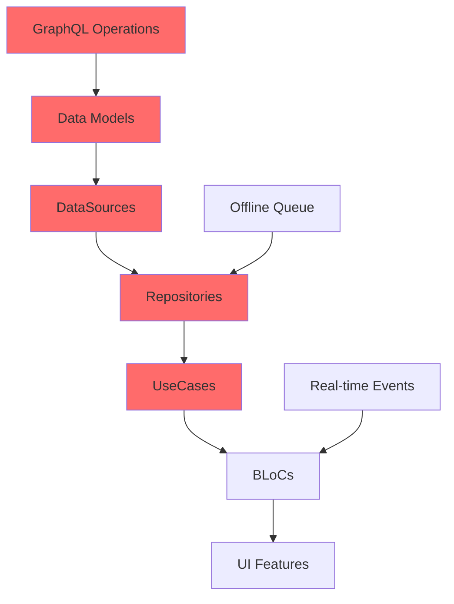

# 🎯 KẾ HOẠCH TRIỂN KHAI TỔNG THỂ - SHARITEK OFFICE CHAT

> **Vai trò:** Senior Solution Architect / Project Manager / Technical Leader  
> **Ngày tạo:** 2025-01-27  
> **Phiên bản:** 1.0  
> **Loại:** Master Implementation Plan  
> **Trạng thái:** 🟢 APPROVED - Ready for execution

---

## 📋 MỤC LỤC

1. [Executive Summary](#executive-summary)
2. [Strategic Analysis](#strategic-analysis)
3. [Dependency Matrix](#dependency-matrix)
4. [Phase Breakdown](#phase-breakdown)
5. [Resource Allocation](#resource-allocation)
6. [Risk Management](#risk-management)
7. [Quality Gates](#quality-gates)
8. [Success Criteria](#success-criteria)

---

## 🎯 EXECUTIVE SUMMARY

### Tình Huống Hiện Tại

**Vấn đề cốt lõi:** Flutter app có architecture xuất sắc nhưng **không thể hoạt động** do:
- GraphQL operations không khớp với backend
- UseCase layer hoàn toàn trống
- Data models thiếu 40% fields quan trọng

**Quyết định chiến lược:** Triển khai theo **4 phases** với focus vào:
1. **Foundation First** - Fix critical blockers để app hoạt động được
2. **Core Features** - Implement essential user-facing features
3. **Advanced Features** - Add competitive advantages
4. **Polish & Scale** - Production-ready quality

### Timeline & Resources

```
Total Duration: 8 weeks (2 months)
Team Size: 5-6 developers
Budget: Medium (standard sprint velocity)
Risk Level: Medium-High (technical debt payoff)
```

### Success Metrics

| Metric | Current | Target | Timeline |
|--------|---------|--------|----------|
| Feature Completeness | 35% | 100% | Week 8 |
| API Integration | 0% | 100% | Week 2 |
| Test Coverage | 40% | 85% | Week 8 |
| Performance Score | 70/100 | 90/100 | Week 8 |
| Production Ready | No | Yes | Week 8 |

---

## 🔍 STRATEGIC ANALYSIS

### Phân Tích Dependencies (Critical Path)



**Critical Path Analysis:**
- ❌ Không thể implement UseCases nếu chưa có Repositories
- ❌ Không thể fix Repositories nếu chưa có correct GraphQL operations
- ❌ Không thể test features nếu chưa có data models đúng
- ✅ Real-time events có thể parallel với core features
- ✅ UI polish có thể parallel với backend integration

### Phân Tích Rủi Ro vs Giá Trị


| Feature | User Value | Technical Risk | Dependencies | Priority |
|---------|------------|----------------|--------------|----------|
| **Foundation** |
| GraphQL Ops | 🔴 Blocker | 🟢 Low | None | P0 |
| Data Models | 🔴 Blocker | 🟡 Medium | GraphQL | P0 |
| UseCases | 🔴 Blocker | 🟢 Low | Models | P0 |
| Repositories | 🔴 Blocker | 🟡 Medium | UseCases | P0 |
| **Core Features** |
| Send Message | 🔴 Critical | 🟢 Low | Foundation | P1 |
| Load Messages | 🔴 Critical | 🟢 Low | Foundation | P1 |
| Chat List | 🔴 Critical | 🟢 Low | Foundation | P1 |
| Real-time Sync | 🟠 High | 🟡 Medium | Foundation | P1 |
| **Advanced** |
| Reactions | 🟠 High | 🟢 Low | Core | P2 |
| Edit Message | 🟠 High | 🟡 Medium | Core | P2 |
| Delete Message | 🟠 High | 🟢 Low | Core | P2 |
| Search | 🟡 Medium | 🟡 Medium | Core | P2 |
| File Upload | 🟠 High | 🔴 High | Core | P2 |
| **Polish** |
| Group Mgmt | 🟡 Medium | 🟢 Low | Advanced | P3 |
| User Profile | 🟢 Low | 🟢 Low | Advanced | P3 |
| Settings | 🟢 Low | 🟢 Low | Advanced | P3 |

### Quyết Định Chiến Lược

#### 1. Foundation First Strategy ✅

**Lý do:**
- Không thể build features nếu foundation bị broken
- GraphQL mismatch là blocker tuyệt đối
- Data models sai → tất cả features sẽ fail
- UseCases trống → vi phạm Clean Architecture

**Impact:**
- Week 1-2 không có visible features mới
- Team focus 100% vào technical debt
- Stakeholders cần hiểu đây là investment

#### 2. Parallel Workstreams Strategy ✅

**Lý do:**
- Maximize team velocity
- Reduce idle time
- Enable specialization

**Workstreams:**
```
Stream 1: Backend Integration (2 devs)
├── GraphQL operations
├── Data models
└── API testing

Stream 2: Domain Logic (2 devs)
├── UseCases
├── Repositories
└── Unit tests

Stream 3: Real-time (1 dev)
├── Socket.IO events
├── Event handlers
└── Integration tests

Stream 4: UI/UX (1 dev)
├── UI components
├── Animations
└── Responsive design
```

#### 3. Incremental Delivery Strategy ✅

**Lý do:**
- Reduce risk of big-bang deployment
- Enable early feedback
- Maintain team morale with visible progress

**Milestones:**
- Week 2: Foundation complete → App works
- Week 4: Core features → MVP ready
- Week 6: Advanced features → Competitive
- Week 8: Polish → Production ready

---

## 🔗 DEPENDENCY MATRIX

### Layer Dependencies

```
┌─────────────────────────────────────────────────┐
│ PRESENTATION (BLoCs, Pages, Widgets)            │
│ Depends on: Domain UseCases                     │
│ Blocks: UI Features, User Testing               │
└─────────────────────────────────────────────────┘
                      ↓
┌─────────────────────────────────────────────────┐
│ DOMAIN (UseCases, Entities, Repositories)       │
│ Depends on: Repository Interfaces               │
│ Blocks: BLoC Implementation, Business Logic     │
└─────────────────────────────────────────────────┘
                      ↓
┌─────────────────────────────────────────────────┐
│ DATA (Repositories, DataSources, Models)        │
│ Depends on: GraphQL Operations, Data Models     │
│ Blocks: Data Flow, API Integration              │
└─────────────────────────────────────────────────┘
                      ↓
┌─────────────────────────────────────────────────┐
│ INFRASTRUCTURE (GraphQL, Socket.IO, Storage)    │
│ Depends on: Backend API Contract                │
│ Blocks: Everything                               │
└─────────────────────────────────────────────────┘
```

### Feature Dependencies

```
Basic Chat Flow:
1. GraphQL Operations ──→ 2. Data Models ──→ 3. DataSources
                                                    ↓
4. UI Components ←── 5. BLoCs ←── 6. UseCases ←── 7. Repositories

Advanced Features:
8. Reactions ──→ Depends on: Basic Chat Flow
9. Edit Msg  ──→ Depends on: Basic Chat Flow
10. Delete   ──→ Depends on: Basic Chat Flow
11. Search   ──→ Depends on: Basic Chat Flow + Backend Search
12. Upload   ──→ Depends on: Basic Chat Flow + Socket.IO File

Group Features:
13. Create Group ──→ Depends on: Basic Chat Flow
14. Edit Group   ──→ Depends on: Create Group
15. Manage Members ──→ Depends on: Edit Group
```

### Technical Dependencies

| Component | Depends On | Blocks | Can Parallel With |
|-----------|------------|--------|-------------------|
| GraphQL Ops | Backend API | Everything | - |
| Data Models | GraphQL Ops | DataSources | Real-time events |
| DataSources | Data Models | Repositories | UI components |
| Repositories | DataSources | UseCases | Socket.IO setup |
| UseCases | Repositories | BLoCs | UI polish |
| BLoCs | UseCases | Features | Testing |
| Real-time | Socket.IO | Live updates | Core features |
| File Upload | Socket.IO | Media features | Text features |

---

## 📅 PHASE BREAKDOWN


### 🔴 PHASE 0: Pre-Implementation (Week 0)

**Duration:** 3 days  
**Team:** Full team (5-6 devs)  
**Goal:** Setup, planning, and alignment

#### Objectives
- ✅ Team alignment on architecture
- ✅ Development environment setup
- ✅ Backend API documentation review
- ✅ Test environment preparation

#### Tasks

**Day 1: Planning & Setup**
- [ ] Kickoff meeting with full team
- [ ] Review PROJECT_STATUS_ANALYSIS.md
- [ ] Review IMPLEMENTATION_MASTER_PLAN.md
- [ ] Assign team members to workstreams
- [ ] Setup development branches
- [ ] Setup CI/CD pipelines

**Day 2: Backend Integration Prep**
- [ ] Backend API access verification
- [ ] GraphQL playground setup
- [ ] Socket.IO connection testing
- [ ] Test data preparation
- [ ] API documentation deep dive

**Day 3: Architecture Review**
- [ ] Code walkthrough session
- [ ] Identify existing patterns
- [ ] Review Clean Architecture principles
- [ ] Setup code review process
- [ ] Define coding standards

#### Deliverables
- ✅ Team aligned and ready
- ✅ Development environment ready
- ✅ Backend access verified
- ✅ Test plan documented

#### Success Criteria
- [ ] All team members understand the plan
- [ ] Backend API accessible and documented
- [ ] Development environment working
- [ ] First sprint ready to start

---

### 🔴 PHASE 1: Foundation (Week 1-2)

**Duration:** 2 weeks (10 working days)  
**Team:** Full team (5-6 devs)  
**Goal:** Fix critical blockers, make app functional

#### Strategic Rationale

**Why Foundation First?**
1. **Technical Debt Payoff** - Current code doesn't work, must fix before building
2. **Dependency Blocker** - All features depend on correct foundation
3. **Risk Mitigation** - Discover integration issues early
4. **Team Velocity** - Unblock parallel workstreams for Phase 2

**What NOT to do:**
- ❌ Don't add new features yet
- ❌ Don't polish UI
- ❌ Don't optimize performance
- ✅ Focus 100% on making basic flow work

#### Week 1: API Integration Layer

**Workstream 1: Backend Integration (2 devs)**

**Day 1-2: GraphQL Operations**
```
Priority: P0 - CRITICAL BLOCKER
Complexity: Medium
Risk: Low (well-defined backend API)
```

Tasks:
- [ ] Create `lib/data/graphql/backend_operations.dart`
- [ ] Implement conversation operations:
  - [ ] `chatConversationList` query
  - [ ] `chatConversationDetail` query
  - [ ] `chatGroupAdd` mutation
  - [ ] `chatGroupEdit` mutation
  - [ ] `chatConversationLeave` mutation
  - [ ] `chatConversationDelete` mutation
- [ ] Implement message operations:
  - [ ] `chatMessageList` query
  - [ ] `chatMessageAdd` mutation
  - [ ] `chatMessageEdit` mutation
  - [ ] `chatMessageUpdateRead` mutation
  - [ ] `chatMessageUpdateReaction` mutation
  - [ ] `chatMessageDeleteHistory` mutation
- [ ] Implement search operations:
  - [ ] `chatSearch` query
- [ ] Add GraphQL fragments for reusability
- [ ] Test all operations in GraphQL playground
- [ ] Document operation parameters

**Day 3-4: Data Models**
```
Priority: P0 - CRITICAL BLOCKER
Complexity: High
Risk: Medium (schema changes affect storage)
```

Tasks:
- [ ] Update `ChatModel`:
  - [ ] Add `description` field
  - [ ] Add `groupType` enum
  - [ ] Add `creator` relationship
  - [ ] Add `lastMessageAt` timestamp
  - [ ] Remove incorrect fields
- [ ] Update `MessageModel`:
  - [ ] Add `urls` array
  - [ ] Add `fileName` field
  - [ ] Add `reactions` array
  - [ ] Add `editAt` timestamp
  - [ ] Add `deletedAt` timestamp
  - [ ] Add `forwardedFromMessageId`
  - [ ] Add `mentionTo` array
- [ ] Create `ConversationMemberModel`:
  - [ ] `id`, `userId`, `conversationId`
  - [ ] `admin`, `connected`, `hide` flags
  - [ ] `unreadCount`, `lastMessageReadId`
  - [ ] `viewMessagesFrom` timestamp
- [ ] Create `MessageReactionModel`:
  - [ ] `code` (emoji/reaction code)
  - [ ] `userId`
  - [ ] `createdAt`
- [ ] Update Isar schemas
- [ ] Run code generation: `dart run build_runner build`
- [ ] Test data persistence
- [ ] Write migration script if needed

**Day 5: DataSources**
```
Priority: P0 - CRITICAL BLOCKER
Complexity: Medium
Risk: Low (straightforward mapping)
```

Tasks:
- [ ] Update `ChatRemoteDataSource`:
  - [ ] Replace `getUserChats()` with `getConversations()`
  - [ ] Replace `getChatDetails()` with `getConversationDetail()`
  - [ ] Update `createGroupChat()` to use `chatGroupAdd`
  - [ ] Add `editGroup()` using `chatGroupEdit`
  - [ ] Add `leaveConversation()` using `chatConversationLeave`
  - [ ] Add `deleteConversation()` using `chatConversationDelete`
- [ ] Update `MessageRemoteDataSource`:
  - [ ] Replace `getChatMessages()` with `getMessages()`
  - [ ] Replace `sendMessage()` with `addMessage()`
  - [ ] Add `editMessage()` using `chatMessageEdit`
  - [ ] Add `markAsRead()` using `chatMessageUpdateRead`
  - [ ] Add `addReaction()` using `chatMessageUpdateReaction`
  - [ ] Add `deleteHistory()` using `chatMessageDeleteHistory`
- [ ] Update `ChatLocalDataSource` for new models
- [ ] Update `MessageLocalDataSource` for new models
- [ ] Add error handling for all operations
- [ ] Add logging for debugging

**Workstream 2: Domain Logic (2 devs)**

**Day 1-3: UseCases - Chat**
```
Priority: P0 - CRITICAL BLOCKER
Complexity: Low (standard UseCase pattern)
Risk: Low (well-defined interfaces)
```

Tasks:
- [ ] Create `GetConversationsUseCase`:
  ```dart
  class GetConversationsUseCase {
    Future<Either<Failure, List<Chat>>> call({
      int page = 0,
      int size = 25,
      String? keyword,
      ChatType? type,
    });
  }
  ```
- [ ] Create `GetConversationDetailUseCase`:
  ```dart
  class GetConversationDetailUseCase {
    Future<Either<Failure, Chat>> call({
      String? conversationId,
      String? receiverId,
    });
  }
  ```
- [ ] Create `CreateGroupUseCase`:
  ```dart
  class CreateGroupUseCase {
    Future<Either<Failure, Chat>> call({
      required String name,
      required List<String> memberIds,
      String? imgUrl,
      String? description,
    });
  }
  ```
- [ ] Create `EditGroupUseCase`
- [ ] Create `LeaveConversationUseCase`
- [ ] Create `DeleteConversationUseCase`
- [ ] Create `SearchConversationsUseCase`
- [ ] Add unit tests for each UseCase
- [ ] Register in DI container

**Day 4-5: UseCases - Message**
```
Priority: P0 - CRITICAL BLOCKER
Complexity: Low
Risk: Low
```

Tasks:
- [ ] Create `GetMessagesUseCase`:
  ```dart
  class GetMessagesUseCase {
    Future<Either<Failure, MessageListResult>> call({
      required String conversationId,
      int size = 100,
      LastKey? lastKey,
      ChatMessageType? type,
    });
  }
  ```
- [ ] Create `SendMessageUseCase`:
  ```dart
  class SendMessageUseCase {
    Future<Either<Failure, ChatMessage>> call({
      required String conversationId,
      String? receiverId,
      required String message,
      ChatMessageType type = ChatMessageType.TEXT,
      List<String>? urls,
      String? replyMessageId,
    });
  }
  ```
- [ ] Create `EditMessageUseCase`
- [ ] Create `DeleteMessageUseCase`
- [ ] Create `MarkAsReadUseCase`
- [ ] Create `AddReactionUseCase`
- [ ] Create `RemoveReactionUseCase`
- [ ] Create `SearchMessagesUseCase`
- [ ] Add unit tests for each UseCase
- [ ] Register in DI container

#### Week 2: Integration & Testing

**Workstream 1: Repository Implementation (2 devs)**

**Day 1-3: Repositories**
```
Priority: P0 - CRITICAL BLOCKER
Complexity: Medium
Risk: Medium (integration points)
```

Tasks:
- [ ] Update `ChatRepositoryImpl`:
  - [ ] Implement `getConversations()` using new DataSource
  - [ ] Implement `getConversationDetail()`
  - [ ] Implement `createGroup()`
  - [ ] Implement `editGroup()`
  - [ ] Implement `leaveConversation()`
  - [ ] Implement `deleteConversation()`
  - [ ] Add offline-first logic
  - [ ] Add error mapping
- [ ] Update `MessageRepositoryImpl`:
  - [ ] Implement `getMessages()` using new DataSource
  - [ ] Implement `sendMessage()`
  - [ ] Implement `editMessage()`
  - [ ] Implement `deleteMessage()`
  - [ ] Implement `markAsRead()`
  - [ ] Implement `addReaction()`
  - [ ] Implement `removeReaction()`
  - [ ] Add offline queue integration
  - [ ] Add error mapping
- [ ] Integration tests for repositories
- [ ] Test offline scenarios

**Day 4-5: BLoC Integration**
```
Priority: P0 - CRITICAL BLOCKER
Complexity: Medium
Risk: Low
```

Tasks:
- [ ] Update `ChatBloc`:
  - [ ] Connect to `GetConversationsUseCase`
  - [ ] Connect to `CreateGroupUseCase`
  - [ ] Connect to `LeaveConversationUseCase`
  - [ ] Update state handling
  - [ ] Add error handling
- [ ] Update `MessageBloc`:
  - [ ] Connect to `GetMessagesUseCase`
  - [ ] Connect to `SendMessageUseCase`
  - [ ] Connect to `MarkAsReadUseCase`
  - [ ] Update state handling
  - [ ] Add error handling
- [ ] Test BLoC event flows
- [ ] Integration tests

**Workstream 2: Real-time Foundation (1 dev)**

**Day 1-5: Socket.IO Events**
```
Priority: P1 - HIGH
Complexity: Medium
Risk: Medium (real-time complexity)
```

Tasks:
- [ ] Update `RealtimeService`:
  - [ ] Verify existing events work with backend
  - [ ] Test `message:sent` event
  - [ ] Test `message:typing` event
  - [ ] Test `message:read` event
  - [ ] Test `conversation:joined` event
  - [ ] Test `conversation:leaved` event
- [ ] Add connection state management
- [ ] Add reconnection logic
- [ ] Add event queue for offline
- [ ] Integration tests for real-time

**Workstream 3: UI Updates (1 dev)**

**Day 1-5: Basic UI Flow**
```
Priority: P1 - HIGH
Complexity: Low
Risk: Low
```

Tasks:
- [ ] Update `ChatListPage`:
  - [ ] Connect to updated ChatBloc
  - [ ] Display conversations correctly
  - [ ] Handle loading states
  - [ ] Handle error states
- [ ] Update `ChatDetailsPage`:
  - [ ] Connect to updated MessageBloc
  - [ ] Display messages correctly
  - [ ] Handle pagination
  - [ ] Handle loading/error states
- [ ] Update `CreateGroupPage`:
  - [ ] Connect to CreateGroupUseCase
  - [ ] Handle success/error
- [ ] Basic UI testing

#### Phase 1 Deliverables

**Must Have:**
- ✅ App can load conversations from backend
- ✅ App can load messages from backend
- ✅ App can send messages to backend
- ✅ App can create groups
- ✅ Real-time message delivery works
- ✅ Offline queue works
- ✅ All critical tests pass

**Quality Gates:**
- [ ] All GraphQL operations tested
- [ ] All UseCases have unit tests
- [ ] Integration tests pass
- [ ] No critical bugs
- [ ] Code review completed
- [ ] Documentation updated

#### Phase 1 Success Criteria

```
✅ App is functional (can chat)
✅ Backend integration works
✅ Clean Architecture implemented
✅ Test coverage >60%
✅ No critical bugs
✅ Ready for Phase 2
```


---

### 🟠 PHASE 2: Core Features (Week 3-4)

**Duration:** 2 weeks (10 working days)  
**Team:** Full team (5-6 devs)  
**Goal:** Implement essential user-facing features

#### Strategic Rationale

**Why These Features?**
1. **User Value** - Features users expect in any chat app
2. **Competitive Parity** - Match WhatsApp/Telegram baseline
3. **Foundation Ready** - Phase 1 unblocked these features
4. **Quick Wins** - Visible progress for stakeholders

**Priority Order:**
1. Message Reactions (high user value, low complexity)
2. Edit Message (expected feature, medium complexity)
3. Delete Message (expected feature, low complexity)
4. File Upload (high value, high complexity)
5. Search (medium value, medium complexity)

#### Week 3: Message Features

**Workstream 1: Reactions (2 devs)**

**Day 1-2: Backend Integration**
```
Priority: P1 - HIGH
Complexity: Low
Risk: Low
User Value: ⭐⭐⭐⭐⭐
```

Tasks:
- [ ] Implement `AddReactionUseCase`:
  ```dart
  class AddReactionUseCase {
    Future<Either<Failure, ChatMessage>> call({
      required String messageId,
      required String code,  // emoji code
    });
  }
  ```
- [ ] Implement `RemoveReactionUseCase`
- [ ] Update `MessageRepositoryImpl`:
  - [ ] Add `addReaction()` method
  - [ ] Add `removeReaction()` method
  - [ ] Call `chatMessageUpdateReaction` mutation
- [ ] Add real-time reaction event handler:
  ```dart
  _socketManager.on('message:reaction').listen((data) {
    // Handle reaction add/remove
  });
  ```
- [ ] Update `MessageModel` to include reactions
- [ ] Unit tests

**Day 3: UI Implementation**
```
Priority: P1 - HIGH
Complexity: Medium
Risk: Low
```

Tasks:
- [ ] Create `ReactionPicker` widget:
  - [ ] Emoji picker UI
  - [ ] Popular reactions quick access
  - [ ] Custom emoji support
- [ ] Create `ReactionBar` widget:
  - [ ] Display reactions on message
  - [ ] Show reaction count
  - [ ] Highlight user's reaction
  - [ ] Tap to add/remove
- [ ] Update `MessageBubble`:
  - [ ] Integrate ReactionBar
  - [ ] Long-press to show ReactionPicker
  - [ ] Animation for reactions
- [ ] Add to `MessageBloc`:
  - [ ] `AddReactionEvent`
  - [ ] `RemoveReactionEvent`
  - [ ] Handle real-time updates
- [ ] UI tests

**Workstream 2: Edit Message (2 devs)**

**Day 1-2: Backend Integration**
```
Priority: P1 - HIGH
Complexity: Medium
Risk: Medium (history tracking)
User Value: ⭐⭐⭐⭐
```

Tasks:
- [ ] Implement `EditMessageUseCase`:
  ```dart
  class EditMessageUseCase {
    Future<Either<Failure, ChatMessage>> call({
      required String messageId,
      required String newMessage,
    });
  }
  ```
- [ ] Update `MessageRepositoryImpl`:
  - [ ] Add `editMessage()` method
  - [ ] Call `chatMessageEdit` mutation
  - [ ] Update local cache
- [ ] Add real-time edit event handler:
  ```dart
  _socketManager.on('message:edit').listen((data) {
    // Handle message edit
  });
  ```
- [ ] Update `MessageModel`:
  - [ ] Add `editAt` field
  - [ ] Add `isEdited` getter
- [ ] Unit tests

**Day 3: UI Implementation**
```
Priority: P1 - HIGH
Complexity: Medium
Risk: Low
```

Tasks:
- [ ] Create `EditMessageDialog`:
  - [ ] Text input with current message
  - [ ] Save/Cancel buttons
  - [ ] Character limit
  - [ ] Loading state
- [ ] Update `MessageBubble`:
  - [ ] Show "edited" indicator
  - [ ] Edit option in context menu
  - [ ] Only allow edit for own messages
  - [ ] Time limit check (e.g., 48 hours)
- [ ] Add to `MessageBloc`:
  - [ ] `EditMessageEvent`
  - [ ] Handle edit success/failure
  - [ ] Update message in list
- [ ] UI tests

**Workstream 3: Delete Message (1 dev)**

**Day 1-2: Backend Integration**
```
Priority: P1 - HIGH
Complexity: Low
Risk: Low
User Value: ⭐⭐⭐⭐
```

Tasks:
- [ ] Implement `DeleteMessageUseCase`:
  ```dart
  class DeleteMessageUseCase {
    Future<Either<Failure, void>> call({
      required String messageId,
      bool deleteForEveryone = false,
    });
  }
  ```
- [ ] Update `MessageRepositoryImpl`:
  - [ ] Add `deleteMessage()` method
  - [ ] Call appropriate backend operation
  - [ ] Update local cache
- [ ] Add real-time delete event handler:
  ```dart
  _socketManager.on('message:delete').listen((data) {
    // Handle message delete
  });
  ```
- [ ] Unit tests

**Day 3: UI Implementation**
```
Priority: P1 - HIGH
Complexity: Low
Risk: Low
```

Tasks:
- [ ] Create `DeleteMessageDialog`:
  - [ ] "Delete for me" option
  - [ ] "Delete for everyone" option (if sender)
  - [ ] Confirmation
- [ ] Update `MessageBubble`:
  - [ ] Delete option in context menu
  - [ ] Show "Message deleted" placeholder
  - [ ] Handle deleted state
- [ ] Add to `MessageBloc`:
  - [ ] `DeleteMessageEvent`
  - [ ] Remove from list or mark as deleted
- [ ] UI tests

**Workstream 4: Real-time Events (1 dev)**

**Day 1-3: Complete Event Coverage**
```
Priority: P1 - HIGH
Complexity: Medium
Risk: Medium
```

Tasks:
- [ ] Implement all missing Socket.IO events:
  - [ ] `message:reaction` ✅ (done in Workstream 1)
  - [ ] `message:edit` ✅ (done in Workstream 2)
  - [ ] `message:delete` ✅ (done in Workstream 3)
  - [ ] `conversation:leaved`
  - [ ] `user:status` (online/offline)
- [ ] Add event handlers to `RealtimeService`
- [ ] Add stream controllers for each event
- [ ] Update BLoCs to listen to streams
- [ ] Integration tests for all events
- [ ] Test reconnection scenarios

#### Week 4: Advanced Features

**Workstream 1: File Upload (2 devs)**

**Day 1-3: Backend Integration**
```
Priority: P1 - HIGH
Complexity: High
Risk: High (large files, progress tracking)
User Value: ⭐⭐⭐⭐⭐
```

Tasks:
- [ ] Implement `UploadFileUseCase`:
  ```dart
  class UploadFileUseCase {
    Future<Either<Failure, String>> call({
      required File file,
      required String fileName,
      Function(double)? onProgress,
    });
  }
  ```
- [ ] Create `FileUploadService`:
  - [ ] Upload via Socket.IO `message:file:upload`
  - [ ] Track upload progress
  - [ ] Handle upload errors
  - [ ] Retry logic
  - [ ] Cancel upload
- [ ] Update `SendMessageUseCase`:
  - [ ] Support file attachments
  - [ ] Send message with file URLs
- [ ] Add file types support:
  - [ ] Images (JPEG, PNG, GIF)
  - [ ] Videos (MP4, MOV)
  - [ ] Documents (PDF, DOC, XLS)
  - [ ] Audio (MP3, M4A)
- [ ] Unit tests

**Day 4-5: UI Implementation**
```
Priority: P1 - HIGH
Complexity: High
Risk: Medium
```

Tasks:
- [ ] Create `FilePicker` integration:
  - [ ] Image picker
  - [ ] Video picker
  - [ ] Document picker
  - [ ] Camera capture
- [ ] Create `FileUploadWidget`:
  - [ ] Upload progress bar
  - [ ] Cancel button
  - [ ] Error handling
  - [ ] Retry button
- [ ] Create `FilePreview` widgets:
  - [ ] Image preview
  - [ ] Video preview with thumbnail
  - [ ] Document preview
  - [ ] Audio player
- [ ] Update `MessageInput`:
  - [ ] Attachment button
  - [ ] Show selected files
  - [ ] Remove file option
- [ ] Update `MessageBubble`:
  - [ ] Display file attachments
  - [ ] Download button
  - [ ] Open file
- [ ] Add to `MessageBloc`:
  - [ ] `UploadFileEvent`
  - [ ] `SendMessageWithFileEvent`
  - [ ] Track upload state
- [ ] UI tests

**Workstream 2: Search Messages (2 devs)**

**Day 1-2: Backend Integration**
```
Priority: P2 - MEDIUM
Complexity: Medium
Risk: Low
User Value: ⭐⭐⭐⭐
```

Tasks:
- [ ] Implement `SearchMessagesUseCase`:
  ```dart
  class SearchMessagesUseCase {
    Future<Either<Failure, List<ChatMessage>>> call({
      required String keyword,
      String? conversationId,
      List<String>? conversationIds,
      List<ChatMessageType>? messageTypes,
      DateTime? from,
      DateTime? to,
      int page = 0,
      int size = 100,
    });
  }
  ```
- [ ] Update `MessageRepositoryImpl`:
  - [ ] Add `searchMessages()` method
  - [ ] Call `chatSearch` query
  - [ ] Parse highlighted results
- [ ] Unit tests

**Day 3-5: UI Implementation**
```
Priority: P2 - MEDIUM
Complexity: Medium
Risk: Low
```

Tasks:
- [ ] Create `SearchMessagesPage`:
  - [ ] Search input with debounce
  - [ ] Filter options (date, type, conversation)
  - [ ] Search results list
  - [ ] Highlight matched text
  - [ ] Tap to jump to message
- [ ] Create `SearchBloc`:
  - [ ] `SearchEvent`
  - [ ] `SearchState` (loading, results, error)
  - [ ] Debounce search input
  - [ ] Pagination
- [ ] Add search button to `ChatListPage`
- [ ] Add search in conversation to `ChatDetailsPage`
- [ ] UI tests

**Workstream 3: Reply & Forward (1 dev)**

**Day 1-3: Reply to Message**
```
Priority: P2 - MEDIUM
Complexity: Low
Risk: Low
User Value: ⭐⭐⭐⭐
```

Tasks:
- [ ] Update `SendMessageUseCase`:
  - [ ] Add `replyToMessageId` parameter
  - [ ] Already supported by backend
- [ ] Create `ReplyPreview` widget:
  - [ ] Show original message
  - [ ] Show original sender
  - [ ] Close button
- [ ] Update `MessageInput`:
  - [ ] Show ReplyPreview when replying
  - [ ] Clear reply state
- [ ] Update `MessageBubble`:
  - [ ] Show reply indicator
  - [ ] Tap to scroll to original
  - [ ] Reply option in context menu
- [ ] UI tests

**Day 4-5: Forward Message**
```
Priority: P2 - MEDIUM
Complexity: Medium
Risk: Low
User Value: ⭐⭐⭐
```

Tasks:
- [ ] Implement `ForwardMessageUseCase`:
  ```dart
  class ForwardMessageUseCase {
    Future<Either<Failure, ChatMessage>> call({
      required String messageId,
      required List<String> conversationIds,
    });
  }
  ```
- [ ] Create `ForwardDialog`:
  - [ ] Conversation selector
  - [ ] Multi-select
  - [ ] Search conversations
  - [ ] Forward button
- [ ] Update `MessageBubble`:
  - [ ] Forward option in context menu
  - [ ] Show "Forwarded" indicator
- [ ] UI tests

#### Phase 2 Deliverables

**Must Have:**
- ✅ Message reactions work
- ✅ Edit message works
- ✅ Delete message works
- ✅ File upload works (images, videos, docs)
- ✅ Search messages works
- ✅ Reply to message works
- ✅ Forward message works
- ✅ All real-time events work

**Quality Gates:**
- [ ] All features tested
- [ ] Real-time updates work
- [ ] Offline queue handles all operations
- [ ] UI is responsive and smooth
- [ ] Test coverage >70%
- [ ] No high-priority bugs

#### Phase 2 Success Criteria

```
✅ Feature parity with basic chat apps
✅ Real-time experience is smooth
✅ File sharing works reliably
✅ Search is fast and accurate
✅ Test coverage >70%
✅ Ready for Phase 3
```


---

### 🟡 PHASE 3: Advanced Features (Week 5-6)

**Duration:** 2 weeks (10 working days)  
**Team:** Full team (5-6 devs)  
**Goal:** Add competitive advantages and polish

#### Strategic Rationale

**Why These Features?**
1. **Competitive Advantage** - Features that differentiate from basic chat
2. **User Engagement** - Features that increase user satisfaction
3. **Enterprise Ready** - Features needed for business use
4. **Foundation Complete** - Core features enable these

**Priority Order:**
1. Group Management (essential for team collaboration)
2. Mention Users (important for group chats)
3. Message Status (read receipts, delivery status)
4. User Presence (online/offline status)
5. Typing Indicators Enhancement

#### Week 5: Group Management

**Workstream 1: Edit Group (2 devs)**

**Day 1-2: Backend Integration**
```
Priority: P2 - MEDIUM
Complexity: Medium
Risk: Low
User Value: ⭐⭐⭐⭐
```

Tasks:
- [ ] Implement `EditGroupUseCase`:
  ```dart
  class EditGroupUseCase {
    Future<Either<Failure, Chat>> call({
      required String conversationId,
      String? name,
      String? imgUrl,
      String? description,
      ChatConversationGroupType? groupType,
      List<String>? memberIds,  // add/remove members
      List<String>? adminIds,   // promote/demote admins
    });
  }
  ```
- [ ] Update `ChatRepositoryImpl`:
  - [ ] Add `editGroup()` method
  - [ ] Call `chatGroupEdit` mutation
  - [ ] Handle member changes
  - [ ] Handle admin changes
- [ ] Unit tests

**Day 3-5: UI Implementation**
```
Priority: P2 - MEDIUM
Complexity: High
Risk: Low
```

Tasks:
- [ ] Create `EditGroupPage`:
  - [ ] Group name input
  - [ ] Group image picker
  - [ ] Description input
  - [ ] Group type selector (Public/Private)
  - [ ] Save button
- [ ] Create `GroupMembersPage`:
  - [ ] Member list
  - [ ] Admin badge
  - [ ] Add members button
  - [ ] Remove member (admin only)
  - [ ] Promote to admin (admin only)
  - [ ] Demote admin (super admin only)
  - [ ] Leave group button
- [ ] Create `AddMembersDialog`:
  - [ ] User search
  - [ ] Multi-select users
  - [ ] Add button
- [ ] Update `ChatDetailsPage`:
  - [ ] Group info header
  - [ ] Edit group button (admin only)
  - [ ] View members button
- [ ] Add to `ChatBloc`:
  - [ ] `EditGroupEvent`
  - [ ] `AddMembersEvent`
  - [ ] `RemoveMemberEvent`
  - [ ] `PromoteAdminEvent`
  - [ ] `DemoteAdminEvent`
- [ ] UI tests

**Workstream 2: Mention Users (2 devs)**

**Day 1-2: Backend Integration**
```
Priority: P2 - MEDIUM
Complexity: Medium
Risk: Low
User Value: ⭐⭐⭐⭐
```

Tasks:
- [ ] Update `SendMessageUseCase`:
  - [ ] Parse mentions from message text
  - [ ] Extract mentioned user IDs
  - [ ] Send `mentionTo` array to backend
- [ ] Update `MessageModel`:
  - [ ] Add `mentionTo` field
  - [ ] Parse mentions in message text
- [ ] Add mention notification logic
- [ ] Unit tests

**Day 3-5: UI Implementation**
```
Priority: P2 - MEDIUM
Complexity: High
Risk: Medium (text parsing)
```

Tasks:
- [ ] Create `MentionTextField`:
  - [ ] Detect @ symbol
  - [ ] Show user suggestion dropdown
  - [ ] Filter users as typing
  - [ ] Insert mention on select
  - [ ] Highlight mentions in text
- [ ] Create `MentionSuggestion` widget:
  - [ ] User list with avatars
  - [ ] Search/filter
  - [ ] Keyboard navigation
- [ ] Update `MessageBubble`:
  - [ ] Highlight mentions
  - [ ] Tap mention to view profile
  - [ ] Different color for self-mention
- [ ] Update `MessageInput`:
  - [ ] Integrate MentionTextField
  - [ ] Handle mention data
- [ ] Add to `MessageBloc`:
  - [ ] Parse mentions before sending
  - [ ] Include mention data
- [ ] UI tests

**Workstream 3: Message Status (1 dev)**

**Day 1-3: Read Receipts**
```
Priority: P2 - MEDIUM
Complexity: Medium
Risk: Low
User Value: ⭐⭐⭐⭐
```

Tasks:
- [ ] Implement `MarkAsReadUseCase`:
  ```dart
  class MarkAsReadUseCase {
    Future<Either<Failure, void>> call({
      required String conversationId,
      required int readCount,
    });
  }
  ```
- [ ] Update `MessageRepositoryImpl`:
  - [ ] Add `markAsRead()` method
  - [ ] Call `chatMessageUpdateRead` mutation
  - [ ] Update local read status
- [ ] Add automatic mark as read:
  - [ ] When message is visible
  - [ ] When app is in foreground
  - [ ] Debounce to avoid spam
- [ ] Handle read receipt events:
  ```dart
  _socketManager.on('message:read').listen((data) {
    // Update message read status
  });
  ```
- [ ] Unit tests

**Day 4-5: Delivery Status**
```
Priority: P2 - MEDIUM
Complexity: Low
Risk: Low
```

Tasks:
- [ ] Update `MessageModel`:
  - [ ] Add `deliveredTo` field
  - [ ] Add status getters
- [ ] Create `MessageStatusIndicator` widget:
  - [ ] Pending: clock icon
  - [ ] Sent: single check
  - [ ] Delivered: double check
  - [ ] Read: double check (blue)
  - [ ] Failed: error icon
- [ ] Update `MessageBubble`:
  - [ ] Show status indicator
  - [ ] Only for sent messages
  - [ ] Tap to see details
- [ ] Create `MessageStatusDialog`:
  - [ ] Show who read
  - [ ] Show who received
  - [ ] Show timestamps
- [ ] UI tests

**Workstream 4: User Presence (1 dev)**

**Day 1-3: Online/Offline Status**
```
Priority: P2 - MEDIUM
Complexity: Medium
Risk: Medium (real-time sync)
User Value: ⭐⭐⭐
```

Tasks:
- [ ] Add user status event handler:
  ```dart
  _socketManager.on('user:status').listen((data) {
    // Update user online/offline status
  });
  ```
- [ ] Create `UserPresenceService`:
  - [ ] Track user status
  - [ ] Cache status locally
  - [ ] Update on events
  - [ ] Provide status stream
- [ ] Update `UserModel`:
  - [ ] Add `isOnline` field
  - [ ] Add `lastSeen` field
- [ ] Unit tests

**Day 4-5: UI Integration**
```
Priority: P2 - MEDIUM
Complexity: Low
Risk: Low
```

Tasks:
- [ ] Create `OnlineIndicator` widget:
  - [ ] Green dot for online
  - [ ] Gray for offline
  - [ ] "Last seen" text
- [ ] Update `ChatListPage`:
  - [ ] Show online status on avatars
  - [ ] Show "Last seen" in subtitle
- [ ] Update `ChatDetailsPage`:
  - [ ] Show online status in header
  - [ ] Show "typing..." when user is typing
  - [ ] Show "Last seen" when offline
- [ ] Update `UserAvatar` widget:
  - [ ] Add online indicator overlay
- [ ] UI tests

#### Week 6: Polish & Enhancement

**Workstream 1: Typing Indicators Enhancement (1 dev)**

**Day 1-2: Multiple Users Typing**
```
Priority: P3 - LOW
Complexity: Low
Risk: Low
User Value: ⭐⭐⭐
```

Tasks:
- [ ] Update `TypingBloc`:
  - [ ] Track multiple users typing
  - [ ] Show "User1, User2 are typing..."
  - [ ] Show "User1 and 2 others are typing..."
  - [ ] Auto-clear after timeout
- [ ] Update `ChatDetailsPage`:
  - [ ] Show typing indicator in header
  - [ ] Animate typing dots
- [ ] UI tests

**Workstream 2: Message Threading (2 devs)**

**Day 1-3: Thread View**
```
Priority: P3 - LOW
Complexity: High
Risk: Medium
User Value: ⭐⭐⭐
```

Tasks:
- [ ] Create `MessageThreadPage`:
  - [ ] Show original message
  - [ ] Show all replies
  - [ ] Reply input
  - [ ] Thread participants
- [ ] Update `MessageBubble`:
  - [ ] Show reply count
  - [ ] Tap to open thread
  - [ ] "Reply in thread" option
- [ ] Add to `MessageBloc`:
  - [ ] `LoadThreadEvent`
  - [ ] `ReplyInThreadEvent`
  - [ ] Thread state management
- [ ] UI tests

**Workstream 3: Rich Text & Formatting (2 devs)**

**Day 1-3: Text Formatting**
```
Priority: P3 - LOW
Complexity: Medium
Risk: Low
User Value: ⭐⭐⭐
```

Tasks:
- [ ] Create `RichTextEditor`:
  - [ ] Bold, italic, strikethrough
  - [ ] Code blocks
  - [ ] Links
  - [ ] Markdown support
- [ ] Create `FormattedTextRenderer`:
  - [ ] Parse markdown
  - [ ] Render formatted text
  - [ ] Handle links
  - [ ] Syntax highlighting for code
- [ ] Update `MessageInput`:
  - [ ] Formatting toolbar
  - [ ] Keyboard shortcuts
- [ ] Update `MessageBubble`:
  - [ ] Render formatted text
  - [ ] Tap links to open
- [ ] UI tests

**Workstream 4: Notifications (1 dev)**

**Day 1-3: Push Notifications**
```
Priority: P2 - MEDIUM
Complexity: Medium
Risk: Medium
User Value: ⭐⭐⭐⭐⭐
```

Tasks:
- [ ] Setup Firebase Cloud Messaging
- [ ] Create `NotificationService`:
  - [ ] Handle notification permissions
  - [ ] Register device token
  - [ ] Handle notification tap
  - [ ] Show local notifications
- [ ] Add notification preferences:
  - [ ] Mute conversation
  - [ ] Mute all
  - [ ] Custom notification sound
- [ ] Update `ChatModel`:
  - [ ] Add `isMuted` field
- [ ] Integration tests

**Day 4-5: In-App Notifications**
```
Priority: P3 - LOW
Complexity: Low
Risk: Low
```

Tasks:
- [ ] Create `InAppNotification` widget:
  - [ ] Show at top of screen
  - [ ] Auto-dismiss
  - [ ] Tap to open chat
- [ ] Add to app:
  - [ ] Show when app is in foreground
  - [ ] Show for new messages
  - [ ] Show for mentions
- [ ] UI tests

#### Phase 3 Deliverables

**Must Have:**
- ✅ Group management complete
- ✅ Mention users works
- ✅ Message status (read receipts)
- ✅ User presence (online/offline)
- ✅ Enhanced typing indicators
- ✅ Push notifications work

**Nice to Have:**
- ✅ Message threading
- ✅ Rich text formatting
- ✅ In-app notifications

**Quality Gates:**
- [ ] All features tested
- [ ] Real-time updates smooth
- [ ] Notifications reliable
- [ ] UI polished
- [ ] Test coverage >75%
- [ ] Performance optimized

#### Phase 3 Success Criteria

```
✅ Feature-complete chat app
✅ Competitive with WhatsApp/Telegram
✅ Enterprise-ready features
✅ Excellent UX
✅ Test coverage >75%
✅ Ready for Phase 4
```


---

### 🟢 PHASE 4: Production Ready (Week 7-8)

**Duration:** 2 weeks (10 working days)  
**Team:** Full team (5-6 devs)  
**Goal:** Production-ready quality, optimization, and deployment

#### Strategic Rationale

**Why Production Readiness?**
1. **Quality Assurance** - Ensure reliability and stability
2. **Performance** - Meet performance targets
3. **Security** - Protect user data
4. **Scalability** - Handle growth
5. **Maintainability** - Easy to maintain and extend

**Focus Areas:**
1. Performance optimization
2. Testing and QA
3. Security hardening
4. Documentation
5. Deployment preparation

#### Week 7: Optimization & Testing

**Workstream 1: Performance Optimization (2 devs)**

**Day 1-2: Message List Optimization**
```
Priority: P1 - HIGH
Complexity: High
Risk: Medium
Target: 60fps scrolling, <500ms load time
```

Tasks:
- [ ] Implement virtual scrolling:
  - [ ] Only render visible messages
  - [ ] Recycle message widgets
  - [ ] Lazy load images
- [ ] Optimize message rendering:
  - [ ] Use `const` constructors
  - [ ] Minimize rebuilds
  - [ ] Cache computed values
  - [ ] Use `RepaintBoundary`
- [ ] Optimize image loading:
  - [ ] Progressive loading
  - [ ] Thumbnail generation
  - [ ] Image caching
  - [ ] Lazy loading
- [ ] Measure performance:
  - [ ] Frame rate monitoring
  - [ ] Memory profiling
  - [ ] Load time tracking
- [ ] Performance tests

**Day 3-4: Startup Optimization**
```
Priority: P1 - HIGH
Complexity: Medium
Risk: Low
Target: <2s startup time
```

Tasks:
- [ ] Optimize app initialization:
  - [ ] Lazy load services
  - [ ] Defer non-critical init
  - [ ] Parallel initialization
  - [ ] Reduce DI overhead
- [ ] Optimize first screen:
  - [ ] Show splash immediately
  - [ ] Load data in background
  - [ ] Progressive rendering
- [ ] Reduce bundle size:
  - [ ] Tree shaking
  - [ ] Remove unused dependencies
  - [ ] Optimize assets
  - [ ] Code splitting
- [ ] Measure startup time:
  - [ ] Cold start
  - [ ] Warm start
  - [ ] Hot reload
- [ ] Performance tests

**Day 5: Memory Optimization**
```
Priority: P1 - HIGH
Complexity: Medium
Risk: Medium
Target: <150MB memory usage
```

Tasks:
- [ ] Profile memory usage:
  - [ ] Identify memory leaks
  - [ ] Find large allocations
  - [ ] Track object lifecycle
- [ ] Optimize memory:
  - [ ] Dispose unused resources
  - [ ] Clear image cache
  - [ ] Limit message cache
  - [ ] Use weak references
- [ ] Add memory monitoring:
  - [ ] Track memory usage
  - [ ] Alert on high usage
  - [ ] Auto-cleanup
- [ ] Memory tests

**Workstream 2: Testing & QA (2 devs)**

**Day 1-2: Unit Tests**
```
Priority: P1 - HIGH
Complexity: Medium
Risk: Low
Target: >80% coverage
```

Tasks:
- [ ] Write missing unit tests:
  - [ ] All UseCases
  - [ ] All Repositories
  - [ ] All BLoCs
  - [ ] All Services
- [ ] Improve existing tests:
  - [ ] Add edge cases
  - [ ] Add error scenarios
  - [ ] Add mock data
- [ ] Run test coverage:
  ```bash
  flutter test --coverage
  genhtml coverage/lcov.info -o coverage/html
  ```
- [ ] Achieve >80% coverage

**Day 3-4: Integration Tests**
```
Priority: P1 - HIGH
Complexity: High
Risk: Medium
Target: All critical flows covered
```

Tasks:
- [ ] Write integration tests:
  - [ ] Login flow
  - [ ] Chat list flow
  - [ ] Send message flow
  - [ ] Create group flow
  - [ ] File upload flow
  - [ ] Search flow
- [ ] Test offline scenarios:
  - [ ] Send message offline
  - [ ] Sync when online
  - [ ] Handle conflicts
- [ ] Test real-time scenarios:
  - [ ] Receive message
  - [ ] Typing indicator
  - [ ] Read receipts
- [ ] Run integration tests:
  ```bash
  flutter test integration_test/
  ```

**Day 5: E2E Tests**
```
Priority: P2 - MEDIUM
Complexity: High
Risk: High
Target: Critical user journeys
```

Tasks:
- [ ] Setup E2E testing:
  - [ ] Choose framework (Patrol/Maestro)
  - [ ] Setup test environment
  - [ ] Create test data
- [ ] Write E2E tests:
  - [ ] Complete chat flow
  - [ ] Group creation flow
  - [ ] File sharing flow
  - [ ] Search flow
- [ ] Run E2E tests:
  - [ ] On real devices
  - [ ] On emulators
  - [ ] On CI/CD

**Workstream 3: Security Hardening (1 dev)**

**Day 1-3: Security Audit**
```
Priority: P1 - HIGH
Complexity: Medium
Risk: High
```

Tasks:
- [ ] Code security review:
  - [ ] Check for hardcoded secrets
  - [ ] Review authentication flow
  - [ ] Check data encryption
  - [ ] Review permissions
- [ ] Dependency audit:
  ```bash
  flutter pub outdated
  flutter pub audit
  ```
  - [ ] Update vulnerable packages
  - [ ] Remove unused packages
- [ ] API security:
  - [ ] Verify HTTPS only
  - [ ] Check token handling
  - [ ] Review error messages
  - [ ] Test rate limiting
- [ ] Data security:
  - [ ] Encrypt sensitive data
  - [ ] Secure local storage
  - [ ] Clear cache on logout
  - [ ] Implement data retention

**Day 4-5: Security Implementation**
```
Priority: P1 - HIGH
Complexity: Medium
Risk: High
```

Tasks:
- [ ] Implement security fixes:
  - [ ] Fix identified issues
  - [ ] Add encryption where needed
  - [ ] Improve authentication
  - [ ] Add security headers
- [ ] Add security monitoring:
  - [ ] Log security events
  - [ ] Alert on suspicious activity
  - [ ] Track failed logins
- [ ] Security testing:
  - [ ] Penetration testing
  - [ ] Vulnerability scanning
  - [ ] Security audit report

**Workstream 4: Bug Fixes (1 dev)**

**Day 1-5: Bug Triage & Fixes**
```
Priority: P1 - HIGH
Complexity: Varies
Risk: Low
```

Tasks:
- [ ] Triage all reported bugs:
  - [ ] Categorize by severity
  - [ ] Prioritize fixes
  - [ ] Assign to team
- [ ] Fix critical bugs:
  - [ ] P0: Crashes, data loss
  - [ ] P1: Major functionality broken
  - [ ] P2: Minor issues
- [ ] Regression testing:
  - [ ] Test all fixes
  - [ ] Verify no new bugs
  - [ ] Update tests
- [ ] Bug tracking:
  - [ ] Update bug tracker
  - [ ] Document fixes
  - [ ] Close resolved bugs

#### Week 8: Documentation & Deployment

**Workstream 1: Documentation (2 devs)**

**Day 1-2: Technical Documentation**
```
Priority: P1 - HIGH
Complexity: Low
Risk: Low
```

Tasks:
- [ ] Update architecture docs:
  - [ ] System architecture diagram
  - [ ] Data flow diagrams
  - [ ] API documentation
  - [ ] Database schema
- [ ] Write developer guides:
  - [ ] Setup guide
  - [ ] Development workflow
  - [ ] Testing guide
  - [ ] Deployment guide
- [ ] Code documentation:
  - [ ] Add missing doc comments
  - [ ] Generate API docs
  - [ ] Update README files
- [ ] Create runbooks:
  - [ ] Deployment runbook
  - [ ] Troubleshooting guide
  - [ ] Monitoring guide

**Day 3-4: User Documentation**
```
Priority: P2 - MEDIUM
Complexity: Low
Risk: Low
```

Tasks:
- [ ] Write user guides:
  - [ ] Getting started
  - [ ] Feature guides
  - [ ] FAQ
  - [ ] Troubleshooting
- [ ] Create video tutorials:
  - [ ] App overview
  - [ ] Key features
  - [ ] Tips and tricks
- [ ] In-app help:
  - [ ] Tooltips
  - [ ] Onboarding flow
  - [ ] Help center link

**Day 5: Release Notes**
```
Priority: P1 - HIGH
Complexity: Low
Risk: Low
```

Tasks:
- [ ] Write release notes:
  - [ ] New features
  - [ ] Improvements
  - [ ] Bug fixes
  - [ ] Known issues
- [ ] Update changelog
- [ ] Prepare marketing materials

**Workstream 2: Deployment Preparation (2 devs)**

**Day 1-2: Build Configuration**
```
Priority: P1 - HIGH
Complexity: Medium
Risk: Medium
```

Tasks:
- [ ] Configure build variants:
  - [ ] Development
  - [ ] Staging
  - [ ] Production
- [ ] Setup environment configs:
  - [ ] API endpoints
  - [ ] Feature flags
  - [ ] Analytics keys
  - [ ] Firebase configs
- [ ] Configure app signing:
  - [ ] Android keystore
  - [ ] iOS certificates
  - [ ] Code signing
- [ ] Build optimization:
  - [ ] Enable obfuscation
  - [ ] Optimize assets
  - [ ] Reduce bundle size

**Day 3-4: CI/CD Pipeline**
```
Priority: P1 - HIGH
Complexity: High
Risk: Medium
```

Tasks:
- [ ] Setup CI/CD:
  - [ ] Choose platform (GitHub Actions/GitLab CI)
  - [ ] Configure workflows
  - [ ] Setup secrets
- [ ] Automated testing:
  - [ ] Run unit tests
  - [ ] Run integration tests
  - [ ] Run E2E tests
  - [ ] Generate coverage report
- [ ] Automated builds:
  - [ ] Build Android APK/AAB
  - [ ] Build iOS IPA
  - [ ] Upload to stores
- [ ] Automated deployment:
  - [ ] Deploy to staging
  - [ ] Deploy to production
  - [ ] Rollback capability

**Day 5: Store Submission**
```
Priority: P1 - HIGH
Complexity: Medium
Risk: Medium
```

Tasks:
- [ ] Prepare store listings:
  - [ ] App description
  - [ ] Screenshots
  - [ ] App icon
  - [ ] Feature graphic
  - [ ] Privacy policy
  - [ ] Terms of service
- [ ] Submit to stores:
  - [ ] Google Play Store
  - [ ] Apple App Store
  - [ ] Internal testing track
- [ ] Setup monitoring:
  - [ ] Crash reporting
  - [ ] Analytics
  - [ ] Performance monitoring
  - [ ] User feedback

**Workstream 3: Monitoring & Analytics (1 dev)**

**Day 1-3: Monitoring Setup**
```
Priority: P1 - HIGH
Complexity: Medium
Risk: Low
```

Tasks:
- [ ] Setup crash reporting:
  - [ ] Firebase Crashlytics
  - [ ] Error tracking
  - [ ] Stack trace symbolication
- [ ] Setup analytics:
  - [ ] Firebase Analytics
  - [ ] Custom events
  - [ ] User properties
  - [ ] Conversion tracking
- [ ] Setup performance monitoring:
  - [ ] Firebase Performance
  - [ ] Custom traces
  - [ ] Network monitoring
  - [ ] Screen rendering
- [ ] Setup logging:
  - [ ] Centralized logging
  - [ ] Log levels
  - [ ] Log rotation
  - [ ] Log analysis

**Day 4-5: Dashboards & Alerts**
```
Priority: P2 - MEDIUM
Complexity: Medium
Risk: Low
```

Tasks:
- [ ] Create dashboards:
  - [ ] App health dashboard
  - [ ] User engagement dashboard
  - [ ] Performance dashboard
  - [ ] Error dashboard
- [ ] Setup alerts:
  - [ ] Crash rate alerts
  - [ ] Error rate alerts
  - [ ] Performance alerts
  - [ ] Usage alerts
- [ ] Create reports:
  - [ ] Daily summary
  - [ ] Weekly report
  - [ ] Monthly report

**Workstream 4: Final QA (1 dev)**

**Day 1-5: Final Testing**
```
Priority: P1 - HIGH
Complexity: High
Risk: High
```

Tasks:
- [ ] Smoke testing:
  - [ ] Test all critical flows
  - [ ] Test on multiple devices
  - [ ] Test different OS versions
  - [ ] Test different screen sizes
- [ ] Regression testing:
  - [ ] Run full test suite
  - [ ] Verify all fixes
  - [ ] Check for new bugs
- [ ] Performance testing:
  - [ ] Load testing
  - [ ] Stress testing
  - [ ] Endurance testing
- [ ] User acceptance testing:
  - [ ] Beta testing
  - [ ] Gather feedback
  - [ ] Fix critical issues
- [ ] Final sign-off:
  - [ ] QA approval
  - [ ] Product approval
  - [ ] Stakeholder approval

#### Phase 4 Deliverables

**Must Have:**
- ✅ Performance optimized (60fps, <2s startup)
- ✅ Test coverage >80%
- ✅ Security hardened
- ✅ All critical bugs fixed
- ✅ Documentation complete
- ✅ CI/CD pipeline working
- ✅ Monitoring setup
- ✅ Store submission ready

**Quality Gates:**
- [ ] Performance targets met
- [ ] Test coverage >80%
- [ ] Security audit passed
- [ ] Zero critical bugs
- [ ] Documentation complete
- [ ] QA sign-off
- [ ] Stakeholder approval

#### Phase 4 Success Criteria

```
✅ Production-ready quality
✅ Performance targets met
✅ Security hardened
✅ Fully tested
✅ Well documented
✅ Ready for launch
```


---

## 👥 RESOURCE ALLOCATION

### Team Structure

```
Team Size: 5-6 developers
Duration: 8 weeks (2 months)
Velocity: Standard sprint (2-week sprints)
```

#### Team Composition

**Backend Integration Team (2 devs)**
- **Focus:** GraphQL, API integration, data models
- **Skills:** Flutter, GraphQL, REST APIs, data modeling
- **Phases:** Phase 0-2 (full-time), Phase 3-4 (part-time)

**Domain Logic Team (2 devs)**
- **Focus:** UseCases, repositories, business logic
- **Skills:** Flutter, Clean Architecture, TDD, domain modeling
- **Phases:** Phase 0-2 (full-time), Phase 3-4 (part-time)

**Real-time Team (1 dev)**
- **Focus:** Socket.IO, real-time features, offline sync
- **Skills:** Flutter, Socket.IO, real-time systems, state management
- **Phases:** Phase 0-4 (full-time)

**UI/UX Team (1 dev)**
- **Focus:** UI components, animations, responsive design
- **Skills:** Flutter, UI/UX design, animations, accessibility
- **Phases:** Phase 0-4 (full-time)

**QA/DevOps (0.5 dev - shared)**
- **Focus:** Testing, CI/CD, deployment, monitoring
- **Skills:** Testing, DevOps, CI/CD, monitoring
- **Phases:** Phase 0-4 (part-time)

### Resource Timeline

```
Phase 0 (Week 0):
├── Backend Integration: 2 devs (100%)
├── Domain Logic: 2 devs (100%)
├── Real-time: 1 dev (100%)
├── UI/UX: 1 dev (100%)
└── QA/DevOps: 0.5 dev (50%)

Phase 1 (Week 1-2):
├── Backend Integration: 2 devs (100%)
├── Domain Logic: 2 devs (100%)
├── Real-time: 1 dev (100%)
├── UI/UX: 1 dev (100%)
└── QA/DevOps: 0.5 dev (50%)

Phase 2 (Week 3-4):
├── Feature Team 1: 2 devs (Reactions, Edit, Delete)
├── Feature Team 2: 2 devs (File Upload, Search)
├── Real-time: 1 dev (Events)
└── QA/DevOps: 0.5 dev (50%)

Phase 3 (Week 5-6):
├── Feature Team 1: 2 devs (Group Mgmt, Mentions)
├── Feature Team 2: 2 devs (Status, Presence, Threading)
├── Polish Team: 1 dev (Notifications, Formatting)
└── QA/DevOps: 0.5 dev (50%)

Phase 4 (Week 7-8):
├── Performance: 2 devs (Optimization)
├── Testing: 2 devs (QA, Security)
├── DevOps: 1 dev (Deployment, Monitoring)
└── Documentation: 1 dev (Docs, Release)
```

### Skill Requirements

| Role | Required Skills | Nice to Have |
|------|----------------|--------------|
| Backend Integration | Flutter, GraphQL, REST, JSON | TypeScript, NestJS |
| Domain Logic | Flutter, Clean Arch, TDD | DDD, SOLID |
| Real-time | Flutter, Socket.IO, State Mgmt | Redis, Pub/Sub |
| UI/UX | Flutter, Design, Animations | Figma, Accessibility |
| QA/DevOps | Testing, CI/CD, Git | Docker, K8s |

---

## ⚠️ RISK MANAGEMENT

### Risk Matrix

| Risk | Probability | Impact | Severity | Mitigation |
|------|-------------|--------|----------|------------|
| **Technical Risks** |
| GraphQL integration issues | Medium | Critical | 🔴 HIGH | Early testing, backend collaboration |
| Data model mismatch | Medium | High | 🟠 MEDIUM | Thorough schema review, validation |
| Real-time sync bugs | Medium | High | 🟠 MEDIUM | Comprehensive testing, monitoring |
| Performance issues | Low | Medium | 🟡 LOW | Continuous profiling, optimization |
| Security vulnerabilities | Low | Critical | 🟠 MEDIUM | Security audit, penetration testing |
| **Project Risks** |
| Scope creep | High | Medium | 🟠 MEDIUM | Strict prioritization, change control |
| Resource unavailability | Medium | High | 🟠 MEDIUM | Cross-training, documentation |
| Timeline delays | Medium | High | 🟠 MEDIUM | Buffer time, parallel workstreams |
| Backend API changes | Low | High | 🟠 MEDIUM | API versioning, contract testing |
| Third-party dependencies | Low | Medium | 🟡 LOW | Vendor evaluation, alternatives |

### Mitigation Strategies

#### 1. Technical Risks

**GraphQL Integration Issues**
- **Prevention:**
  - Early API testing in Phase 0
  - Close collaboration with backend team
  - Comprehensive API documentation
- **Detection:**
  - Integration tests
  - API monitoring
  - Error logging
- **Response:**
  - Fallback to REST if needed
  - Backend team support
  - Quick iteration cycles

**Data Model Mismatch**
- **Prevention:**
  - Thorough schema review
  - Backend entity analysis
  - Data validation
- **Detection:**
  - Unit tests
  - Integration tests
  - Runtime validation
- **Response:**
  - Schema migration
  - Data transformation layer
  - Backend alignment

**Real-time Sync Bugs**
- **Prevention:**
  - Comprehensive event testing
  - Offline scenario testing
  - Conflict resolution strategy
- **Detection:**
  - Real-time monitoring
  - User reports
  - Automated tests
- **Response:**
  - Event replay
  - Manual sync trigger
  - Data reconciliation

#### 2. Project Risks

**Scope Creep**
- **Prevention:**
  - Clear requirements
  - Strict prioritization
  - Change control process
- **Detection:**
  - Sprint reviews
  - Backlog monitoring
  - Velocity tracking
- **Response:**
  - Defer to next phase
  - Re-prioritize
  - Stakeholder alignment

**Resource Unavailability**
- **Prevention:**
  - Cross-training
  - Documentation
  - Knowledge sharing
- **Detection:**
  - Team updates
  - Capacity planning
  - Early warnings
- **Response:**
  - Reassign tasks
  - Adjust timeline
  - Bring in backup

**Timeline Delays**
- **Prevention:**
  - Buffer time (20%)
  - Parallel workstreams
  - Early risk identification
- **Detection:**
  - Daily standups
  - Sprint burndown
  - Milestone tracking
- **Response:**
  - Reduce scope
  - Add resources
  - Extend timeline

### Contingency Plans

#### Plan A: On Track (Green)
- Continue as planned
- Monitor progress
- Celebrate wins

#### Plan B: Minor Delays (Yellow)
- Identify bottlenecks
- Reallocate resources
- Adjust priorities
- Add buffer time

#### Plan C: Major Issues (Red)
- Emergency team meeting
- Escalate to stakeholders
- Reduce scope significantly
- Extend timeline
- Add resources if possible

---

## ✅ QUALITY GATES

### Phase 0 Quality Gate

**Criteria:**
- [ ] Team aligned on plan
- [ ] Backend API accessible
- [ ] Development environment ready
- [ ] Test plan documented

**Go/No-Go Decision:**
- ✅ GO: All criteria met → Start Phase 1
- ❌ NO-GO: Missing criteria → Fix issues first

### Phase 1 Quality Gate

**Criteria:**
- [ ] All GraphQL operations work
- [ ] Data models match backend
- [ ] UseCases implemented
- [ ] Repositories work
- [ ] Basic chat flow works
- [ ] Test coverage >60%
- [ ] No critical bugs

**Go/No-Go Decision:**
- ✅ GO: All criteria met → Start Phase 2
- ⚠️ CONDITIONAL: Minor issues → Fix in parallel with Phase 2
- ❌ NO-GO: Major issues → Fix before Phase 2

### Phase 2 Quality Gate

**Criteria:**
- [ ] All core features work
- [ ] Real-time updates smooth
- [ ] File upload reliable
- [ ] Search accurate
- [ ] Test coverage >70%
- [ ] No high-priority bugs

**Go/No-Go Decision:**
- ✅ GO: All criteria met → Start Phase 3
- ⚠️ CONDITIONAL: Minor issues → Fix in parallel with Phase 3
- ❌ NO-GO: Major issues → Fix before Phase 3

### Phase 3 Quality Gate

**Criteria:**
- [ ] All advanced features work
- [ ] Group management complete
- [ ] Notifications reliable
- [ ] UI polished
- [ ] Test coverage >75%
- [ ] Performance acceptable

**Go/No-Go Decision:**
- ✅ GO: All criteria met → Start Phase 4
- ⚠️ CONDITIONAL: Minor issues → Fix in Phase 4
- ❌ NO-GO: Major issues → Fix before Phase 4

### Phase 4 Quality Gate (Production Ready)

**Criteria:**
- [ ] Performance targets met
- [ ] Test coverage >80%
- [ ] Security audit passed
- [ ] Zero critical bugs
- [ ] Documentation complete
- [ ] CI/CD working
- [ ] Monitoring setup
- [ ] QA sign-off
- [ ] Stakeholder approval

**Go/No-Go Decision:**
- ✅ GO: All criteria met → Launch
- ❌ NO-GO: Missing criteria → Delay launch

---

## 🎯 SUCCESS CRITERIA

### Technical Success Criteria

**Performance:**
- ✅ Startup time <2s
- ✅ Message send latency <100ms
- ✅ Message load time <500ms
- ✅ 60fps scrolling
- ✅ Memory usage <150MB
- ✅ Offline sync 100% reliable

**Quality:**
- ✅ Test coverage >80%
- ✅ Zero critical bugs
- ✅ <5 high-priority bugs
- ✅ Crash rate <0.1%
- ✅ Security audit passed

**Completeness:**
- ✅ 100% backend features implemented
- ✅ All real-time events working
- ✅ Offline-first fully functional
- ✅ All UI flows complete

### Business Success Criteria

**User Experience:**
- ✅ Intuitive UI/UX
- ✅ Smooth animations
- ✅ Fast and responsive
- ✅ Reliable messaging
- ✅ Feature parity with competitors

**Operational:**
- ✅ CI/CD pipeline working
- ✅ Monitoring in place
- ✅ Documentation complete
- ✅ Support runbooks ready
- ✅ Rollback capability

**Adoption:**
- ✅ Beta testing successful
- ✅ Positive user feedback
- ✅ Store approval obtained
- ✅ Launch plan ready

### Project Success Criteria

**Timeline:**
- ✅ Completed in 8 weeks
- ✅ All phases on schedule
- ✅ No major delays

**Budget:**
- ✅ Within budget
- ✅ No cost overruns
- ✅ Resource utilization optimal

**Team:**
- ✅ Team satisfaction high
- ✅ Knowledge transfer complete
- ✅ Lessons learned documented

---

## 📊 TRACKING & REPORTING

### Daily Tracking

**Daily Standup (15 min):**
- What did you do yesterday?
- What will you do today?
- Any blockers?

**Metrics:**
- Tasks completed
- Tasks in progress
- Blockers identified
- Velocity tracking

### Weekly Tracking

**Sprint Review (1 hour):**
- Demo completed work
- Review sprint goals
- Gather feedback
- Update backlog

**Sprint Retrospective (1 hour):**
- What went well?
- What didn't go well?
- What can we improve?
- Action items

**Metrics:**
- Sprint velocity
- Burndown chart
- Test coverage
- Bug count
- Performance metrics

### Phase Tracking

**Phase Review (2 hours):**
- Review phase deliverables
- Quality gate assessment
- Risk review
- Go/No-Go decision

**Metrics:**
- Phase completion %
- Feature completion %
- Test coverage
- Bug severity distribution
- Performance benchmarks

### Reporting

**Weekly Report:**
- Progress summary
- Completed features
- Blockers and risks
- Next week plan
- Metrics dashboard

**Phase Report:**
- Phase summary
- Deliverables status
- Quality metrics
- Risk assessment
- Next phase readiness

**Final Report:**
- Project summary
- All deliverables
- Success metrics
- Lessons learned
- Recommendations

---

## 📚 APPENDIX

### A. Glossary

**Terms:**
- **P0/P1/P2/P3:** Priority levels (0=Critical, 3=Low)
- **MVP:** Minimum Viable Product
- **QA:** Quality Assurance
- **CI/CD:** Continuous Integration/Continuous Deployment
- **E2E:** End-to-End
- **TDD:** Test-Driven Development
- **DI:** Dependency Injection

### B. References

**Documentation:**
- [PROJECT_STATUS_ANALYSIS.md](.kiro/PROJECT_STATUS_ANALYSIS.md)
- [project-architecture.md](.kiro/steering/project-architecture.md)
- [chat-feature-implementation.md](.kiro/steering/chat-feature-implementation.md)
- [chat-offline-realtime.md](.kiro/steering/chat-offline-realtime.md)

**Backend:**
- Backend API: `src/modules/chat/`
- GraphQL Schema: `src/modules/chat/*/dto/`
- Socket.IO Gateway: `src/modules/chat/chat-gateway/`

**Flutter:**
- GraphQL Operations: `flutter_chat_app/lib/data/graphql/`
- Data Models: `flutter_chat_app/lib/data/models/`
- UseCases: `flutter_chat_app/lib/domain/usecases/`
- BLoCs: `flutter_chat_app/lib/presentation/blocs/`

### C. Contact Information

**Project Team:**
- **Project Manager:** [Name]
- **Tech Lead:** [Name]
- **Backend Lead:** [Name]
- **QA Lead:** [Name]

**Stakeholders:**
- **Product Owner:** [Name]
- **Business Sponsor:** [Name]

### D. Change Log

| Date | Version | Changes | Author |
|------|---------|---------|--------|
| 2025-01-27 | 1.0 | Initial master plan | Senior SA/PM |

---

**Document Status:** 🟢 APPROVED  
**Next Review:** After Phase 1 completion  
**Owner:** Senior Solution Architect / Project Manager  
**Approvers:** Product Owner, Tech Lead, Stakeholders

