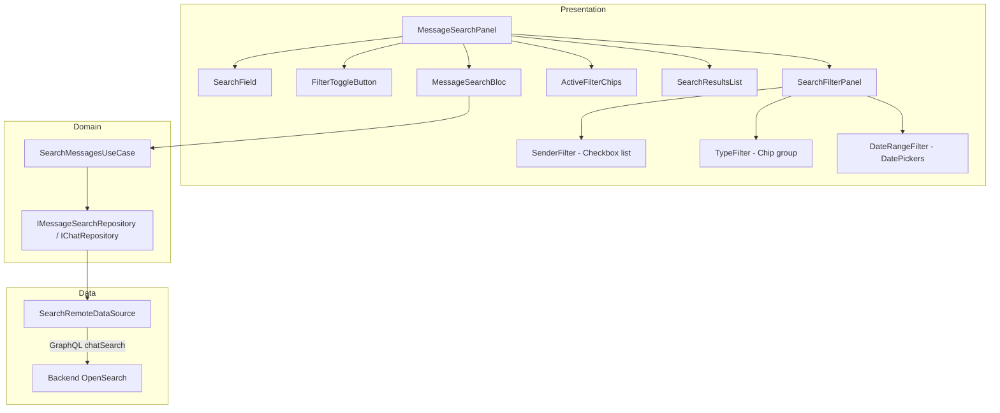
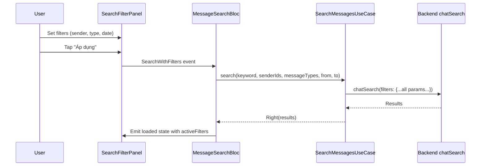

# Tài liệu Thiết kế — Advanced Search Filters UI

## Tổng quan

Mở rộng `MessageSearchBloc` và `message_search_panel.dart` để hỗ trợ filter theo sender, message type, và date range. Backend `chatSearch` đã hỗ trợ đầy đủ — chỉ cần truyền thêm parameters. Tận dụng: `MessageSearchBloc` hiện có, `ChatQueries.searchMessages` đã có đầy đủ filter fields, `SearchMessagesUseCase` hiện có.

### Quyết định thiết kế chính

| Quyết định | Lựa chọn | Lý do |
|---|---|---|
| Filter state | Thêm vào `MessageSearchBloc` state | Giữ filter state cùng search state, đơn giản |
| Filter UI | Expandable panel dưới search field | Không chiếm nhiều không gian, toggle show/hide |
| Sender picker | Checkbox list từ conversation members | Đơn giản, data đã có sẵn |
| Type filter | Chip group multi-select | Trực quan, dễ dùng |
| Date picker | `AppDatePicker` x2 | Tái sử dụng design system component |
| Active filters | Chip row với nút xoá | Pattern phổ biến, dễ hiểu |

## Kiến trúc



### Luồng dữ liệu



## Thành phần và Giao diện

### 1. `SearchFilters` Value Object (Domain)

Đặt tại: `lib/domain/entities/search_filters.dart`

```dart
class SearchFilters {
  final List<String> senderIds;
  final List<String> messageTypes;
  final DateTime? fromDate;
  final DateTime? toDate;

  const SearchFilters({
    this.senderIds = const [],
    this.messageTypes = const [],
    this.fromDate,
    this.toDate,
  });

  bool get isEmpty => senderIds.isEmpty && messageTypes.isEmpty && fromDate == null && toDate == null;
  bool get isNotEmpty => !isEmpty;

  SearchFilters copyWith({...});

  /// Số lượng active filters
  int get activeCount {
    int count = 0;
    if (senderIds.isNotEmpty) count++;
    if (messageTypes.isNotEmpty) count++;
    if (fromDate != null || toDate != null) count++;
    return count;
  }
}
```

### 2. Mở rộng `MessageSearchEvent`

```dart
// Thêm event mới
class SearchWithFilters extends MessageSearchEvent {
  final String keyword;
  final String? conversationId;
  final SearchFilters filters;
  const SearchWithFilters({
    required this.keyword,
    this.conversationId,
    this.filters = const SearchFilters(),
  });
}

class UpdateFilters extends MessageSearchEvent {
  final SearchFilters filters;
  const UpdateFilters({required this.filters});
}

class ClearFilters extends MessageSearchEvent {
  const ClearFilters();
}
```

### 3. Mở rộng `MessageSearchState`

Thêm `activeFilters` vào loaded state:

```dart
// Trong _Loaded state, thêm:
final SearchFilters activeFilters;
```

### 4. Mở rộng `SearchMessagesUseCase`

Thêm parameters cho filters:

```dart
Future<Either<Failure, List<SearchResult>>> call({
  required String keyword,
  String? conversationId,
  List<String>? senderIds,
  List<String>? messageTypes,
  DateTime? fromDate,
  DateTime? toDate,
  int? limit,
});
```

### 5. Mở rộng Search Remote DataSource

Truyền thêm filter variables trong GraphQL query:

```dart
final variables = <String, dynamic>{
  'filters': {
    'keyword': keyword,
    if (conversationId != null) 'conversationIds': [conversationId],
    if (senderIds != null && senderIds.isNotEmpty) 'senderIds': senderIds,
    if (messageTypes != null && messageTypes.isNotEmpty) 'messageTypes': messageTypes,
    if (fromDate != null) 'from': fromDate.millisecondsSinceEpoch.toDouble(),
    if (toDate != null) 'to': toDate.millisecondsSinceEpoch.toDouble(),
    'page': page,
    'size': size,
  },
};
```

### 6. `SearchFilterPanel` Widget (Presentation)

Đặt tại: `lib/features/chat/presentation/widgets/search/search_filter_panel.dart`

```dart
class SearchFilterPanel extends BaseStatefulWidget {
  const SearchFilterPanel({
    super.key,
    required this.members,
    required this.currentFilters,
    required this.onApply,
    required this.onClear,
  });

  final List<ConversationMember> members;
  final SearchFilters currentFilters;
  final ValueChanged<SearchFilters> onApply;
  final VoidCallback onClear;

  /// Layout:
  /// [Sender Filter - expandable section]
  ///   AppCheckbox list với AppAvatar + AppText
  /// [Type Filter]
  ///   Wrap of AppChip (multi-select)
  /// [Date Range]
  ///   Row: AppDatePicker "Từ ngày" | AppDatePicker "Đến ngày"
  /// [Buttons]
  ///   Row: AppButton "Xoá bộ lọc" | AppButton "Áp dụng"
}
```

### 7. `ActiveFilterChips` Widget (Presentation)

Đặt tại: `lib/features/chat/presentation/widgets/search/active_filter_chips.dart`

```dart
class ActiveFilterChips extends BaseStatelessWidget {
  const ActiveFilterChips({
    super.key,
    required this.filters,
    required this.members,
    required this.onRemoveFilter,
  });

  final SearchFilters filters;
  final List<ConversationMember> members;
  final ValueChanged<SearchFilters> onRemoveFilter;

  /// Hiển thị Wrap of AppChip:
  /// - "Người gửi: Nguyễn A, Trần B" (với nút x)
  /// - "Loại: Hình ảnh, Video" (với nút x)
  /// - "Từ 01/01/2025 đến 31/01/2025" (với nút x)
}
```

### 8. Cập nhật `message_search_panel.dart`

- Thêm filter toggle button (icon filter) cạnh search field
- Thêm `SearchFilterPanel` (expandable, show/hide)
- Thêm `ActiveFilterChips` row dưới search field
- Kết nối với `MessageSearchBloc` events

### 9. Message Type Mapping

```dart
const messageTypeDisplayMap = {
  'TEXT': 'Văn bản',      // context.l10n.messageTypeText
  'IMAGE': 'Hình ảnh',    // context.l10n.messageTypeImage
  'VIDEO': 'Video',       // context.l10n.messageTypeVideo
  'DOC': 'Tài liệu',     // context.l10n.messageTypeDocument
  'VOICE_NOTE': 'Tin nhắn thoại', // context.l10n.messageTypeVoiceNote
  'STICKER': 'Sticker',   // context.l10n.messageTypeSticker
  'AUDIO': 'Âm thanh',    // context.l10n.messageTypeAudio
};
```

## Mô hình Dữ liệu

### SearchFilters

```dart
class SearchFilters {
  final List<String> senderIds;      // UUID list
  final List<String> messageTypes;   // Backend enum values: TEXT, IMAGE, etc.
  final DateTime? fromDate;
  final DateTime? toDate;
}
```

### GraphQL Variables (mở rộng)

```json
{
  "filters": {
    "keyword": "hello",
    "conversationIds": ["conv_123"],
    "senderIds": ["user_1", "user_2"],
    "messageTypes": ["IMAGE", "VIDEO"],
    "from": 1704067200000,
    "to": 1706745600000,
    "page": 0,
    "size": 50
  }
}
```

## Correctness Properties

Không có thuật toán phức tạp. Filter logic là pass-through đến backend.

## Xử lý Lỗi

| Tình huống | Xử lý |
|---|---|
| Search với filters thất bại | Hiển thị error state giống search thường |
| Date range không hợp lệ (from > to) | Disable nút "Áp dụng", hiển thị validation error |
| Không có kết quả với filters | Hiển thị empty state với gợi ý xoá bớt filters |
| Members list rỗng | Ẩn Sender_Filter section |

## Chiến lược Testing

### Unit Tests

| Test | Mô tả |
|---|---|
| MessageSearchBloc — SearchWithFilters | Verify filters được truyền đến use case |
| MessageSearchBloc — ClearFilters | Verify filters reset, search lại |
| MessageSearchBloc — LoadMore giữ filters | Verify pagination giữ nguyên filters |
| SearchFilters — activeCount | Verify đếm đúng số active filters |
| SearchFilters — isEmpty | Verify logic isEmpty/isNotEmpty |

### Widget Tests

| Test | Mô tả |
|---|---|
| SearchFilterPanel — hiển thị sections | Verify sender, type, date sections |
| SearchFilterPanel — apply filters | Verify callback với đúng filters |
| ActiveFilterChips — hiển thị chips | Verify chips cho mỗi active filter |
| ActiveFilterChips — remove chip | Verify callback xoá đúng filter |
| Date validation — from > to | Verify nút apply bị disable |
