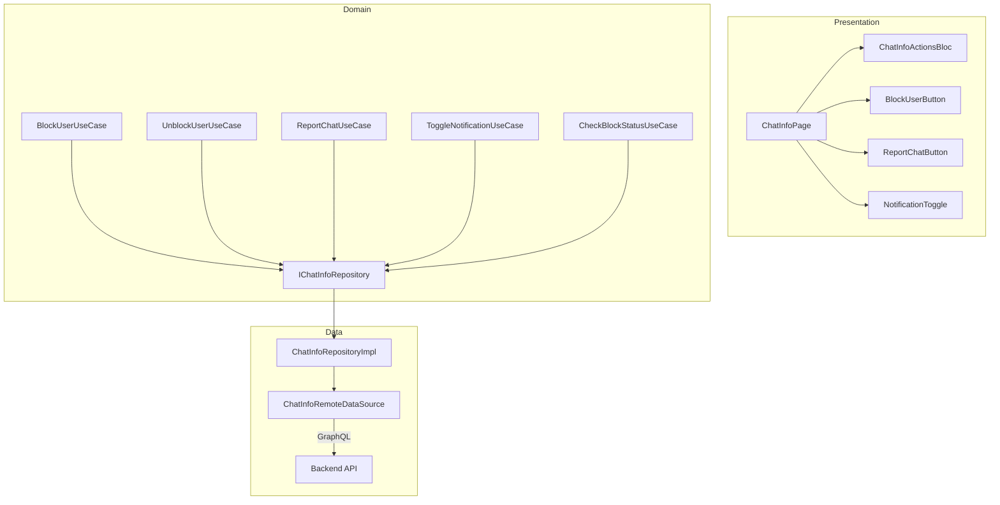

# Tài liệu Thiết kế — Block/Unblock User, Report Chat, Notification Settings

## Tổng quan

Implement các TODO stubs trong `ChatInfoRemoteDataSource`, thêm GraphQL operations, tạo BLoC xử lý actions, và cập nhật Chat Info Page UI. Tận dụng tối đa: `IChatInfoRepository` interface đã có, `NotificationSettingsModel` đã có, `ChatInfoRemoteDataSource` structure đã có.

### Quyết định thiết kế chính

| Quyết định | Lựa chọn | Lý do |
|---|---|---|
| BLoC | Tạo `ChatInfoActionsBloc` riêng | Tách biệt khỏi ChatInfoBloc hiện có (shared media), single responsibility |
| API calls | GraphQL mutations | Nhất quán với toàn bộ app, backend là GraphQL-first |
| Block state | Check on page open + cache | Tránh gọi API mỗi lần render |
| Report cooldown | Local SharedPreferences | Đơn giản, không cần backend support |
| Notification toggle | Optimistic update + revert on fail | UX mượt mà |

## Kiến trúc



## Thành phần và Giao diện

### 1. GraphQL Operations mới

Thêm vào `chat_operations.dart` hoặc tạo `chat_info_operations.dart`:

```dart
class ChatInfoMutations {
  static const String blockUser = r'''
    mutation BlockUser($userId: String!) {
      chatBlockUser(userId: $userId)
    }
  ''';

  static const String unblockUser = r'''
    mutation UnblockUser($userId: String!) {
      chatUnblockUser(userId: $userId)
    }
  ''';

  static const String isUserBlocked = r'''
    query IsUserBlocked($userId: String!) {
      chatIsUserBlocked(userId: $userId)
    }
  ''';

  static const String reportChat = r'''
    mutation ReportChat($arguments: ChatReportInput!) {
      chatReport(arguments: $arguments)
    }
  ''';

  static const String updateNotificationSettings = r'''
    mutation UpdateNotificationSettings($arguments: ChatNotificationSettingsInput!) {
      chatUpdateNotificationSettings(arguments: $arguments) {
        conversationId
        isMuted
      }
    }
  ''';

  static const String getNotificationSettings = r'''
    query GetNotificationSettings($conversationId: String!) {
      chatNotificationSettings(conversationId: $conversationId) {
        conversationId
        isMuted
      }
    }
  ''';
}
```

**Lưu ý:** Cần xác nhận tên mutation/query chính xác với backend team. Nếu backend chưa có API riêng cho block/report, cần coordinate với backend để thêm.

### 2. Implement `ChatInfoRemoteDataSource`

Thay thế tất cả TODO stubs bằng GraphQL calls thực tế:

```dart
@override
Future<void> blockUser({required String userId}) async {
  try {
    await _graphqlClient.mutate(
      ChatInfoMutations.blockUser,
      variables: {'userId': userId},
      operationName: 'BlockUser',
    );
  } catch (e) {
    throw ServerException(message: 'Failed to block user: $e');
  }
}
// ... tương tự cho unblockUser, isUserBlocked, reportChat, notification settings
```

### 3. `ChatInfoActionsBloc` (Presentation)

Đặt tại: `lib/presentation/blocs/chat_info/chat_info_actions_bloc.dart`

```dart
@injectable
class ChatInfoActionsBloc extends BaseBloc<ChatInfoActionsEvent, ChatInfoActionsState> {
  final IChatInfoRepository _repository;
  final AppLogger _logger;

  // Events: CheckBlockStatus, BlockUser, UnblockUser, ReportChat,
  //         LoadNotificationSettings, ToggleNotification
  // States: initial, loading, loaded(isBlocked, isMuted), error
}
```

### 4. `ChatInfoActionsState` (Presentation)

```dart
@freezed
class ChatInfoActionsState extends BaseState with _$ChatInfoActionsState {
  const factory ChatInfoActionsState.initial() = _Initial;
  const factory ChatInfoActionsState.loading() = _Loading;
  const factory ChatInfoActionsState.loaded({
    required bool isBlocked,
    required bool isMuted,
    @Default(false) bool isBlockLoading,
    @Default(false) bool isReportLoading,
    @Default(false) bool isNotificationLoading,
  }) = _Loaded;
  const factory ChatInfoActionsState.error({required String message}) = _Error;
}
```

### 5. UI Components trong Chat Info Page

```dart
// Block/Unblock button
AppButton(
  label: state.isBlocked ? context.l10n.unblockUser : context.l10n.blockUser,
  onPressed: () => _handleBlockToggle(context, state.isBlocked),
  // Chỉ hiển thị cho direct chat
)

// Report button
AppButton(
  label: context.l10n.reportChat,
  onPressed: () => _showReportDialog(context),
)

// Notification toggle
AppSwitch(
  value: state.isMuted,
  onChanged: (value) => bloc.add(ToggleNotification(isMuted: value)),
  label: context.l10n.muteNotifications,
)
```

### 6. Report Dialog

```dart
/// Dialog chọn lý do report
class ReportChatDialog {
  static Future<String?> show(BuildContext context) {
    // AppModalBottomSheet với danh sách lý do
    // Radio buttons: spam, harassment, inappropriate, other
    // Nếu "other" → hiển thị AppTextArea
    // Nút submit
  }
}
```

## Mô hình Dữ liệu

### Entities hiện có (không thay đổi)

```dart
// NotificationSettings — đã có chatId, isMuted
// NotificationSettingsModel — đã có fromJson
```

### Events mới

```dart
// ChatInfoActionsEvent
class CheckBlockStatus extends ChatInfoActionsEvent { final String userId; }
class BlockUser extends ChatInfoActionsEvent { final String userId; }
class UnblockUser extends ChatInfoActionsEvent { final String userId; }
class ReportChat extends ChatInfoActionsEvent { final String chatId; final String reason; }
class LoadNotificationSettings extends ChatInfoActionsEvent { final String chatId; }
class ToggleNotification extends ChatInfoActionsEvent { final String chatId; final bool isMuted; }
```

## Correctness Properties

Tính năng này chủ yếu là CRUD operations. Không có thuật toán phức tạp.

No testable properties identified. All acceptance criteria are best validated through example-based tests.

## Xử lý Lỗi

| Tình huống | Xử lý |
|---|---|
| Block API thất bại | Hiển thị `AppSnackBar` lỗi, giữ nguyên trạng thái |
| Unblock API thất bại | Hiển thị `AppSnackBar` lỗi, giữ nguyên trạng thái |
| Report API thất bại | Hiển thị `AppSnackBar` lỗi, cho phép thử lại |
| Notification toggle thất bại | Revert switch, hiển thị `AppSnackBar` lỗi |
| Check block status thất bại | Default isBlocked = false, log warning |
| Network offline | Hiển thị thông báo offline, disable actions |

## Chiến lược Testing

### Unit Tests

| Test | Mô tả |
|---|---|
| ChatInfoActionsBloc — BlockUser success | Verify state chuyển sang isBlocked = true |
| ChatInfoActionsBloc — BlockUser failure | Verify error state, isBlocked không đổi |
| ChatInfoActionsBloc — UnblockUser | Verify state chuyển sang isBlocked = false |
| ChatInfoActionsBloc — ToggleNotification | Verify optimistic update + revert on fail |
| ChatInfoActionsBloc — ReportChat | Verify success state |
| ChatInfoRemoteDataSource — blockUser | Verify GraphQL mutation được gọi đúng |

### Widget Tests

| Test | Mô tả |
|---|---|
| Block button — direct chat | Verify hiển thị nút block |
| Block button — group chat | Verify không hiển thị nút block |
| Report dialog — chọn lý do | Verify radio buttons và submit |
| Notification toggle — toggle | Verify switch state thay đổi |
