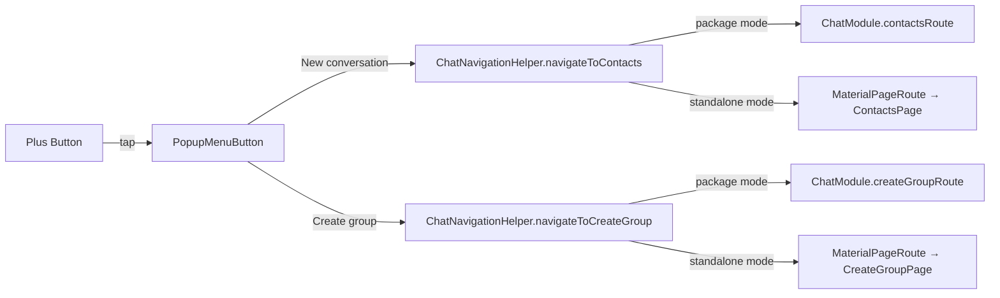

# Design Document: Chat List Actions

## Overview

Tính năng này thêm nút "+" vào AppBar (mobile) và header (panel/tablet) của màn hình danh sách chat, thay thế FAB và PopupMenuButton hiện tại. Khi nhấn, nút hiển thị popup menu với hai tùy chọn: "Thêm cuộc hội thoại" (điều hướng đến ContactsPage) và "Tạo nhóm mới" (điều hướng đến CreateGroupPage).

Đây là thay đổi thuần presentation layer — không cần BLoC, repository, hay domain layer mới. Thay đổi chính gồm:
- Cập nhật UI trên `ChatListPage` và `ChatListPanel`
- Thêm `navigateToContacts` vào `ChatNavigationHelper`
- Thêm `contactsRoute()` vào `ChatModule`
- Thêm chuỗi l10n `newConversation`

## Architecture

Tính năng này chỉ ảnh hưởng đến presentation layer và navigation infrastructure. Không có data flow mới — chỉ là UI trigger dẫn đến navigation action.



### Affected Files

| File | Change |
|---|---|
| `chat_list_page.dart` | Remove FAB + PopupMenuButton, add "+" IconButton in AppBar actions |
| `chat_list_panel.dart` | Add "+" IconButton in header Row after search |
| `chat_navigation_helper.dart` | Add `navigateToContacts` + `contactsRoute` methods |
| `chat_module.dart` | Add `contactsRoute()` + `contactsPage()` methods |
| `app_en.arb` | Add `newConversation` key |
| `app_vi.arb` | Add `newConversation` key |

## Components and Interfaces

### 1. Plus Button + Action Menu (shared pattern)

Cả `ChatListPage` và `ChatListPanel` sẽ sử dụng cùng một pattern: `PopupMenuButton<String>` với icon `Icons.add`, chứa hai `PopupMenuItem`.

```dart
PopupMenuButton<String>(
  icon: const Icon(Icons.add),
  onSelected: (value) {
    switch (value) {
      case 'newConversation':
        ChatNavigationHelper.navigateToContacts(context);
      case 'newGroup':
        ChatNavigationHelper.navigateToCreateGroup(context);
    }
  },
  itemBuilder: (context) => [
    PopupMenuItem(
      value: 'newConversation',
      child: AppText(context.l10n.newConversation),
    ),
    PopupMenuItem(
      value: 'newGroup',
      child: AppText(context.l10n.createNewGroup),
    ),
  ],
)
```

### 2. ChatNavigationHelper — `navigateToContacts`

Thêm method mới theo đúng pattern của `navigateToCreateGroup`:

```dart
static Future<void> navigateToContacts(BuildContext context) {
  if (isPackageMode) {
    return Navigator.push(context, ChatModule.contactsRoute());
  } else {
    return Navigator.push(
      context,
      MaterialPageRoute(
        builder: (_) => const ContactsPage(),
        settings: const RouteSettings(name: '/chat/contacts'),
      ),
    );
  }
}

static Route<dynamic> contactsRoute() {
  if (isPackageMode) {
    return ChatModule.contactsRoute();
  } else {
    return MaterialPageRoute(
      builder: (_) => const ContactsPage(),
      settings: const RouteSettings(name: '/chat/contacts'),
    );
  }
}
```

### 3. ChatModule — `contactsRoute` + `contactsPage`

Thêm route builder và page widget theo pattern hiện có:

```dart
static Widget contactsPage() {
  _ensureInitialized();
  return const _ChatPackageWrapper(child: ContactsPage());
}

static Route<dynamic> contactsRoute() {
  _ensureInitialized();
  return MaterialPageRoute<void>(
    builder: (_) => const _ChatPackageWrapper(child: ContactsPage()),
    settings: const RouteSettings(name: '/chat/contacts'),
  );
}
```

### 4. ChatListPage Changes

- Remove `floatingActionButton` from Scaffold
- Remove `PopupMenuButton<String>` from AppBar actions
- Add Plus Button PopupMenuButton in AppBar actions after search IconButton
- Settings navigation remains via BottomNavigationBar (index 2)

### 5. ChatListPanel Changes

- Add Plus Button PopupMenuButton in header Row after search IconButton

### 6. Localization

```json
// app_en.arb
"newConversation": "New conversation"

// app_vi.arb
"newConversation": "Thêm cuộc hội thoại"
```

## Data Models

Không có data model mới. Tính năng này chỉ sử dụng các entity và model hiện có. Navigation actions không yêu cầu truyền data mới giữa các trang.


## Correctness Properties

*A property is a characteristic or behavior that should hold true across all valid executions of a system — essentially, a formal statement about what the system should do. Properties serve as the bridge between human-readable specifications and machine-verifiable correctness guarantees.*

Tính năng này là thay đổi thuần UI/navigation — không có data transformation, serialization, hay algorithmic logic. Tất cả acceptance criteria đều là example-based (kiểm tra widget cụ thể, navigation outcome cụ thể). Không có universal quantification nào áp dụng được.

No testable properties identified for this feature. All acceptance criteria are best validated through example-based widget tests and integration tests.

## Error Handling

Tính năng này có rủi ro lỗi thấp vì chỉ thêm UI elements và navigation calls. Các trường hợp lỗi:

| Scenario | Handling |
|---|---|
| `ChatModule` chưa initialized khi navigate (package mode) | `_ensureInitialized()` trong ChatModule throw `StateError` — đây là behavior hiện có, không cần thay đổi |
| Navigation fail (route not found) | Flutter framework tự handle — không cần custom error handling |
| l10n key missing | Build-time error từ `flutter gen-l10n` — caught during development |

Không cần thêm error handling mới. Các pattern hiện có đã đủ.

## Testing Strategy

### Widget Tests (Example-based)

Vì không có correctness properties, testing strategy tập trung vào widget tests và integration tests:

1. **ChatListPage — Plus Button hiển thị đúng vị trí**
   - Verify Icons.add xuất hiện trong AppBar actions
   - Verify FloatingActionButton không còn tồn tại
   - Verify PopupMenuButton cũ (three-dot) không còn tồn tại
   - Validates: Requirements 1.1, 1.2, 1.3

2. **ChatListPanel — Plus Button hiển thị đúng vị trí**
   - Verify Icons.add xuất hiện trong header Row
   - Validates: Requirements 2.1

3. **Action Menu — hiển thị đúng options**
   - Tap Plus Button trên ChatListPage, verify popup có 2 items với text từ l10n
   - Tap Plus Button trên ChatListPanel, verify popup có 2 items giống nhau
   - Validates: Requirements 3.1, 3.3

4. **Navigation — New Conversation**
   - Select "New conversation" từ menu, verify ChatNavigationHelper.navigateToContacts được gọi
   - Validates: Requirements 4.1

5. **Navigation — Create Group**
   - Select "Create group" từ menu, verify ChatNavigationHelper.navigateToCreateGroup được gọi
   - Validates: Requirements 5.1

6. **ChatNavigationHelper.navigateToContacts**
   - Test package mode: verify sử dụng ChatModule.contactsRoute()
   - Test standalone mode: verify sử dụng MaterialPageRoute trực tiếp đến ContactsPage
   - Validates: Requirements 4.2, 8.1, 8.2, 8.3

7. **Settings vẫn accessible**
   - Verify BottomNavigationBar có settings tab tại index 2
   - Validates: Requirements 6.1

8. **Localization keys tồn tại**
   - Verify `newConversation` key có trong cả app_en.arb và app_vi.arb
   - Validates: Requirements 7.1, 7.2

### Test Framework

- Widget tests: `flutter_test` package với `WidgetTester`
- Mock navigation: `mocktail` package để mock `NavigatorObserver`
- No property-based testing needed — feature has no universal properties
