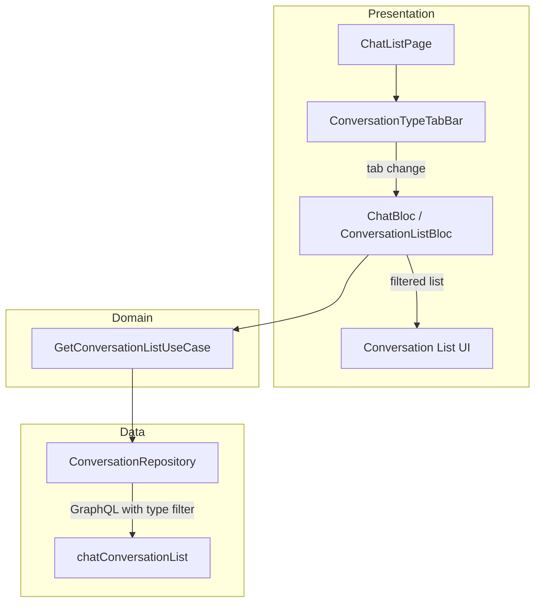

# Tài liệu Thiết kế — Conversation Type Tab Filter

## Tổng quan

Thêm tab bar "Tất cả | Cá nhân | Nhóm" vào chat list page/panel. Mở rộng conversation list BLoC để truyền filter `type` khi gọi API. Tận dụng: `ChatQueries.getConversationList` đã có field `type`, `Chat` entity đã có `type` field.

### Quyết định thiết kế chính

| Quyết định | Lựa chọn | Lý do |
|---|---|---|
| Tab implementation | `TabBar` + `TabBarView` hoặc custom chips | Chips đơn giản hơn, không cần separate views |
| State management | Mở rộng ChatBloc/ConversationListBloc | Giữ conversation state tập trung |
| Cache per tab | Separate list per tab type trong state | Chuyển tab nhanh, không fetch lại |
| API call | Truyền `type` filter trong existing query | Backend đã hỗ trợ, không cần API mới |
| Default tab | "Tất cả" (no filter) | Behavior hiện tại, không breaking change |

## Kiến trúc



## Thành phần và Giao diện

### 1. `ConversationTypeFilter` Enum (Domain)

Đặt tại: `lib/domain/entities/conversation_type_filter.dart` (hoặc thêm vào entity hiện có)

```dart
enum ConversationTypeFilter {
  all,     // Không filter
  direct,  // type: "Direct"
  group,   // type: "Group"
}

extension ConversationTypeFilterExtension on ConversationTypeFilter {
  /// Convert sang backend API value
  String? get apiValue {
    switch (this) {
      case ConversationTypeFilter.all: return null;
      case ConversationTypeFilter.direct: return 'Direct';
      case ConversationTypeFilter.group: return 'Group';
    }
  }
}
```

### 2. Mở rộng Conversation List BLoC

Thêm event và state:

```dart
// Event
class ChangeConversationTypeFilter extends ChatEvent {
  final ConversationTypeFilter filter;
  const ChangeConversationTypeFilter({required this.filter});
}

// State — thêm fields:
final ConversationTypeFilter activeFilter; // default: all
final Map<ConversationTypeFilter, List<Chat>> cachedLists; // cache per tab
```

Handler:
1. Nếu cache có data cho filter mới → emit ngay
2. Nếu không → emit loading → fetch với type filter → cache + emit

### 3. Mở rộng API call

Trong repository/datasource, truyền `type` filter:

```dart
final variables = {
  'filters': {
    'size': pageSize,
    'page': page,
    if (keyword != null) 'keyword': keyword,
    if (typeFilter != null) 'type': typeFilter, // "Direct" hoặc "Group"
  },
};
```

### 4. `ConversationTypeTabBar` Widget (Presentation)

Đặt tại: `lib/features/chat/presentation/widgets/chat/conversation_type_tab_bar.dart`

```dart
class ConversationTypeTabBar extends BaseStatelessWidget {
  const ConversationTypeTabBar({
    super.key,
    required this.activeFilter,
    required this.onFilterChanged,
  });

  final ConversationTypeFilter activeFilter;
  final ValueChanged<ConversationTypeFilter> onFilterChanged;

  @override
  Widget buildContent(BuildContext context) {
    // Row of 3 AppChip/ChoiceChip:
    // "Tất cả" | "Cá nhân" | "Nhóm"
    // Active chip highlighted with AppColors.primary
    // Sử dụng AppDimens cho spacing
    // context.l10n cho labels
  }
}
```

### 5. Tích hợp vào ChatListPage và ChatListPanel

- Đặt `ConversationTypeTabBar` dưới AppBar/header, trên list
- `BlocBuilder` cho `activeFilter` state
- Kết nối `onFilterChanged` → `bloc.add(ChangeConversationTypeFilter(filter))`

### 6. Pagination per Tab

Mỗi tab có pagination state riêng:

```dart
final Map<ConversationTypeFilter, int> _currentPages; // page per tab
final Map<ConversationTypeFilter, bool> _hasMore;     // hasMore per tab
```

Pull-to-refresh: reset page cho tab hiện tại, fetch lại.
Load more: increment page cho tab hiện tại.

## Mô hình Dữ liệu

### GraphQL Variables (mở rộng)

```json
{
  "filters": {
    "size": 25,
    "page": 0,
    "type": "Direct"
  }
}
```

### State mở rộng

```dart
// Thêm vào conversation list state:
final ConversationTypeFilter activeFilter;
// Cache: Map<ConversationTypeFilter, List<Chat>>
```

## Correctness Properties

Không có thuật toán phức tạp. Simple filter pass-through.

## Xử lý Lỗi

| Tình huống | Xử lý |
|---|---|
| Fetch filtered list thất bại | Hiển thị error state cho tab đó, giữ cache tabs khác |
| Chuyển tab khi đang loading | Cancel request cũ, fetch cho tab mới |
| Empty list cho tab | Hiển thị empty state phù hợp ("Không có chat cá nhân" / "Không có nhóm") |

## Chiến lược Testing

### Unit Tests

| Test | Mô tả |
|---|---|
| BLoC — ChangeConversationTypeFilter | Verify API gọi với đúng type filter |
| BLoC — cache hit | Verify không gọi API khi cache có data |
| BLoC — pagination per tab | Verify page state riêng cho mỗi tab |
| ConversationTypeFilter — apiValue | Verify mapping đúng |

### Widget Tests

| Test | Mô tả |
|---|---|
| ConversationTypeTabBar — hiển thị 3 tabs | Verify labels đúng |
| ConversationTypeTabBar — active state | Verify tab active highlighted |
| ConversationTypeTabBar — tap | Verify callback với đúng filter |
| ChatListPage — tab integration | Verify list thay đổi khi chuyển tab |
