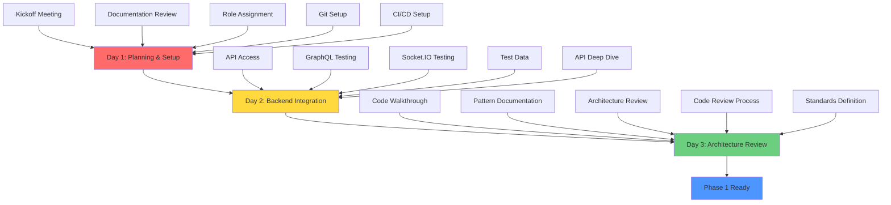

# Design Document - Foundation Setup (Phase 0)

## Overview

Phase 0: Foundation Setup is a critical 3-day pre-implementation phase that establishes the foundation for successful development of the Sharitek Office Chat application. This phase is not about building features but about ensuring the team is aligned, equipped, and ready to execute the 8-week implementation plan.

### Goals

1. **Team Readiness**: Ensure all team members understand the architecture, their roles, and the implementation strategy
2. **Environment Readiness**: Configure all development environments with required tools and access
3. **Integration Readiness**: Verify backend API connectivity and understand available operations
4. **Process Readiness**: Establish code quality standards, review processes, and CI/CD automation
5. **Knowledge Transfer**: Ensure the team understands Clean Architecture, BLoC pattern, and offline-first principles

### Success Criteria

- All team members can explain the project architecture and their role
- All development environments pass verification checks
- Backend API is accessible and tested from all developer machines
- CI/CD pipeline is configured and tested
- Code quality standards are documented and enforced
- Team is ready to start Phase 1 implementation

## Architecture

### Setup Workflow

The Phase 0 setup follows a 3-day sequential workflow with dependencies:



### Dependencies

**Day 1 Dependencies:**
- None (starting point)
- Requires: Project documentation, team availability

**Day 2 Dependencies:**
- Requires: Day 1 complete (team aligned, Git configured)
- Requires: Backend API credentials
- Requires: Network access to backend services

**Day 3 Dependencies:**
- Requires: Day 1 & 2 complete
- Requires: Access to codebase
- Requires: Understanding of backend API

### Critical Path

The critical path for Phase 0 is sequential:
1. Team alignment (Day 1) → Enables parallel work in later phases
2. Backend access (Day 2) → Blocks all API integration work
3. Architecture understanding (Day 3) → Blocks correct implementation

## Components and Interfaces

### Team Roles and Responsibilities

**Backend Integration Team (2 developers)**
- Responsibilities:
  - Verify GraphQL operations against backend
  - Test Socket.IO connectivity
  - Document API endpoints and schemas
  - Prepare test data and test accounts
- Skills Required: Flutter, GraphQL, REST APIs, WebSockets
- Phase 0 Tasks: API verification, GraphQL playground setup, Socket.IO testing

**Domain Logic Team (2 developers)**
- Responsibilities:
  - Understand repository pattern
  - Review existing UseCases structure
  - Understand Clean Architecture layers
  - Document domain patterns
- Skills Required: Flutter, Clean Architecture, Domain-Driven Design
- Phase 0 Tasks: Architecture review, pattern documentation, code walkthrough

**Real-time Team (1 developer)**
- Responsibilities:
  - Test Socket.IO events
  - Understand real-time sync patterns
  - Review offline queue implementation
  - Document event handlers
- Skills Required: Flutter, Socket.IO, Real-time systems, State management
- Phase 0 Tasks: Socket.IO testing, event documentation, sync review

**UI/UX Team (1 developer)**
- Responsibilities:
  - Review existing UI components
  - Understand BLoC pattern usage
  - Document UI patterns and conventions
  - Review responsive design approach
- Skills Required: Flutter, UI/UX, BLoC pattern, Responsive design
- Phase 0 Tasks: UI review, BLoC pattern study, component documentation

**QA/DevOps (0.5 developer - shared)**
- Responsibilities:
  - Configure CI/CD pipeline
  - Setup test environment
  - Document testing strategy
  - Establish quality gates
- Skills Required: CI/CD, Testing, DevOps, Automation
- Phase 0 Tasks: CI/CD setup, test environment verification, quality gate definition

### Tools and Systems

**Development Tools:**
- Flutter SDK (latest stable)
- Dart SDK (latest stable)
- Android Studio / VS Code with Flutter extensions
- Git with SSH keys configured
- build_runner for code generation
- flutter_gen for localization

**Backend Systems:**
- NestJS GraphQL API (production/staging endpoints)
- GraphQL Playground (interactive testing)
- Socket.IO Gateway (WebSocket server)
- PostgreSQL database (test environment)
- Redis (caching and pub/sub)

**CI/CD Tools:**
- GitHub Actions / GitLab CI (to be determined)
- Flutter test runner
- Code coverage tools
- Linting and analysis tools

**Documentation Systems:**
- Project documentation repository
- API documentation (GraphQL schema, Socket.IO events)
- Architecture diagrams (Mermaid)
- Code review checklists

### Configuration Files

**Environment Configuration:**
```dart
// lib/core/config/environment.dart
class Environment {
  static const String apiBaseUrl = String.fromEnvironment('API_BASE_URL');
  static const String socketUrl = String.fromEnvironment('SOCKET_URL');
  static const String environment = String.fromEnvironment('ENVIRONMENT');
}
```

**CI/CD Configuration:**
```yaml
# .github/workflows/flutter-ci.yml
name: Flutter CI
on: [push, pull_request]
jobs:
  test:
    runs-on: ubuntu-latest
    steps:
      - uses: actions/checkout@v2
      - uses: subosito/flutter-action@v2
      - run: flutter pub get
      - run: flutter analyze
      - run: flutter test --coverage
```

**Linting Configuration:**
```yaml
# analysis_options.yaml
include: package:flutter_lints/flutter.yaml
analyzer:
  strong-mode:
    implicit-casts: false
    implicit-dynamic: false
  errors:
    missing_required_param: error
    missing_return: error
linter:
  rules:
    - always_declare_return_types
    - avoid_print
    - prefer_const_constructors
    - use_key_in_widget_constructors
```

## Data Models

### Team Member Model

```dart
class TeamMember {
  final String name;
  final String role;
  final List<String> workstreams;
  final Map<String, bool> setupChecklist;
  
  const TeamMember({
    required this.name,
    required this.role,
    required this.workstreams,
    required this.setupChecklist,
  });
}
```

### Environment Verification Model

```dart
class EnvironmentStatus {
  final bool flutterDoctorPassed;
  final bool buildRunnerWorks;
  final bool testsPass;
  final bool i18nGenerates;
  final bool gitConfigured;
  final List<String> missingTools;
  
  const EnvironmentStatus({
    required this.flutterDoctorPassed,
    required this.buildRunnerWorks,
    required this.testsPass,
    required this.i18nGenerates,
    required this.gitConfigured,
    required this.missingTools,
  });
  
  bool get isReady => 
    flutterDoctorPassed &&
    buildRunnerWorks &&
    testsPass &&
    i18nGenerates &&
    gitConfigured &&
    missingTools.isEmpty;
}
```

### API Verification Model

```dart
class APIStatus {
  final bool authenticationWorks;
  final bool graphqlResponds;
  final bool socketConnects;
  final bool testDataAvailable;
  final List<String> failedEndpoints;
  
  const APIStatus({
    required this.authenticationWorks,
    required this.graphqlResponds,
    required this.socketConnects,
    required this.testDataAvailable,
    required this.failedEndpoints,
  });
  
  bool get isReady =>
    authenticationWorks &&
    graphqlResponds &&
    socketConnects &&
    testDataAvailable &&
    failedEndpoints.isEmpty;
}
```

## Correctness Properties

*A property is a characteristic or behavior that should hold true across all valid executions of a system—essentially, a formal statement about what the system should do. Properties serve as the bridge between human-readable specifications and machine-verifiable correctness guarantees.*

For Phase 0, correctness properties are "readiness properties" that verify the team and environment are prepared for implementation. These properties ensure that the foundation is solid before building features.

### Property Reflection

After analyzing all acceptance criteria, I identified several redundant properties that can be consolidated:

- Multiple "knowledge verification" properties (4.2, 4.3, 4.4, 4.6, 8.4, 8.5, 9.2, 9.3, 9.4) can be combined into a single comprehensive "Team Knowledge" property
- Multiple "environment verification" properties (2.1, 2.2, 2.3, 2.4) can be combined into "Environment Completeness" property
- Multiple "access verification" properties (9.1, 9.5, 9.6) can be combined into "Documentation Accessibility" property
- API verification properties (3.1, 3.2, 3.3, 3.4, 3.5) can be combined into "API Connectivity" property

This reduces 54 potential properties to 12 comprehensive properties that provide unique validation value.

### Property 1: Team Knowledge Completeness

*For any* team member, they should be able to explain Clean Architecture layers, BLoC pattern, offline-first architecture, repository pattern, ARB file structure, l10n usage, the 4-phase implementation strategy, available GraphQL operations, and Socket.IO events.

**Validates: Requirements 1.2, 1.4, 4.2, 4.3, 4.4, 4.6, 8.4, 8.5, 9.2, 9.3, 9.4**

### Property 2: Role Clarity

*For any* two team members, their assigned responsibilities should not overlap, and each should be able to articulate their specific role and workstream.

**Validates: Requirements 1.3**

### Property 3: Documentation Accessibility

*For any* team member, they should have read access to all project documentation including master plan, API reference, architecture docs, coding standards, and best practices.

**Validates: Requirements 1.5, 9.1, 9.5, 9.6**

### Property 4: Environment Completeness

*For any* developer's machine, running `flutter doctor`, `dart run build_runner build`, `flutter test`, and `flutter gen-l10n` should all succeed without errors, and all required IDE extensions should be installed.

**Validates: Requirements 2.1, 2.2, 2.3, 2.4, 2.5**

### Property 5: Git Configuration

*For any* developer, Git should be configured with proper credentials and SSH keys, allowing push/pull operations to the repository.

**Validates: Requirements 2.6**

### Property 6: API Connectivity

*For any* developer with valid credentials, they should be able to authenticate to the backend, query GraphQL endpoints, connect to Socket.IO, and execute operations in GraphQL Playground successfully.

**Validates: Requirements 3.1, 3.2, 3.3, 3.4, 3.5**

### Property 7: Pattern Recognition

*For any* team member given a code example with architectural violations, they should be able to identify the violations and explain the correct pattern.

**Validates: Requirements 4.5**

### Property 8: Test Environment Accessibility

*For any* access attempt to the test environment, it should be reachable, responsive, and authenticate successfully with test credentials, returning consistent test data.

**Validates: Requirements 5.1, 5.2, 5.3, 5.4**

### Property 9: CI/CD Automation

*For any* code push to a development branch, the CI/CD pipeline should automatically trigger, execute tests, enforce quality checks, and generate artifacts if tests pass, providing clear error messages on failure.

**Validates: Requirements 6.1, 6.2, 6.3, 6.4, 6.5**

### Property 10: Automated Quality Enforcement

*For any* code submission, automated linting should run and provide clear feedback on violations, enforcing the defined coding standards.

**Validates: Requirements 7.3, 7.4**

### Property 11: i18n Functionality

*For any* supported locale (English or Vietnamese), the i18n system should generate localization files successfully, make new translations available without errors, and display text in the correct language.

**Validates: Requirements 8.1, 8.2, 8.3**

### Property 12: Localization Round-Trip

*For any* new translation key added to ARB files, running `flutter gen-l10n` then accessing the translation via `context.l10n` should return the correct translated text.

**Validates: Requirements 8.2, 8.5**

## Error Handling

### Setup Failure Scenarios

**Environment Setup Failures:**
- **Symptom**: `flutter doctor` reports errors
- **Cause**: Missing SDK, outdated version, or configuration issues
- **Resolution**: 
  1. Install/update Flutter SDK
  2. Run `flutter doctor --android-licenses`
  3. Configure IDE extensions
  4. Verify PATH environment variables

**API Access Failures:**
- **Symptom**: Cannot authenticate or connect to backend
- **Cause**: Invalid credentials, network restrictions, or backend unavailable
- **Resolution**:
  1. Verify credentials with backend team
  2. Check network connectivity and firewall rules
  3. Verify backend services are running
  4. Use VPN if required for remote access

**Code Generation Failures:**
- **Symptom**: `build_runner` fails with errors
- **Cause**: Syntax errors in models, missing dependencies, or version conflicts
- **Resolution**:
  1. Run `flutter clean`
  2. Run `flutter pub get`
  3. Fix syntax errors in annotated classes
  4. Update dependencies to compatible versions

**CI/CD Configuration Failures:**
- **Symptom**: Pipeline fails to trigger or execute
- **Cause**: Incorrect YAML syntax, missing secrets, or permission issues
- **Resolution**:
  1. Validate YAML syntax
  2. Configure required secrets in CI/CD platform
  3. Verify repository permissions
  4. Test pipeline with minimal configuration first

### Escalation Process

**Level 1: Self-Service (0-30 minutes)**
- Check documentation
- Search error messages
- Review setup guides
- Try common fixes

**Level 2: Team Support (30 minutes - 2 hours)**
- Ask team members in chat
- Pair with another developer
- Review similar setups
- Check team knowledge base

**Level 3: Technical Lead (2-4 hours)**
- Escalate to technical lead
- Schedule debugging session
- Review environment configuration
- Identify systemic issues

**Level 4: External Support (4+ hours)**
- Contact backend team for API issues
- Contact DevOps for CI/CD issues
- Contact vendor support for tool issues
- Document issue for future reference

## Testing Strategy

### Verification Approach

Phase 0 uses **verification checklists** rather than traditional unit tests. Each property is verified through manual checks and automated scripts.

### Verification Checklist

**Team Readiness Verification:**
```bash
# Script: verify_team_readiness.sh
#!/bin/bash

echo "Verifying team readiness..."

# Check if all team members completed onboarding
check_onboarding_completion

# Verify knowledge through quiz or interview
verify_architecture_knowledge

# Confirm role assignments are clear
verify_role_clarity

# Check documentation access
verify_documentation_access

echo "Team readiness: $RESULT"
```

**Environment Verification:**
```bash
# Script: verify_environment.sh
#!/bin/bash

echo "Verifying development environment..."

# Run flutter doctor
flutter doctor -v || exit 1

# Test code generation
dart run build_runner build --delete-conflicting-outputs || exit 1

# Run existing tests
flutter test || exit 1

# Test localization generation
flutter gen-l10n || exit 1

# Verify Git configuration
git config user.name || exit 1
git config user.email || exit 1

echo "Environment verification: PASSED"
```

**API Verification:**
```bash
# Script: verify_api_access.sh
#!/bin/bash

echo "Verifying backend API access..."

# Test authentication
curl -X POST $API_URL/auth/login \
  -H "Content-Type: application/json" \
  -d '{"email":"test@example.com","password":"test123"}' || exit 1

# Test GraphQL endpoint
curl -X POST $API_URL/graphql \
  -H "Content-Type: application/json" \
  -H "Authorization: Bearer $TOKEN" \
  -d '{"query":"{ __schema { types { name } } }"}' || exit 1

# Test Socket.IO connection
node test_socket_connection.js || exit 1

echo "API verification: PASSED"
```

**CI/CD Verification:**
```bash
# Script: verify_cicd.sh
#!/bin/bash

echo "Verifying CI/CD pipeline..."

# Create test branch
git checkout -b test/cicd-verification

# Make trivial change
echo "# CI/CD Test" >> README.md
git add README.md
git commit -m "test: verify CI/CD pipeline"

# Push and verify pipeline triggers
git push origin test/cicd-verification

# Wait for pipeline to complete
wait_for_pipeline_completion

# Verify pipeline passed
check_pipeline_status || exit 1

# Cleanup
git checkout main
git branch -D test/cicd-verification
git push origin --delete test/cicd-verification

echo "CI/CD verification: PASSED"
```

### Acceptance Testing

Each requirement has specific acceptance tests:

**Requirement 1: Team Alignment**
- [ ] All team members attended kickoff meeting
- [ ] Each team member can explain the 4-phase plan
- [ ] Each team member can describe their role
- [ ] No role overlaps identified
- [ ] All team members have access to communication channels

**Requirement 2: Development Environment**
- [ ] `flutter doctor` passes on all machines
- [ ] `build_runner` generates code successfully
- [ ] All existing tests pass
- [ ] Localization generation works
- [ ] IDE extensions installed and configured
- [ ] Git configured with SSH keys

**Requirement 3: Backend API Access**
- [ ] Authentication succeeds with test credentials
- [ ] GraphQL queries return valid responses
- [ ] Socket.IO connection establishes
- [ ] GraphQL Playground accessible
- [ ] API reachable from all developer machines
- [ ] Test accounts and data available

**Requirement 4: Architecture Understanding**
- [ ] Code walkthrough completed and documented
- [ ] Team can explain Clean Architecture layers
- [ ] Team can explain BLoC pattern
- [ ] Team understands offline-first approach
- [ ] Team can identify pattern violations
- [ ] Team understands repository pattern

**Requirement 5: Test Environment**
- [ ] Test environment is reachable
- [ ] Test authentication works
- [ ] Test data is consistent
- [ ] All test scenarios supported
- [ ] Environment is isolated
- [ ] Data reset mechanism works

**Requirement 6: CI/CD Pipeline**
- [ ] Pipeline triggers on code push
- [ ] Tests execute automatically
- [ ] Artifacts generated on success
- [ ] Clear error messages on failure
- [ ] Quality checks enforced
- [ ] Secrets properly managed

**Requirement 7: Code Quality Standards**
- [ ] Coding standards documented
- [ ] Code review checklist created
- [ ] Automated linting configured
- [ ] Clear feedback on violations
- [ ] Performance guidelines documented
- [ ] Security practices documented

**Requirement 8: i18n System**
- [ ] Localization files generate successfully
- [ ] New translations work without errors
- [ ] Correct language displays based on locale
- [ ] Team understands ARB file structure
- [ ] Team understands l10n usage pattern
- [ ] English and Vietnamese supported

**Requirement 9: Documentation**
- [ ] All team members have documentation access
- [ ] Master plan reviewed and understood
- [ ] API documentation reviewed
- [ ] Architecture documentation reviewed
- [ ] Backend API reference accessible
- [ ] Coding standards accessible

### Quality Gates

**Phase 0 Quality Gate:**
- [ ] All team members verified ready (Property 1, 2, 3)
- [ ] All environments verified ready (Property 4, 5)
- [ ] Backend API verified accessible (Property 6)
- [ ] Test environment verified ready (Property 8)
- [ ] CI/CD pipeline verified working (Property 9, 10)
- [ ] i18n system verified working (Property 11, 12)
- [ ] All verification scripts pass
- [ ] No blocking issues identified

**Go/No-Go Decision:**
- ✅ GO: All quality gates passed → Start Phase 1
- ⚠️ CONDITIONAL: Minor issues (1-2 developers need setup help) → Fix in parallel with Phase 1 start
- ❌ NO-GO: Major issues (API inaccessible, multiple environments broken) → Fix before Phase 1

## Implementation Notes

### Day 1: Planning & Setup

**Morning (9:00 AM - 12:00 PM):**
- Kickoff meeting (2 hours)
  - Present master plan
  - Explain 4-phase strategy
  - Discuss architecture principles
  - Q&A session
- Documentation review (1 hour)
  - Review PROJECT_STATUS_ANALYSIS.md
  - Review IMPLEMENTATION_MASTER_PLAN.md
  - Review architecture documentation

**Afternoon (1:00 PM - 5:00 PM):**
- Role assignment (1 hour)
  - Assign workstreams
  - Define responsibilities
  - Identify dependencies
- Git setup (2 hours)
  - Create development branches
  - Configure Git workflow
  - Setup branch protection rules
- CI/CD setup (1 hour)
  - Choose CI/CD platform
  - Configure basic pipeline
  - Test pipeline trigger

### Day 2: Backend Integration Prep

**Morning (9:00 AM - 12:00 PM):**
- API access verification (2 hours)
  - Distribute credentials
  - Test authentication
  - Verify network access
- GraphQL playground setup (1 hour)
  - Access GraphQL endpoint
  - Test sample queries
  - Document available operations

**Afternoon (1:00 PM - 5:00 PM):**
- Socket.IO testing (1.5 hours)
  - Test WebSocket connection
  - Test event emission
  - Document available events
- Test data preparation (1.5 hours)
  - Create test accounts
  - Prepare test data
  - Document test scenarios
- API deep dive (1 hour)
  - Review GraphQL schema
  - Review Socket.IO events
  - Document integration patterns

### Day 3: Architecture Review

**Morning (9:00 AM - 12:00 PM):**
- Code walkthrough (2 hours)
  - Walk through existing code
  - Identify patterns
  - Discuss design decisions
- Pattern documentation (1 hour)
  - Document identified patterns
  - Create pattern examples
  - Document anti-patterns

**Afternoon (1:00 PM - 5:00 PM):**
- Architecture review (1.5 hours)
  - Review Clean Architecture
  - Review BLoC pattern
  - Review offline-first approach
- Code review process (1 hour)
  - Define review workflow
  - Create review checklist
  - Setup review tools
- Standards definition (1.5 hours)
  - Define coding standards
  - Document best practices
  - Configure linting rules

### Success Metrics

**Quantitative Metrics:**
- 100% of team members pass knowledge verification
- 100% of development environments pass verification
- 100% of API endpoints accessible
- 100% of verification scripts pass
- 0 blocking issues remaining

**Qualitative Metrics:**
- Team confidence level: High
- Documentation clarity: Excellent
- Process understanding: Complete
- Tool familiarity: Proficient

## Conclusion

Phase 0 is the foundation upon which the entire 8-week implementation depends. By investing 3 days in thorough preparation, we prevent weeks of delays, integration issues, and architectural misalignments. The correctness properties defined here ensure that every team member and every environment meets the standards required for successful implementation.

Upon completion of Phase 0, the team will be aligned, equipped, and ready to execute Phase 1: Foundation with confidence and efficiency.
