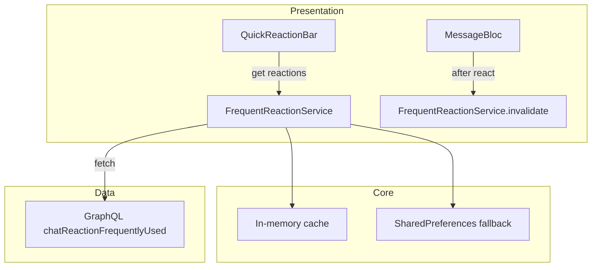

# Tài liệu Thiết kế — Frequently Used Reactions

## Tổng quan

Fetch top reactions từ backend `chatReactionFrequentlyUsed`, cache locally, hiển thị trong quick reaction bar. Tính năng nhỏ, chủ yếu là: 1 GraphQL call, 1 service cache, cập nhật UI reaction bar.

### Quyết định thiết kế chính

| Quyết định | Lựa chọn | Lý do |
|---|---|---|
| Service | `FrequentReactionService` singleton | Cache + stream cho nhiều widgets |
| Cache | In-memory + SharedPreferences fallback | Nhanh, persist qua app restart |
| GraphQL | Dùng mutation hiện có `chatReactionFrequentlyUsed` | Backend đã có, không cần thay đổi |
| Default reactions | `['👍', '❤️', '😂', '😮', '😢', '😡']` | Fallback khi API fail |
| Refetch trigger | Debounced 10s sau khi user react | Tránh gọi API quá nhiều |

## Kiến trúc



## Thành phần và Giao diện

### 1. GraphQL Operation

Thêm vào `chat_operations.dart`:

```dart
class ChatQueries {
  // ... existing queries ...

  static const String getFrequentlyUsedReactions = r'''
    mutation GetFrequentlyUsedReactions {
      chatReactionFrequentlyUsed
    }
  ''';
}
```

### 2. `FrequentReactionService` (Core)

Đặt tại: `lib/core/services/frequent_reaction_service.dart`

```dart
@lazySingleton
class FrequentReactionService {
  final GraphQLClientWrapper _graphqlClient;
  final AppLogger _logger;

  static const _defaultReactions = ['👍', '❤️', '😂', '😮', '😢', '😡'];
  static const _cacheTtl = Duration(minutes: 5);
  static const _refetchDebounce = Duration(seconds: 10);

  List<String> _cachedReactions = _defaultReactions;
  DateTime? _lastFetchTime;
  Timer? _refetchTimer;

  /// Stream cho UI updates
  final _reactionsSubject = BehaviorSubject<List<String>>.seeded(_defaultReactions);
  Stream<List<String>> get reactionsStream => _reactionsSubject.stream;
  List<String> get currentReactions => _cachedReactions;

  /// Fetch từ backend
  Future<void> fetch() async { ... }

  /// Invalidate cache (gọi sau khi user react)
  void invalidateAfterReaction() {
    _refetchTimer?.cancel();
    _refetchTimer = Timer(_refetchDebounce, fetch);
  }

  void dispose() { _refetchTimer?.cancel(); _reactionsSubject.close(); }
}
```

### 3. Cập nhật Quick Reaction Bar

Trong widget hiển thị reaction options trên message:
- Inject `FrequentReactionService`
- `StreamBuilder` trên `reactionsStream`
- Hiển thị top 6 + nút "+"

### 4. Cập nhật `MessageBloc`

Sau khi reaction thành công, gọi `frequentReactionService.invalidateAfterReaction()`.

## Mô hình Dữ liệu

Không có entity mới. Chỉ là `List<String>` (emoji codes).

## Correctness Properties

Không có thuật toán phức tạp. Simple fetch + cache.

## Xử lý Lỗi

| Tình huống | Xử lý |
|---|---|
| API thất bại | Dùng default reactions, log warning |
| API trả về rỗng | Dùng default reactions |
| Network offline | Dùng cached data hoặc default |

## Chiến lược Testing

### Unit Tests

| Test | Mô tả |
|---|---|
| FrequentReactionService — fetch success | Verify cache updated, stream emits |
| FrequentReactionService — fetch fail | Verify default reactions returned |
| FrequentReactionService — cache TTL | Verify refetch sau TTL |
| FrequentReactionService — debounce | Verify chỉ 1 fetch sau nhiều invalidate |
