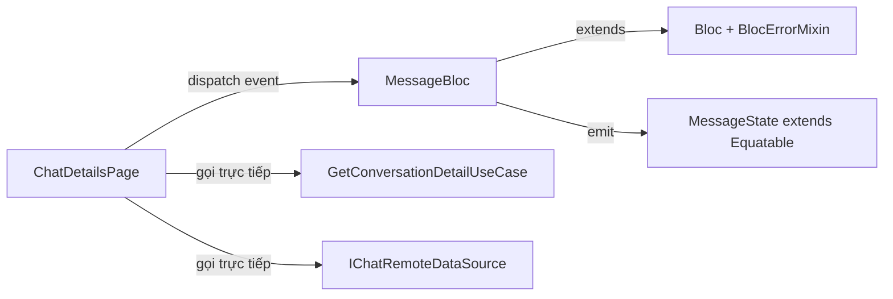
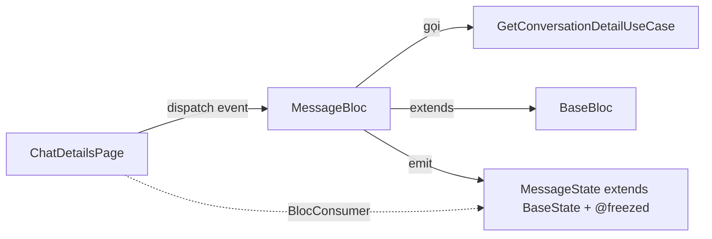

# Design Document — MessageBloc Refactoring

## Tổng quan (Overview)

Tài liệu thiết kế cho việc refactoring MessageBloc (~1497 dòng) và các thành phần liên quan. Mục tiêu chính:

1. **Di chuyển GetConversationDetailUseCase** từ ChatDetailsPage vào MessageBloc — tuân thủ Clean Architecture (Presentation → BLoC → Domain)
2. **Migrate MessageBloc** từ `Bloc` + `BlocErrorMixin` sang `BaseBloc` — có sẵn error handling, analytics, crash reporting, performance monitoring
3. **Migrate MessageState** từ `Equatable` sang `BaseState` + `@freezed` — immutable state, pattern matching, auto copyWith
4. **Load dữ liệu local khi khởi tạo** — đã hoạt động qua Two-Phase Render, chỉ cần đảm bảo tương thích sau refactoring

### Phạm vi thay đổi

Refactoring này là **internal restructuring** — không thay đổi business logic hay UX. Tất cả chức năng hiện tại (send, edit, delete, reactions, pagination, Two-Phase Render, delta sync, socket buffering) phải giữ nguyên.

### Quyết định thiết kế chính

| Quyết định | Lý do |
|---|---|
| Thêm `GetConversationDetailUseCase` vào MessageBloc thay vì tạo BLoC riêng | MessageBloc đã quản lý chatId, conversation detail là context cần thiết cho message display |
| Giữ `part of` pattern cho state/event files | Consistent với codebase hiện tại, MessageBloc đã dùng `part` directive |
| Dùng `@freezed` với named constructors thay vì abstract subclasses | Mandatory pattern của dự án, cho phép pattern matching `state.when(...)` |
| Giữ `MessageDataSource` enum riêng biệt | Enum này không phải state, nó là metadata trong state |

## Kiến trúc (Architecture)

### Luồng dữ liệu hiện tại (Before)



### Luồng dữ liệu sau refactoring (After)



### Tác động đến các layer

```
┌─────────────────────────────────────────────────────────┐
│ Presentation Layer                                       │
│  ┌──────────────────┐    ┌────────────────────────────┐ │
│  │ ChatDetailsPage   │    │ MessageBloc                │ │
│  │ - Bỏ UseCase call │    │ - extends BaseBloc         │ │
│  │ - Bỏ DataSource   │    │ - Bỏ BlocErrorMixin       │ │
│  │ - Dispatch event  │    │ + GetConversationDetail    │ │
│  │ - Read state      │    │ + LoadConversationDetail   │ │
│  └──────────────────┘    └────────────────────────────┘ │
│                                                          │
│  ┌────────────────────────────────────────────────────┐  │
│  │ MessageState (@freezed extends BaseState)           │  │
│  │ .initial() | .loading() | .loaded() | .error()     │  │
│  └────────────────────────────────────────────────────┘  │
├─────────────────────────────────────────────────────────┤
│ Domain Layer — KHÔNG THAY ĐỔI                            │
│  GetConversationDetailUseCase, GetMessagesUseCase, ...   │
├─────────────────────────────────────────────────────────┤
│ Data Layer — KHÔNG THAY ĐỔI                              │
│  MessageRepositoryImpl, ChatRepositoryImpl, ...          │
└─────────────────────────────────────────────────────────┘
```

## Components và Interfaces

### 1. MessageBloc (refactored)

**Thay đổi chính:**
- `extends BaseBloc<MessageEvent, MessageState>` thay vì `extends Bloc<...> with BlocErrorMixin`
- Thêm dependency `GetConversationDetailUseCase`
- Thêm event handler `on<LoadConversationDetail>`
- Initial state: `const MessageState.initial()`

```dart
@injectable
class MessageBloc extends BaseBloc<MessageEvent, MessageState> {
  // Existing dependencies giữ nguyên
  final GetMessagesUseCase _getMessages;
  final SendMessageUseCase _sendMessage;
  // ... (tất cả UseCase hiện tại)
  
  // NEW: Conversation detail
  final GetConversationDetailUseCase _getConversationDetail;
  
  // Giữ nguyên AppLogger field (override BaseBloc's logger nếu cần)
  @override
  final AppLogger logger;

  MessageBloc({
    // ... existing params ...
    required GetConversationDetailUseCase getConversationDetail,
    required this.logger,
  }) : // ... existing assignments ...
       _getConversationDetail = getConversationDetail,
       super(const MessageState.initial()) {
    // Existing event handlers giữ nguyên
    on<LoadMessages>(_onLoadMessages);
    on<LoadMoreMessages>(_onLoadMoreMessages);
    // ... tất cả handlers hiện tại ...
    
    // NEW handler
    on<LoadConversationDetail>(_onLoadConversationDetail);
    
    // Existing connection state subscription giữ nguyên
  }
}
```

**Lưu ý về BaseBloc compatibility:**
- BaseBloc có `_logger` riêng (Logger từ package logger), nhưng MessageBloc dùng `AppLogger` (custom wrapper). Cần giữ `@override final AppLogger logger` để MessageBloc tiếp tục dùng AppLogger cho logging chi tiết.
- BaseBloc có `_subscriptions` set và `addSubscription()` method. MessageBloc quản lý subscriptions riêng qua `_messageSubscriptions` map. Cần giữ cả hai: dùng `addSubscription()` cho Phase 2+3 subscriptions, giữ `_messageSubscriptions` map cho per-chat subscriptions.
- BaseBloc.close() tự động cancel `_subscriptions`. MessageBloc vẫn cần override `close()` để cancel `_backgroundFetchOperation` và `_messageSubscriptions`.

### 2. MessageEvent (thêm event mới)

```dart
/// Event load conversation detail (thay thế việc gọi UseCase trực tiếp từ Page)
class LoadConversationDetail extends MessageEvent {
  final String chatId;
  const LoadConversationDetail({required this.chatId});
  
  @override
  List<Object?> get props => [chatId];
}
```

### 3. MessageState (@freezed)

**Trước (Equatable):**
```dart
abstract class MessageState extends Equatable { ... }
class MessageInitial extends MessageState { ... }
class MessagesLoading extends MessageState { ... }
class MessagesLoaded extends MessageState { ... }
class MessagesError extends MessageState { ... }
```

**Sau (@freezed + BaseState):**
```dart
@freezed
class MessageState extends BaseState with _$MessageState {
  const MessageState._(); // Private constructor cho custom methods
  
  const factory MessageState.initial() = MessageInitial;
  
  const factory MessageState.loading({
    required String chatId,
  }) = MessagesLoading;
  
  const factory MessageState.loaded({
    required String chatId,
    required List<ChatMessage> messages,
    @Default([]) List<MessageUIState> uiMessages,
    @Default(false) bool hasReachedMax,
    String? paginationError,
    @Default(MessageDataSource.server) MessageDataSource dataSource,
    @Default(false) bool isBackgroundFetching,
    Chat? conversationDetail, // NEW: từ GetConversationDetailUseCase
  }) = MessagesLoaded;
  
  const factory MessageState.error({
    required String chatId,
    required String error,
    List<ChatMessage>? previousMessages,
  }) = MessagesError;
}
```

**Quyết định thiết kế — `conversationDetail` trong `MessagesLoaded`:**
- Thêm field `Chat? conversationDetail` vào `MessagesLoaded` thay vì tạo state riêng
- Lý do: conversation detail là context cho message display (header, mention), không phải state độc lập
- ChatDetailsPage sẽ đọc `state.conversationDetail` thay vì gọi UseCase trực tiếp

### 4. ChatDetailsPage (refactored)

**Loại bỏ:**
- `late final GetConversationDetailUseCase _getConversationDetail`
- `import get_conversation_detail_usecase.dart`
- `import chat_remote_datasource.dart`
- Method `_loadChatHeader()` gọi UseCase trực tiếp

**Thay thế bằng:**
- Dispatch `LoadConversationDetail` event tới MessageBloc
- Đọc `conversationDetail` từ `MessagesLoaded` state qua BlocConsumer

```dart
// initState
_messageBloc.add(LoadConversationDetail(chatId: widget.chatId));
_messageBloc.add(LoadMessages(chatId: widget.chatId, limit: _pageSize));

// BlocConsumer listener
listener: (context, state) {
  if (state is MessagesLoaded && state.conversationDetail != null) {
    // Update header, mention context
  }
}
```

### 5. Mapping type checks sang freezed

Tất cả `state is MessagesLoaded` checks trong MessageBloc và ChatDetailsPage cần được cập nhật. Với freezed, type checks vẫn hoạt động vì freezed generate concrete classes (`MessagesLoaded`, `MessagesLoading`, etc.):

```dart
// Cả hai cách đều hoạt động với @freezed:
if (state is MessagesLoaded) { ... }  // ✅ Vẫn OK
state.when(
  initial: () => ...,
  loading: (chatId) => ...,
  loaded: (chatId, messages, ...) => ...,
  error: (chatId, error, prev) => ...,
); // ✅ Pattern matching mới
```

**Chiến lược migration:** Giữ `state is MessagesLoaded` checks hiện tại trong MessageBloc (ít rủi ro hơn). Chỉ dùng `state.when()` ở ChatDetailsPage builder nếu cần.

## Data Models

### MessageState fields (không thay đổi logic)

| Field | Type | Mô tả |
|---|---|---|
| chatId | `String` | ID conversation hiện tại |
| messages | `List<ChatMessage>` | Danh sách tin nhắn domain entities |
| uiMessages | `List<MessageUIState>` | Tin nhắn đã transform cho UI |
| hasReachedMax | `bool` | Đã load hết pagination chưa |
| paginationError | `String?` | Lỗi tạm khi load more (không phá state) |
| dataSource | `MessageDataSource` | local / server / merged |
| isBackgroundFetching | `bool` | Đang background fetch không |
| conversationDetail | `Chat?` | **MỚI** — thông tin conversation từ UseCase |

### MessageDataSource enum (giữ nguyên)

```dart
enum MessageDataSource { local, server, merged }
```

### MessageEvent additions

| Event | Fields | Mô tả |
|---|---|---|
| `LoadConversationDetail` | `chatId: String` | **MỚI** — thay thế việc gọi UseCase từ Page |

Tất cả events hiện tại giữ nguyên, không thay đổi.


## Correctness Properties

*Một property là một đặc tính hoặc hành vi phải đúng trong mọi lần thực thi hợp lệ của hệ thống — về cơ bản là một phát biểu formal về những gì hệ thống phải làm. Properties đóng vai trò cầu nối giữa specifications mà con người đọc được và correctness guarantees mà máy có thể kiểm chứng.*

### Property 1: LoadConversationDetail trả về Chat entity trong state

*For any* chatId hợp lệ, khi MessageBloc nhận event `LoadConversationDetail` và UseCase trả về thành công, state emitted phải là `MessagesLoaded` với field `conversationDetail` chứa Chat entity tương ứng với chatId đó.

**Validates: Requirements 1.1, 1.3**

### Property 2: Conversation detail error không phá vỡ message state

*For any* chatId và bất kỳ lỗi nào từ `GetConversationDetailUseCase`, nếu MessageBloc đang ở state `MessagesLoaded`, thì sau khi xử lý lỗi, state vẫn phải là `MessagesLoaded` với danh sách messages giữ nguyên (không chuyển sang `MessagesError`).

**Validates: Requirements 1.4**

### Property 3: Freezed state field preservation round-trip

*For any* tập hợp giá trị hợp lệ cho các fields (chatId, messages, uiMessages, hasReachedMax, paginationError, dataSource, isBackgroundFetching, conversationDetail), khi tạo `MessageState.loaded(...)` rồi đọc lại từng field, tất cả giá trị phải bằng giá trị đầu vào. Tương tự cho `MessageState.error(chatId, error, previousMessages)`.

**Validates: Requirements 3.3, 3.4, 3.5**

### Property 4: Two-Phase Render — local data kèm background fetching flag

*For any* chatId có dữ liệu local, khi MessageBloc nhận `LoadMessages`, state emitted đầu tiên phải là `MessagesLoaded` với `dataSource == MessageDataSource.local` và `isBackgroundFetching == true`.

**Validates: Requirements 4.1, 4.4**

### Property 5: Background fetch thành công → merged state

*For any* `MessagesLoaded` state với `isBackgroundFetching == true`, khi background fetch hoàn tất thành công, state mới phải có `dataSource == MessageDataSource.merged` và `isBackgroundFetching == false`, và danh sách messages phải chứa kết quả merge của local và server messages.

**Validates: Requirements 4.5**

### Property 6: Background fetch thất bại → giữ nguyên local data

*For any* `MessagesLoaded` state với `isBackgroundFetching == true`, khi background fetch thất bại, state mới phải giữ nguyên danh sách messages hiện tại và có `isBackgroundFetching == false`.

**Validates: Requirements 4.6**

### Property 7: Tất cả event handlers được bảo toàn sau migration

*For any* event type trong tập hợp events hiện tại (LoadMessages, LoadMoreMessages, SendMessage, EditMessage, DeleteMessage, MarkChatAsRead, ReceiveRealTimeMessage, RefreshMessages, ClearMessages, ToggleReaction, SendMessageWithAttachments, SendLocationMessage, AppResumed, ReceiveMessageEdited, ReceiveMessageDeleted, ReceiveMessageReaction), MessageBloc phải có handler registered và không throw `unhandled event` error.

**Validates: Requirements 2.4**

## Error Handling

### Chiến lược error handling sau migration

Sau khi migrate sang BaseBloc, error handling thay đổi như sau:

| Trước (Bloc + BlocErrorMixin) | Sau (BaseBloc) |
|---|---|
| `BlocErrorMixin.handleEitherResult()` | Xử lý `result.fold()` trực tiếp trong handler |
| `BlocErrorMixin.getUserErrorMessage()` | `BaseBloc._extractUserFriendlyMessage()` tự động |
| `BlocErrorMixin.emitSafe()` | `emit()` trực tiếp (BaseBloc handle errors trong `onError`) |
| Manual crash reporting | BaseBloc tự động: `_crashReporter.recordError()` |
| Manual analytics | BaseBloc tự động: `_analyticsService.logError()` |

### Error handling cho LoadConversationDetail

```dart
Future<void> _onLoadConversationDetail(
  LoadConversationDetail event,
  Emitter<MessageState> emit,
) async {
  final result = await _getConversationDetail(event.chatId);
  
  result.fold(
    (failure) {
      // Log lỗi nhưng KHÔNG emit error state
      // Giữ nguyên message state hiện tại
      logger.e('Failed to load conversation detail', error: failure);
    },
    (chat) {
      if (chat == null) return;
      if (state is MessagesLoaded) {
        final currentState = state as MessagesLoaded;
        emit(currentState.copyWith(conversationDetail: chat));
      }
    },
  );
}
```

**Nguyên tắc:** Lỗi load conversation detail KHÔNG được phá vỡ luồng tin nhắn. Tin nhắn vẫn hiển thị bình thường, chỉ header có thể thiếu thông tin.

### Error categories (kế thừa từ BaseBloc)

- `ErrorType.network` → "Không thể kết nối đến máy chủ"
- `ErrorType.timeout` → "Yêu cầu quá thời gian"
- `ErrorType.authentication` → "Phiên đăng nhập đã hết hạn"
- `ErrorType.server` → "Máy chủ đang gặp sự cố"
- `ErrorType.general` → "Đã có lỗi xảy ra"

### Giữ nguyên error patterns hiện tại

- Pagination error: `paginationError` field trong `MessagesLoaded` (không phá state)
- Send/Edit/Delete error: emit `MessagesError` với `previousMessages` để recovery
- Background fetch error: giữ local data, tắt `isBackgroundFetching`
- Mark as read error: chỉ log, không emit error

## Testing Strategy

### Dual Testing Approach

Sử dụng kết hợp unit tests và property-based tests:

- **Unit tests**: Kiểm tra specific examples, edge cases, error conditions
- **Property tests**: Kiểm tra universal properties across all inputs

### Property-Based Testing

**Library:** `dart_check` (Dart property-based testing library, tương tự QuickCheck)

**Cấu hình:**
- Minimum 100 iterations per property test
- Mỗi test phải có comment tag reference design property

**Tag format:** `Feature: message-bloc-refactoring, Property {number}: {property_text}`

**Mỗi correctness property phải được implement bởi MỘT property-based test duy nhất.**

### Unit Tests

| Test | Mô tả | Validates |
|---|---|---|
| MessageBloc initial state | Verify initial state là `MessageState.initial()` | Req 2.3 |
| MessageDataSource enum values | Verify enum có 3 values: local, server, merged | Req 3.6 |
| close() cancels subscriptions | Verify tất cả subscriptions được cancel | Req 2.5 |
| LoadConversationDetail with null result | Verify state không thay đổi khi Chat là null | Req 1.4 |
| Freezed pattern matching | Verify `state.when()` hoạt động đúng | Req 3.7 |

### Property Tests

| Property | Test mô tả | Iterations |
|---|---|---|
| Property 1 | Generate random chatIds, mock UseCase success, verify state contains Chat | 100 |
| Property 2 | Generate random failures, verify MessagesLoaded state preserved | 100 |
| Property 3 | Generate random field values, construct state, verify round-trip | 100 |
| Property 4 | Generate random chatIds with local data, verify local emission + bgFetching flag | 100 |
| Property 5 | Generate random local + server message lists, verify merge result | 100 |
| Property 6 | Generate random failures during bgFetch, verify local data preserved | 100 |
| Property 7 | Iterate all event types, verify handler exists | 100 |

### Test file structure

```
flutter_chat_app/test/
├── presentation/blocs/message/
│   ├── message_bloc_test.dart          # Unit tests
│   ├── message_bloc_property_test.dart # Property-based tests
│   └── message_state_test.dart         # State construction tests
```
