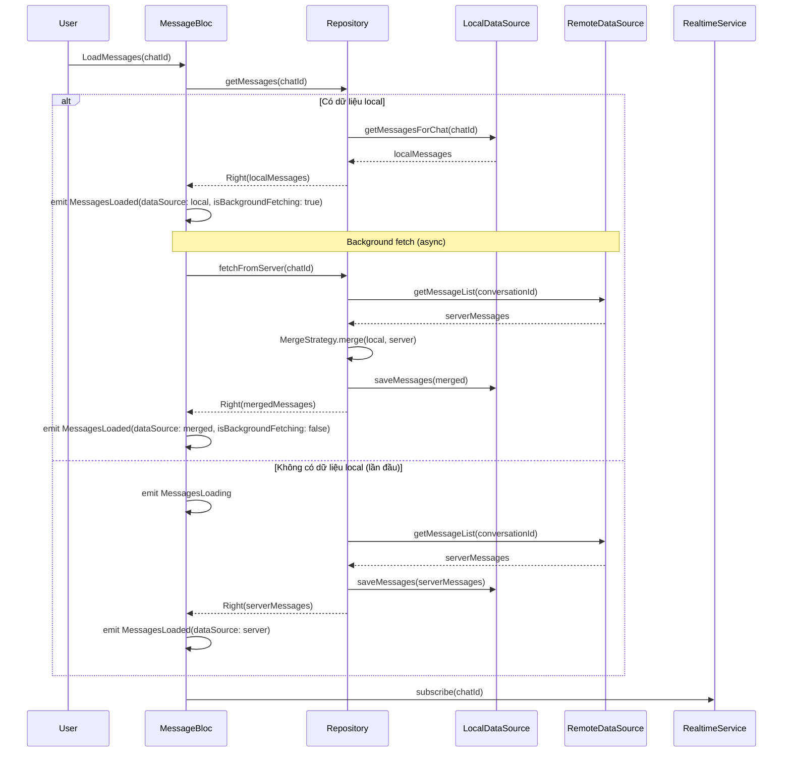
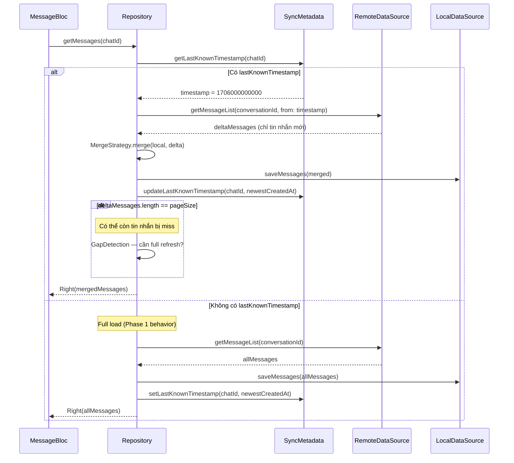
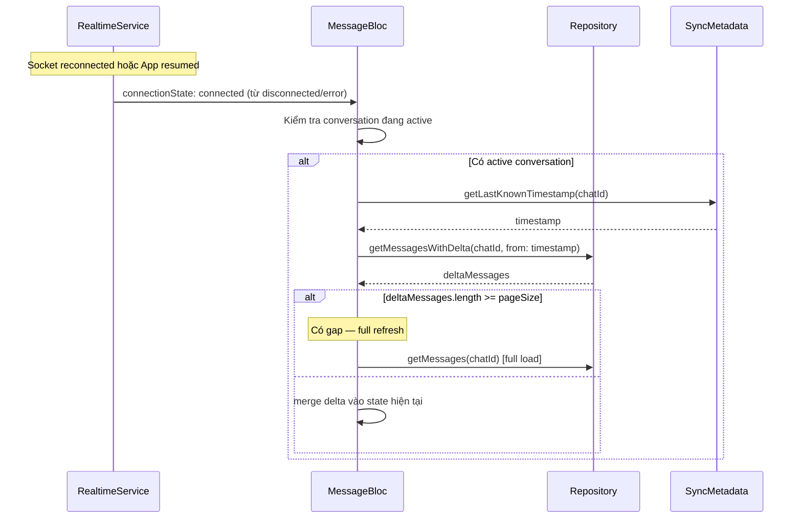

# Design Document — Message Loading Architecture (Phase 2 + Phase 3)

## Overview

Tài liệu thiết kế chi tiết cho việc nâng cấp kiến trúc tải tin nhắn từ Phase 1 (remote-first / offline-first đơn giản) sang Phase 2 (Two-Phase Render) và Phase 3 (Delta Sync). Mục tiêu chính:

- **Phase 2**: Hiển thị tin nhắn local ngay lập tức (< 50ms), đồng thời fetch từ server ở background, sau đó merge kết quả — loại bỏ loading spinner cho chat đã truy cập.
- **Phase 3**: Chỉ fetch tin nhắn mới kể từ `lastKnownTimestamp` (delta sync), kết hợp socket events cho real-time edits/deletes/reactions, xử lý missed events khi reconnect/app resume.

**Phạm vi**: Chỉ thay đổi phía client (Flutter). Backend đã hỗ trợ đầy đủ (`ChatMessageGetListFilter.from`, Socket.IO events, DynamoDB query với `createdAt >= from`).

**Nguyên tắc thiết kế**:
- Backward compatible 100% — không breaking change cho public API
- Tái sử dụng BaseRepository patterns (`executeOnlineFirst`, `executeOfflineFirst`)
- Giữ nguyên Equatable-based states (KHÔNG dùng Freezed)
- Giữ nguyên `Bloc` + `BlocErrorMixin` (KHÔNG chuyển sang BaseBloc)
- Purely client-side — không thay đổi backend

## Architecture

### High-Level Architecture

```
┌─────────────────────────────────────────────────────────────────┐
│                    Presentation Layer                            │
│  ┌───────────────────────────────────────────────────────────┐  │
│  │  MessageBloc (extends Bloc + BlocErrorMixin)              │  │
│  │  ┌─────────────┐  ┌──────────────┐  ┌─────────────────┐  │  │
│  │  │ Two-Phase   │  │ Delta Sync   │  │ Socket Event    │  │  │
│  │  │ Render      │  │ Controller   │  │ Buffer          │  │  │
│  │  │ Controller  │  │              │  │                 │  │  │
│  │  └─────────────┘  └──────────────┘  └─────────────────┘  │  │
│  └───────────────────────────────────────────────────────────┘  │
├─────────────────────────────────────────────────────────────────┤
│                    Domain Layer                                  │
│  ┌──────────────────┐  ┌──────────────────────────────────────┐ │
│  │ GetMessagesUseCase│  │ IMessageRepository (extended)       │ │
│  │ (unchanged)       │  │ + getMessagesWithDelta(from:)       │ │
│  └──────────────────┘  └──────────────────────────────────────┘ │
├─────────────────────────────────────────────────────────────────┤
│                    Data Layer                                    │
│  ┌──────────────────────────────────────────────────────────┐   │
│  │ MessageRepositoryImpl (extends BaseRepository)           │   │
│  │ ┌──────────────┐ ┌──────────────┐ ┌───────────────────┐ │   │
│  │ │ MergeStrategy│ │ SyncMetadata │ │ GapDetection      │ │   │
│  │ │              │ │ Manager      │ │ Logic             │ │   │
│  │ └──────────────┘ └──────────────┘ └───────────────────┘ │   │
│  ├──────────────────────────────────────────────────────────┤   │
│  │ LocalDataSource (Isar) │ RemoteDataSource (GraphQL)     │   │
│  └──────────────────────────────────────────────────────────┘   │
├─────────────────────────────────────────────────────────────────┤
│                    Infrastructure                                │
│  ┌──────────────────┐  ┌──────────────────┐  ┌──────────────┐  │
│  │ RealtimeService  │  │ AppCacheManager  │  │ CacheSync    │  │
│  │ (Socket.IO)      │  │ (Hive + Memory)  │  │ Strategy     │  │
│  └──────────────────┘  └──────────────────┘  └──────────────┘  │
└─────────────────────────────────────────────────────────────────┘
```

### Data Flow — Two-Phase Render (Phase 2)



### Data Flow — Delta Sync (Phase 3)



### Data Flow — Reconnection & Missed Events (Phase 3)




## Components and Interfaces

### 1. MessagesLoaded State — Mở rộng (Backward Compatible)

Mở rộng `MessagesLoaded` state hiện tại với các fields mới có giá trị default, đảm bảo không breaking change.

```dart
/// Nguồn dữ liệu của tin nhắn hiện tại
enum MessageDataSource {
  /// Dữ liệu từ local storage/cache
  local,
  /// Dữ liệu từ server (full load hoặc delta)
  server,
  /// Dữ liệu đã merge giữa local và server
  merged,
}

class MessagesLoaded extends MessageState {
  final String chatId;
  final List<ChatMessage> messages;
  final List<MessageUIState> uiMessages;
  final bool hasReachedMax;
  final String? paginationError;
  
  // === NEW FIELDS (Phase 2 + 3) ===
  /// Nguồn dữ liệu hiện tại (default: server — giữ behavior Phase 1)
  final MessageDataSource dataSource;
  /// Đang có background fetch chạy không
  final bool isBackgroundFetching;

  const MessagesLoaded({
    required this.chatId,
    required this.messages,
    this.uiMessages = const [],
    this.hasReachedMax = false,
    this.paginationError,
    this.dataSource = MessageDataSource.server, // default giữ backward compat
    this.isBackgroundFetching = false,
  });

  // copyWith mở rộng với fields mới
  MessagesLoaded copyWith({
    String? chatId,
    List<ChatMessage>? messages,
    List<MessageUIState>? uiMessages,
    bool? hasReachedMax,
    String? paginationError,
    MessageDataSource? dataSource,
    bool? isBackgroundFetching,
  }) {
    return MessagesLoaded(
      chatId: chatId ?? this.chatId,
      messages: messages ?? this.messages,
      uiMessages: uiMessages ?? this.uiMessages,
      hasReachedMax: hasReachedMax ?? this.hasReachedMax,
      paginationError: paginationError,
      dataSource: dataSource ?? this.dataSource,
      isBackgroundFetching: isBackgroundFetching ?? this.isBackgroundFetching,
    );
  }

  @override
  List<Object?> get props => [
    chatId, messages, uiMessages, hasReachedMax, paginationError,
    dataSource, isBackgroundFetching,
  ];
}
```

**Rationale**: Thêm `dataSource` và `isBackgroundFetching` với default values đảm bảo tất cả code hiện tại sử dụng `MessagesLoaded` không cần thay đổi. UI có thể optionally kiểm tra `isBackgroundFetching` để hiển thị subtle indicator.

### 2. New Events — Mở rộng MessageEvent

```dart
/// Event khi background fetch hoàn tất (internal, không public)
class _BackgroundFetchCompleted extends MessageEvent {
  final String chatId;
  final List<ChatMessage> serverMessages;
  
  const _BackgroundFetchCompleted({
    required this.chatId,
    required this.serverMessages,
  });
  
  @override
  List<Object?> get props => [chatId, serverMessages];
}

/// Event khi background fetch thất bại (internal)
class _BackgroundFetchFailed extends MessageEvent {
  final String chatId;
  final String error;
  
  const _BackgroundFetchFailed({
    required this.chatId,
    required this.error,
  });
  
  @override
  List<Object?> get props => [chatId, error];
}

/// Event khi socket reconnect — trigger delta sync
class _ReconnectionDetected extends MessageEvent {
  const _ReconnectionDetected();
}

/// Event khi app resume từ background
class AppResumed extends MessageEvent {
  const AppResumed();
}

/// Event cho socket edit/delete/reaction (mở rộng từ ReceiveRealTimeMessage)
class ReceiveMessageEdited extends MessageEvent {
  final ChatMessage editedMessage;
  const ReceiveMessageEdited(this.editedMessage);
  
  @override
  List<Object?> get props => [editedMessage];
}

class ReceiveMessageDeleted extends MessageEvent {
  final String messageId;
  const ReceiveMessageDeleted(this.messageId);
  
  @override
  List<Object?> get props => [messageId];
}

class ReceiveMessageReaction extends MessageEvent {
  final String messageId;
  final String code;
  final String userId;
  final String userName;
  final bool isAdd;
  
  const ReceiveMessageReaction({
    required this.messageId,
    required this.code,
    required this.userId,
    required this.userName,
    required this.isAdd,
  });
  
  @override
  List<Object?> get props => [messageId, code, userId, userName, isAdd];
}
```

### 3. MergeStrategy — Pure Function (Data Layer)

```dart
/// Thuật toán merge tin nhắn local với server.
/// Pure function, không side effects, dễ test.
class MessageMergeStrategy {
  /// Merge local messages với server messages.
  /// 
  /// Rules:
  /// 1. Deduplicate bằng message ID — server wins khi conflict
  /// 2. Loại bỏ tin nhắn có deletedAt từ server
  /// 3. Cập nhật tin nhắn đã edit (editedAt khác)
  /// 4. Thêm tin nhắn mới từ server vào đúng vị trí
  /// 5. Bảo toàn tin nhắn sending/pending (chưa có server ID)
  /// 6. Sort theo createdAt descending
  static List<ChatMessage> merge({
    required List<ChatMessage> localMessages,
    required List<ChatMessage> serverMessages,
  }) {
    // Build map: id -> message, server priority
    final Map<String, ChatMessage> mergedMap = {};
    
    // 1. Add local messages first
    for (final msg in localMessages) {
      mergedMap[msg.id] = msg;
    }
    
    // 2. Override/add server messages (server wins)
    for (final msg in serverMessages) {
      if (msg.deletedAt != null) {
        // Server says deleted — remove from result
        mergedMap.remove(msg.id);
      } else {
        mergedMap[msg.id] = msg;
      }
    }
    
    // 3. Preserve sending/pending messages (local-only, no server ID)
    for (final msg in localMessages) {
      final isSendingOrPending = msg.localStatus == MessageStatus.sending ||
                                  msg.localStatus == MessageStatus.pending;
      final isLocalOnly = msg.id.startsWith('draft_') || msg.clientId != null;
      
      if (isSendingOrPending && isLocalOnly) {
        // Kiểm tra xem server đã confirm chưa (match by clientId)
        final serverConfirmed = serverMessages.any(
          (s) => s.clientId == msg.clientId && msg.clientId != null,
        );
        if (!serverConfirmed) {
          mergedMap[msg.id] = msg; // Giữ lại pending message
        }
      }
    }
    
    // 4. Sort descending by createdAt
    final result = mergedMap.values.toList()
      ..sort((a, b) => b.createdAt.compareTo(a.createdAt));
    
    return result;
  }
}
```

**Rationale**: Pure function cho phép unit test dễ dàng. Server luôn là source of truth cho tin nhắn đã confirmed. Tin nhắn sending/pending được bảo toàn vì chưa có trên server.

### 4. SyncMetadataManager — Isar-based Local Storage (Data Layer)

#### 4.1 SyncMetadataModel — Isar Collection

```dart
/// Isar collection lưu trữ sync metadata cho mỗi conversation.
/// Hỗ trợ query, batch cleanup, TTL eviction — scale tốt với hàng nghìn conversations.
@collection
class SyncMetadataModel {
  Id id = Isar.autoIncrement;
  
  /// Conversation ID — unique index cho lookup nhanh
  @Index(unique: true, replace: true)
  late String conversationId;
  
  /// Timestamp (millisecondsSinceEpoch) của tin nhắn mới nhất đã biết
  late int lastKnownTimestamp;
  
  /// Thời gian sync cuối cùng (millisecondsSinceEpoch)
  late int lastSyncTime;
  
  /// Thời gian record được cập nhật — dùng cho TTL cleanup
  @Index()
  late int updatedAt;
}
```

#### 4.2 SyncMetadataManager — Manager Class

```dart
/// Quản lý metadata đồng bộ cho mỗi conversation.
/// Sử dụng Isar thay vì SharedPreferences để:
/// - Scale tốt với hàng nghìn conversations (không load toàn bộ vào memory)
/// - Hỗ trợ query (tìm conversations cần cleanup, stale data)
/// - Batch operations (cleanup hàng loạt)
/// - TTL eviction tự động
/// - Đã có sẵn trong project (không thêm dependency)
@lazySingleton
class SyncMetadataManager {
  final Isar _isar;
  
  /// TTL cho sync metadata: 60 ngày (conversations không truy cập > 60 ngày sẽ bị cleanup)
  static const int _ttlDays = 60;
  
  SyncMetadataManager({required Isar isar}) : _isar = isar;
  
  /// Lấy lastKnownTimestamp cho conversation (millisecondsSinceEpoch)
  int? getLastKnownTimestamp(String conversationId) {
    final record = _isar.syncMetadataModels
        .where()
        .conversationIdEqualTo(conversationId)
        .findFirstSync();
    return record?.lastKnownTimestamp;
  }
  
  /// Cập nhật lastKnownTimestamp
  Future<void> setLastKnownTimestamp(String conversationId, int timestamp) async {
    await _isar.writeTxn(() async {
      final existing = await _isar.syncMetadataModels
          .where()
          .conversationIdEqualTo(conversationId)
          .findFirst();
      
      final record = existing ?? SyncMetadataModel()
        ..conversationId = conversationId
        ..lastSyncTime = DateTime.now().millisecondsSinceEpoch;
      
      record
        ..lastKnownTimestamp = timestamp
        ..updatedAt = DateTime.now().millisecondsSinceEpoch;
      
      await _isar.syncMetadataModels.put(record);
    });
  }
  
  /// Lấy thời gian sync cuối cùng
  int? getLastSyncTime(String conversationId) {
    final record = _isar.syncMetadataModels
        .where()
        .conversationIdEqualTo(conversationId)
        .findFirstSync();
    return record?.lastSyncTime;
  }
  
  /// Cập nhật thời gian sync
  Future<void> setLastSyncTime(String conversationId) async {
    final now = DateTime.now().millisecondsSinceEpoch;
    await _isar.writeTxn(() async {
      final existing = await _isar.syncMetadataModels
          .where()
          .conversationIdEqualTo(conversationId)
          .findFirst();
      
      if (existing != null) {
        existing
          ..lastSyncTime = now
          ..updatedAt = now;
        await _isar.syncMetadataModels.put(existing);
      }
    });
  }
  
  /// Xóa metadata cho conversation (khi cache bị clear)
  Future<void> clearMetadata(String conversationId) async {
    await _isar.writeTxn(() async {
      await _isar.syncMetadataModels
          .where()
          .conversationIdEqualTo(conversationId)
          .deleteAll();
    });
  }
  
  /// Cập nhật timestamp từ danh sách tin nhắn (lấy max createdAt)
  Future<void> updateFromMessages(
    String conversationId,
    List<ChatMessage> messages,
  ) async {
    if (messages.isEmpty) return;
    
    final maxTimestamp = messages
        .map((m) => m.createdAt.millisecondsSinceEpoch)
        .reduce((a, b) => a > b ? a : b);
    
    final current = getLastKnownTimestamp(conversationId) ?? 0;
    if (maxTimestamp > current) {
      await setLastKnownTimestamp(conversationId, maxTimestamp);
    }
  }
  
  /// Batch cleanup: xóa metadata cho conversations không truy cập > TTL
  Future<int> cleanupStaleMetadata() async {
    final cutoff = DateTime.now()
        .subtract(Duration(days: _ttlDays))
        .millisecondsSinceEpoch;
    
    return _isar.writeTxn(() async {
      return _isar.syncMetadataModels
          .where()
          .updatedAtLessThan(cutoff)
          .deleteAll();
    });
  }
  
  /// Lấy tổng số conversations đang track (cho monitoring/debug)
  int getTrackedConversationCount() {
    return _isar.syncMetadataModels.countSync();
  }
}
```

**Rationale**: Chuyển từ SharedPreferences sang Isar vì:
1. SharedPreferences load toàn bộ file vào memory khi khởi động — không scale với hàng nghìn conversations
2. Mỗi write operation serialize lại toàn bộ file — O(n) thay vì O(1)
3. Không hỗ trợ query (ví dụ: tìm conversations cần cleanup)
4. Không có auto-cleanup/TTL
5. Isar đã có sẵn trong project, hỗ trợ index, query, batch operations, và chỉ read/write record cần thiết

### 5. GapDetection Logic

```dart
/// Logic phát hiện gap (tin nhắn bị miss) trong delta sync.
class GapDetectionLogic {
  /// Kiểm tra xem delta sync có đầy đủ không.
  /// 
  /// Returns true nếu cần full refresh (có gap).
  /// 
  /// Heuristic:
  /// - Nếu delta trả về đúng pageSize → có thể còn tin nhắn
  /// - Nếu delta < pageSize → đã lấy hết tin nhắn mới
  static bool hasGap({
    required int deltaCount,
    required int pageSize,
  }) {
    return deltaCount >= pageSize;
  }
}
```

### 6. Socket Event Buffer — Race Condition Handler

```dart
/// Buffer socket events trong khi background fetch đang chạy.
/// Sau khi merge hoàn tất, apply buffered events lên state mới.
class SocketEventBuffer {
  final List<MessageEvent> _buffer = [];
  bool _isBuffering = false;
  
  /// Bắt đầu buffering (khi background fetch bắt đầu)
  void startBuffering() {
    _isBuffering = true;
    _buffer.clear();
  }
  
  /// Thêm event vào buffer (nếu đang buffering)
  /// Returns true nếu event đã được buffer, false nếu cần xử lý ngay
  bool bufferIfNeeded(MessageEvent event) {
    if (!_isBuffering) return false;
    _buffer.add(event);
    return true;
  }
  
  /// Dừng buffering và trả về events đã buffer
  List<MessageEvent> stopBuffering() {
    _isBuffering = false;
    final events = List<MessageEvent>.from(_buffer);
    _buffer.clear();
    return events;
  }
  
  /// Kiểm tra đang buffering không
  bool get isBuffering => _isBuffering;
}
```

### 7. IMessageRepository — Mở rộng Interface

```dart
abstract class IMessageRepository {
  // ... existing methods unchanged ...
  
  /// **NEW**: Lấy tin nhắn delta từ timestamp
  /// Sử dụng tham số `from` của backend API.
  /// Returns tin nhắn có createdAt >= from.
  Future<Either<Failure, List<ChatMessage>>> getMessagesDelta(
    String chatId, {
    required int fromTimestamp,
    int limit = 20,
  });
  
  /// **NEW**: Lấy tin nhắn từ local storage only (cho two-phase render phase 1)
  Future<Either<Failure, List<ChatMessage>>> getMessagesFromLocal(
    String chatId, {
    int limit = 20,
  });
}
```

### 8. MessageBloc — Luồng xử lý chính (Updated)

```dart
@injectable
class MessageBloc extends Bloc<MessageEvent, MessageState> with BlocErrorMixin {
  // ... existing dependencies unchanged ...
  
  // === NEW DEPENDENCIES ===
  final SyncMetadataManager _syncMetadataManager;
  
  // === NEW INTERNAL STATE ===
  final SocketEventBuffer _socketEventBuffer = SocketEventBuffer();
  StreamSubscription? _connectionStateSubscription;
  StreamSubscription? _messageEditedSubscription;
  StreamSubscription? _messageDeletedSubscription;
  StreamSubscription? _messageReactionSubscription;
  CancelableOperation<void>? _backgroundFetchOperation;
  DateTime? _lastBackgroundedAt;
  
  // Constructor mở rộng (backward compatible — SyncMetadataManager thêm vào DI)
  MessageBloc({
    // ... existing params ...
    required SyncMetadataManager syncMetadataManager,
  }) : _syncMetadataManager = syncMetadataManager,
       super(const MessageInitial()) {
    // ... existing event handlers ...
    
    // NEW event handlers
    on<_BackgroundFetchCompleted>(_onBackgroundFetchCompleted);
    on<_BackgroundFetchFailed>(_onBackgroundFetchFailed);
    on<_ReconnectionDetected>(_onReconnectionDetected);
    on<AppResumed>(_onAppResumed);
    on<ReceiveMessageEdited>(_onReceiveMessageEdited);
    on<ReceiveMessageDeleted>(_onReceiveMessageDeleted);
    on<ReceiveMessageReaction>(_onReceiveMessageReaction);
    
    // Subscribe to connection state changes for reconnection detection
    _connectionStateSubscription = _realtimeService.connectionState
        .distinct()
        .pairwise() // rxdart: emit (previous, current) pairs
        .where((pair) => 
          pair.first != SocketConnectionState.connected &&
          pair.last == SocketConnectionState.connected)
        .listen((_) => add(const _ReconnectionDetected()));
  }
}
```

### 9. Updated _onLoadMessages — Two-Phase Render + Delta Sync

```dart
Future<void> _onLoadMessages(LoadMessages event, Emitter<MessageState> emit) async {
  logger.i('Loading messages for chat: ${event.chatId}');
  
  // Step 1: Thử lấy local data trước (Two-Phase Render)
  final localResult = await _getMessages.repository.getMessagesFromLocal(
    event.chatId,
    limit: event.limit,
  );
  
  final hasLocalData = localResult.fold(
    (_) => false,
    (messages) => messages.isNotEmpty,
  );
  
  if (hasLocalData) {
    // === TWO-PHASE RENDER PATH ===
    final localMessages = localResult.fold((_) => <ChatMessage>[], (m) => m);
    
    // Phase 1: Emit local data ngay lập tức
    emit(MessagesLoaded(
      chatId: event.chatId,
      messages: localMessages,
      uiMessages: _transformMessages(localMessages),
      hasReachedMax: false,
      dataSource: MessageDataSource.local,
      isBackgroundFetching: true,
    ));
    
    // Subscribe to real-time updates
    if (event.subscribeToUpdates) {
      unawaited(_subscribeToMessages(event.chatId));
      _subscribeToEditDeleteReaction(event.chatId);
    }
    
    // Phase 2: Background fetch (delta hoặc full)
    _startBackgroundFetch(event.chatId, event.limit);
    
  } else {
    // === FIRST-TIME LOAD PATH (Phase 1 behavior) ===
    emit(MessagesLoading(chatId: event.chatId));
    
    final result = await _getMessages(
      conversationId: event.chatId,
      limit: event.limit,
    );
    
    result.fold(
      (failure) {
        logger.e('Failed to load messages', error: failure);
        emit(MessagesError(chatId: event.chatId, error: failure.message));
      },
      (messages) {
        logger.i('Loaded ${messages.length} messages for chat ${event.chatId}');
        _cacheSyncStrategy.resetChatMessagesDirtyFlag(event.chatId);
        
        // Cập nhật sync metadata
        unawaited(_syncMetadataManager.updateFromMessages(event.chatId, messages));
        
        if (event.subscribeToUpdates) {
          unawaited(_subscribeToMessages(event.chatId));
          _subscribeToEditDeleteReaction(event.chatId);
        }
        
        emit(MessagesLoaded(
          chatId: event.chatId,
          messages: messages,
          uiMessages: _transformMessages(messages),
          hasReachedMax: messages.length < event.limit,
          dataSource: MessageDataSource.server,
        ));
      },
    );
  }
}
```

### 10. Background Fetch với Delta Sync

```dart
void _startBackgroundFetch(String chatId, int limit) {
  // Start buffering socket events
  _socketEventBuffer.startBuffering();
  
  // Cancel previous background fetch nếu có
  _backgroundFetchOperation?.cancel();
  
  _backgroundFetchOperation = CancelableOperation.fromFuture(
    _performBackgroundFetch(chatId, limit),
  );
}

Future<void> _performBackgroundFetch(String chatId, int limit) async {
  try {
    final lastTimestamp = _syncMetadataManager.getLastKnownTimestamp(chatId);
    
    Either<Failure, List<ChatMessage>> result;
    
    if (lastTimestamp != null) {
      // Delta sync: chỉ lấy tin nhắn mới
      result = await _getMessages.repository.getMessagesDelta(
        chatId,
        fromTimestamp: lastTimestamp,
        limit: limit,
      );
      
      // Gap detection
      final deltaCount = result.fold((_) => 0, (m) => m.length);
      if (GapDetectionLogic.hasGap(deltaCount: deltaCount, pageSize: limit)) {
        logger.w('Gap detected in delta sync for chat $chatId, doing full refresh');
        result = await _getMessages(conversationId: chatId, limit: limit);
      }
    } else {
      // Full load (không có timestamp)
      result = await _getMessages(conversationId: chatId, limit: limit);
    }
    
    result.fold(
      (failure) => add(_BackgroundFetchFailed(chatId: chatId, error: failure.message)),
      (messages) => add(_BackgroundFetchCompleted(chatId: chatId, serverMessages: messages)),
    );
  } catch (e) {
    logger.e('Background fetch error', error: e);
    add(_BackgroundFetchFailed(chatId: chatId, error: e.toString()));
  }
}

void _onBackgroundFetchCompleted(
  _BackgroundFetchCompleted event,
  Emitter<MessageState> emit,
) {
  if (state is! MessagesLoaded) return;
  final currentState = state as MessagesLoaded;
  
  // Kiểm tra conversation ID match (race condition guard)
  if (currentState.chatId != event.chatId) {
    logger.w('Background fetch completed for wrong chat: ${event.chatId} vs ${currentState.chatId}');
    _socketEventBuffer.stopBuffering();
    return;
  }
  
  // Merge local + server
  final merged = MessageMergeStrategy.merge(
    localMessages: currentState.messages,
    serverMessages: event.serverMessages,
  );
  
  // Cập nhật sync metadata
  unawaited(_syncMetadataManager.updateFromMessages(event.chatId, merged));
  _cacheSyncStrategy.resetChatMessagesDirtyFlag(event.chatId);
  
  // Emit merged state
  emit(currentState.copyWith(
    messages: merged,
    uiMessages: _transformMessages(merged),
    dataSource: MessageDataSource.merged,
    isBackgroundFetching: false,
    hasReachedMax: event.serverMessages.length < 20,
  ));
  
  // Apply buffered socket events
  final bufferedEvents = _socketEventBuffer.stopBuffering();
  for (final bufferedEvent in bufferedEvents) {
    add(bufferedEvent);
  }
}

void _onBackgroundFetchFailed(
  _BackgroundFetchFailed event,
  Emitter<MessageState> emit,
) {
  if (state is! MessagesLoaded) return;
  final currentState = state as MessagesLoaded;
  
  if (currentState.chatId != event.chatId) {
    _socketEventBuffer.stopBuffering();
    return;
  }
  
  // Giữ nguyên local data, chỉ tắt background fetching flag
  logger.w('Background fetch failed for chat ${event.chatId}: ${event.error}');
  
  emit(currentState.copyWith(
    isBackgroundFetching: false,
    dataSource: currentState.dataSource, // giữ nguyên
  ));
  
  // Apply buffered socket events
  final bufferedEvents = _socketEventBuffer.stopBuffering();
  for (final bufferedEvent in bufferedEvents) {
    add(bufferedEvent);
  }
}
```

### 11. Socket Event Handlers — Edit/Delete/Reaction

```dart
/// Subscribe to edit/delete/reaction streams từ RealtimeService
void _subscribeToEditDeleteReaction(String chatId) {
  // Cancel existing subscriptions
  _messageEditedSubscription?.cancel();
  _messageDeletedSubscription?.cancel();
  _messageReactionSubscription?.cancel();
  
  _messageEditedSubscription = _realtimeService.messageEditedStream
      .where((msg) => msg.chatId == chatId)
      .listen((msg) => add(ReceiveMessageEdited(msg)));
  
  _messageDeletedSubscription = _realtimeService.messageDeletedStream
      .listen((msgId) => add(ReceiveMessageDeleted(msgId)));
  
  _messageReactionSubscription = _realtimeService.messageReactionStream
      .listen((reaction) => add(ReceiveMessageReaction(
        messageId: reaction.messageId,
        code: reaction.code,
        userId: reaction.userId,
        userName: reaction.userName,
        isAdd: reaction.action == ReactionAction.add,
      )));
}

void _onReceiveMessageEdited(ReceiveMessageEdited event, Emitter<MessageState> emit) {
  // Buffer nếu đang background fetch
  if (_socketEventBuffer.bufferIfNeeded(event)) return;
  
  if (state is! MessagesLoaded) return;
  final currentState = state as MessagesLoaded;
  
  final updatedMessages = currentState.messages.map((msg) {
    if (msg.id == event.editedMessage.id) {
      return event.editedMessage;
    }
    return msg;
  }).toList();
  
  emit(currentState.copyWith(
    messages: updatedMessages,
    uiMessages: _transformMessages(updatedMessages),
  ));
  
  // Cập nhật sync metadata
  unawaited(_syncMetadataManager.updateFromMessages(
    currentState.chatId,
    [event.editedMessage],
  ));
}

void _onReceiveMessageDeleted(ReceiveMessageDeleted event, Emitter<MessageState> emit) {
  if (_socketEventBuffer.bufferIfNeeded(event)) return;
  
  if (state is! MessagesLoaded) return;
  final currentState = state as MessagesLoaded;
  
  final updatedMessages = currentState.messages
      .where((msg) => msg.id != event.messageId)
      .toList();
  
  emit(currentState.copyWith(
    messages: updatedMessages,
    uiMessages: _transformMessages(updatedMessages),
  ));
}

void _onReceiveMessageReaction(ReceiveMessageReaction event, Emitter<MessageState> emit) {
  if (_socketEventBuffer.bufferIfNeeded(event)) return;
  
  if (state is! MessagesLoaded) return;
  final currentState = state as MessagesLoaded;
  
  final updatedMessages = currentState.messages.map((msg) {
    if (msg.id != event.messageId) return msg;
    
    List<MessageReaction> updatedReactions;
    if (event.isAdd) {
      updatedReactions = [
        ...msg.reactions,
        MessageReaction(
          code: event.code,
          userId: event.userId,
          userName: event.userName,
          createdAt: DateTime.now(),
        ),
      ];
    } else {
      updatedReactions = msg.reactions
          .where((r) => !(r.code == event.code && r.userId == event.userId))
          .toList();
    }
    
    return msg.copyWith(reactions: updatedReactions);
  }).toList();
  
  emit(currentState.copyWith(
    messages: updatedMessages,
    uiMessages: _transformMessages(updatedMessages),
  ));
}
```

### 12. Reconnection & App Resume Handlers

```dart
void _onReconnectionDetected(_ReconnectionDetected event, Emitter<MessageState> emit) {
  if (state is! MessagesLoaded) return;
  final currentState = state as MessagesLoaded;
  
  logger.i('Reconnection detected, triggering delta sync for chat ${currentState.chatId}');
  _startBackgroundFetch(currentState.chatId, 20);
}

void _onAppResumed(AppResumed event, Emitter<MessageState> emit) {
  if (state is! MessagesLoaded) return;
  final currentState = state as MessagesLoaded;
  
  // Chỉ delta sync nếu app đã background > 30 giây
  final now = DateTime.now();
  if (_lastBackgroundedAt != null) {
    final backgroundDuration = now.difference(_lastBackgroundedAt!);
    if (backgroundDuration.inSeconds < 30) {
      logger.d('App resumed after ${backgroundDuration.inSeconds}s, skipping delta sync');
      return;
    }
  }
  
  logger.i('App resumed after >30s, triggering delta sync for chat ${currentState.chatId}');
  _startBackgroundFetch(currentState.chatId, 20);
}

/// Gọi từ Page khi app vào background
void setBackgroundedAt(DateTime time) {
  _lastBackgroundedAt = time;
}
```

### 13. Updated close() — Cleanup

```dart
@override
Future<void> close() async {
  // Cancel background fetch
  _backgroundFetchOperation?.cancel();
  
  // Cancel new subscriptions
  _connectionStateSubscription?.cancel();
  _messageEditedSubscription?.cancel();
  _messageDeletedSubscription?.cancel();
  _messageReactionSubscription?.cancel();
  
  // Cancel existing subscriptions (Phase 1)
  for (final chatId in _messageSubscriptions.keys) {
    await _cancelMessageSubscription(chatId);
  }
  _messageSubscriptions.clear();
  
  return super.close();
}
```


## Data Models

### Existing Models (Không thay đổi)

#### ChatMessage (Domain Entity)
```
ChatMessage
├── id: String                    # Server ID hoặc draft_xxx cho local
├── chatId: String                # Conversation ID
├── content: String               # Nội dung tin nhắn
├── contentType: ContentType      # text, image, video, audio, file, location
├── sender: MessageSender         # {id, name, avatar}
├── createdAt: DateTime           # Thời gian tạo (sort key)
├── updatedAt: DateTime           # Thời gian cập nhật
├── editedAt: DateTime?           # Thời gian chỉnh sửa
├── deletedAt: DateTime?          # Thời gian xóa (soft delete)
├── urls: List<String>            # Media URLs
├── fileName: String?             # Tên file đính kèm
├── replyMessageId: String?       # ID tin nhắn reply
├── replyMessage: ChatMessage?    # Nested reply message
├── reactions: List<MessageReaction>  # Danh sách reactions
├── readBy: List<String>          # IDs người đã đọc
├── attachments: List<MessageAttachment>
├── localStatus: MessageStatus?   # pending, sending, failed (optimistic UI)
└── clientId: String?             # UUID tracking cho optimistic messages
```

#### MessageModel (Data Layer — Isar)
```
MessageModel (@collection)
├── id: int                       # Isar auto-increment ID
├── serverId: String? (@Index)    # Server ID
├── localId: String (@Index)      # Local UUID
├── chatId: String (@Index)       # Conversation ID
├── senderId: String              # Sender ID
├── content: String               # Nội dung
├── type: MessageType             # text, image, video, audio, file, location
├── status: MessageStatus         # pending, sending, sent, delivered, read, failed
├── createdAt: DateTime (@Index)  # Thời gian tạo
├── updatedAt: DateTime?          # Thời gian cập nhật
├── editedAt: DateTime?           # Thời gian chỉnh sửa
├── deletedAt: DateTime?          # Thời gian xóa
├── urls: List<String>            # Media URLs
├── fileName: String?             # Tên file
├── replyToMessageId: String?     # Reply message ID
├── metadata: String?             # JSON metadata (sender info, reactions, reply)
└── readBy: List<String>          # IDs người đã đọc
```

### New Models

#### MessageDataSource (Enum — Presentation Layer)
```
MessageDataSource
├── local    # Dữ liệu từ local storage/cache
├── server   # Dữ liệu từ server (full load hoặc delta)
└── merged   # Dữ liệu đã merge giữa local và server
```

#### SyncMetadataModel (Isar @collection)
```
SyncMetadataModel (@collection)
├── id: int                       # Isar auto-increment ID
├── conversationId: String        # @Index(unique: true, replace: true)
├── lastKnownTimestamp: int       # millisecondsSinceEpoch — createdAt của tin nhắn mới nhất đã biết
├── lastSyncTime: int             # millisecondsSinceEpoch — thời gian sync cuối cùng
└── updatedAt: int                # @Index — millisecondsSinceEpoch — dùng cho TTL cleanup
```

### Backend API Models (Không thay đổi)

#### ChatMessageGetListFilter (GraphQL Input)
```
ChatMessageGetListFilter
├── conversationId: String        # Required — partition key
├── size: Int (default: 100)      # Page size
├── lastKey: LastKeyChatMessage?  # Cursor pagination
│   ├── conversationId: String
│   └── createdAt: Float          # millisecondsSinceEpoch
├── type: ChatMessageType?        # Filter by message type
├── order: OrderBy (default: DESC)# ASC hoặc DESC
└── from: Float?                  # ★ Delta sync: createdAt >= from
```

**DynamoDB Query**: `conversationId = :conversationId AND createdAt >= :createdAt` với `:createdAt = from || 1000000`. Khi `from` được set, chỉ trả về tin nhắn có `createdAt >= from`.

#### Socket.IO Events (Server → Client)
```
message:sent    → { message: OfficeChatMessage, conversationId: String }
message:edit    → { message: OfficeChatMessage, conversationId: String }
message:delete  → { message: OfficeChatMessage, conversationId: String }
message:reaction → { reactor: OfficeUser, data: { messageId, code, act } }
message:read    → { message: OfficeChatMessage, reader: OfficeUser }
```

### Data Flow Summary

```
┌──────────────────────────────────────────────────────────────┐
│                    State Transitions                          │
│                                                              │
│  MessageInitial                                              │
│       │                                                      │
│       ▼                                                      │
│  ┌─ LoadMessages ─────────────────────────────────────────┐  │
│  │                                                        │  │
│  │  Has local data?                                       │  │
│  │  ├─ YES → MessagesLoaded(local, fetching=true)         │  │
│  │  │         │                                           │  │
│  │  │         ├─ BG fetch OK → MessagesLoaded(merged)     │  │
│  │  │         └─ BG fetch FAIL → MessagesLoaded(local)    │  │
│  │  │                                                     │  │
│  │  └─ NO → MessagesLoading                               │  │
│  │           │                                            │  │
│  │           ├─ Server OK → MessagesLoaded(server)        │  │
│  │           └─ Server FAIL → MessagesError               │  │
│  └────────────────────────────────────────────────────────┘  │
│                                                              │
│  Socket Events (while MessagesLoaded):                       │
│  ├─ message:sent → add to list (existing behavior)           │
│  ├─ message:edit → update in list (NEW)                      │
│  ├─ message:delete → remove from list (NEW)                  │
│  └─ message:reaction → update reactions (NEW)                │
│                                                              │
│  Reconnection / App Resume:                                  │
│  └─ Delta sync → merge → MessagesLoaded(merged)             │
└──────────────────────────────────────────────────────────────┘
```


## Correctness Properties

*A property is a characteristic or behavior that should hold true across all valid executions of a system — essentially, a formal statement about what the system should do. Properties serve as the bridge between human-readable specifications and machine-verifiable correctness guarantees.*

### Property 1: Merge deduplication with server priority and ordering

*For any* two lists of ChatMessage (local and server), the result of `MessageMergeStrategy.merge(local, server)` should contain no duplicate IDs, should use the server version for any message ID present in both lists, and should be sorted by `createdAt` descending.

**Validates: Requirements 2.1, 2.3, 2.4**

### Property 2: Merge removes deleted messages

*For any* list of local messages and any list of server messages where some server messages have `deletedAt != null`, the merged result should not contain any message whose server version has `deletedAt` set.

**Validates: Requirements 2.2**

### Property 3: Merge preserves sending/pending messages

*For any* list of local messages containing messages with `localStatus == sending` or `localStatus == pending` (and `clientId` not matched by any server message), and any list of server messages, the merged result should still contain those sending/pending messages.

**Validates: Requirements 2.5**

### Property 4: Background fetch failure preserves local data

*For any* `MessagesLoaded` state with `dataSource == local` and `isBackgroundFetching == true`, when a `_BackgroundFetchFailed` event is processed, the resulting state should have the same `messages` list, `isBackgroundFetching == false`, and should NOT be a `MessagesError` state.

**Validates: Requirements 1.5, 3.4**

### Property 5: Two-phase render emits local data with fetching flag

*For any* conversation with non-empty local data, when `LoadMessages` is processed, the first emitted `MessagesLoaded` state should have `dataSource == local` and `isBackgroundFetching == true`.

**Validates: Requirements 1.1, 1.2, 3.3**

### Property 6: SyncMetadata round-trip

*For any* conversation ID and any timestamp value, calling `setLastKnownTimestamp(id, ts)` followed by `getLastKnownTimestamp(id)` should return the same timestamp value. The Isar-backed storage should persist and retrieve values correctly through its unique index on `conversationId`.

**Validates: Requirements 4.1**

### Property 7: SyncMetadata timestamp monotonic update

*For any* sequence of messages (from delta sync or socket events), calling `updateFromMessages` should only increase (never decrease) the stored `lastKnownTimestamp`. Specifically, after update, the stored timestamp should equal `max(previousTimestamp, maxCreatedAtInMessages)`.

**Validates: Requirements 4.4, 5.5**

### Property 8: Socket edit updates message in state

*For any* `MessagesLoaded` state containing a message with ID X, and any `ReceiveMessageEdited` event with an edited message having ID X, the resulting state should contain the edited version of message X (with updated content/editedAt) and all other messages unchanged.

**Validates: Requirements 5.2**

### Property 9: Socket delete removes message from state

*For any* `MessagesLoaded` state containing a message with ID X, and any `ReceiveMessageDeleted` event with messageId X, the resulting state should not contain message X, and the count of messages should decrease by exactly 1.

**Validates: Requirements 5.3**

### Property 10: Socket reaction updates reactions correctly

*For any* `MessagesLoaded` state containing a message with ID X, and any `ReceiveMessageReaction` event targeting message X with `isAdd == true`, the resulting message X should have one additional reaction with the specified code and userId. Conversely, with `isAdd == false`, the matching reaction should be removed.

**Validates: Requirements 5.4**

### Property 11: Gap detection heuristic

*For any* delta sync result count and page size, `GapDetectionLogic.hasGap` should return `true` if and only if `deltaCount >= pageSize`.

**Validates: Requirements 6.3, 6.5**

### Property 12: App resume threshold

*For any* background duration, delta sync should be triggered if and only if the duration exceeds 30 seconds. For durations ≤ 30 seconds, no delta sync should occur.

**Validates: Requirements 6.2**

### Property 13: Socket event buffering during background fetch

*For any* sequence of socket events arriving while `SocketEventBuffer.isBuffering == true`, all events should be stored in the buffer. When `stopBuffering()` is called, all buffered events should be returned in order, and the buffer should be empty afterwards.

**Validates: Requirements 9.2**

### Property 14: Conversation ID guard for stale responses

*For any* `_BackgroundFetchCompleted` event with a `chatId` different from the current `MessagesLoaded.chatId`, the state should remain unchanged (the stale response is ignored).

**Validates: Requirements 9.4**

### Property 15: Optimistic messages preserved during background fetch merge

*For any* `MessagesLoaded` state containing optimistic messages (with `localStatus == sending` and a `clientId`), when a `_BackgroundFetchCompleted` event arrives with server messages that do NOT contain a matching `clientId`, the merged state should still contain those optimistic messages.

**Validates: Requirements 3.5, 9.1**

### Property 16: Cache limit enforces 500 message maximum

*For any* conversation where the merged message count exceeds 500, the cached result should contain exactly the 500 messages with the most recent `createdAt` values.

**Validates: Requirements 7.5**

### Property 17: Backward compatible default values

*For any* `MessagesLoaded` instance created without specifying `dataSource` or `isBackgroundFetching`, the defaults should be `MessageDataSource.server` and `false` respectively, ensuring existing code continues to work.

**Validates: Requirements 10.3**

### Property 18: Dirty flag reset after successful sync

*For any* conversation ID, after a successful delta sync or two-phase merge, `CacheSyncStrategy.shouldRefreshChatMessages(chatId)` should return `false`.

**Validates: Requirements 7.3**


## Error Handling

### Error Scenarios và Recovery Strategy

| Scenario | Layer | Strategy | User Impact |
|----------|-------|----------|-------------|
| Local storage read failure | Data | Return empty list, proceed to server fetch | Không — fallback sang server |
| Background fetch network error | BLoC | Giữ local data, log warning, tắt fetching flag | Không — user thấy local data |
| Background fetch server error (5xx) | Data | Retry 1 lần, nếu fail thì giữ local data | Không — user thấy local data |
| Delta sync trả về quá nhiều (gap) | BLoC | Trigger full refresh thay vì delta | Có thể thấy brief loading |
| Socket event parse error | RealtimeService | Log error, skip event, không crash | Không — event bị bỏ qua |
| Merge conflict (impossible state) | Data | Server wins, log warning | Không |
| Isar sync metadata read failure | Data | Return null timestamp, trigger full load | Không — fallback sang full load |
| Concurrent delta sync | BLoC | Cancel previous, process latest only | Không |
| Navigate away during fetch | BLoC | Cancel via CancelableOperation | Không — cleanup tự động |
| App killed during merge | Data | Next load sẽ re-merge từ local + server | Không — self-healing |

### Error Handling Pattern trong MessageBloc

```dart
// Background fetch KHÔNG emit MessagesError
// Chỉ log warning và giữ local data
void _onBackgroundFetchFailed(
  _BackgroundFetchFailed event,
  Emitter<MessageState> emit,
) {
  if (state is! MessagesLoaded) return;
  final currentState = state as MessagesLoaded;
  
  // KHÔNG emit MessagesError — giữ local data
  logger.w('Background fetch failed: ${event.error}');
  
  emit(currentState.copyWith(
    isBackgroundFetching: false,
  ));
  
  // Flush buffered events
  final buffered = _socketEventBuffer.stopBuffering();
  for (final e in buffered) { add(e); }
}
```

### Error Handling trong MergeStrategy

```dart
// MergeStrategy là pure function — không throw exceptions
// Xử lý edge cases bằng defensive coding
static List<ChatMessage> merge({
  required List<ChatMessage> localMessages,
  required List<ChatMessage> serverMessages,
}) {
  // Empty inputs → return the other list
  if (localMessages.isEmpty) return List.from(serverMessages);
  if (serverMessages.isEmpty) return List.from(localMessages);
  
  // ... merge logic ...
  // Không throw — luôn trả về valid list
}
```

### Error Handling trong SyncMetadataManager

```dart
// Isar write operations có thể fail — wrap trong try/catch
Future<void> setLastKnownTimestamp(String conversationId, int timestamp) async {
  try {
    await _isar.writeTxn(() async {
      final existing = await _isar.syncMetadataModels
          .where()
          .conversationIdEqualTo(conversationId)
          .findFirst();
      
      final record = existing ?? SyncMetadataModel()
        ..conversationId = conversationId
        ..lastSyncTime = DateTime.now().millisecondsSinceEpoch;
      
      record
        ..lastKnownTimestamp = timestamp
        ..updatedAt = DateTime.now().millisecondsSinceEpoch;
      
      await _isar.syncMetadataModels.put(record);
    });
  } catch (e) {
    // Log nhưng không throw — delta sync sẽ fallback sang full load
    logger.w('Failed to save sync metadata: $e');
  }
}
```

### Failure Types sử dụng

- `CacheFailure` — Local storage/cache read/write failures
- `ConnectionFailure` — Network unavailable
- `ServerFailure` — Backend API errors (5xx, timeout)
- `ValidationFailure` — Invalid input (empty conversationId)
- `UnexpectedFailure` — Catch-all cho unexpected errors

Tất cả đều extend `Failure` base class và được wrap trong `Either<Failure, T>` theo pattern hiện tại.

## Testing Strategy

### Dual Testing Approach

Sử dụng kết hợp **unit tests** (specific examples, edge cases) và **property-based tests** (universal properties across random inputs) để đảm bảo coverage toàn diện.

### Property-Based Testing Configuration

- **Library**: `dart_check` (Dart property-based testing library)
- **Minimum iterations**: 100 per property test
- **Tag format**: `Feature: message-loading-architecture, Property {number}: {title}`
- **Mỗi correctness property** được implement bởi **một property-based test duy nhất**

### Test Structure

```
flutter_chat_app/test/
├── unit/
│   ├── data/
│   │   ├── merge_strategy_test.dart          # Properties 1-3, 15
│   │   ├── sync_metadata_manager_test.dart   # Properties 6-7
│   │   ├── gap_detection_test.dart           # Property 11
│   │   └── message_repository_delta_test.dart # Properties 16, 18
│   ├── presentation/
│   │   ├── message_bloc_two_phase_test.dart  # Properties 4-5, 14, 17
│   │   ├── message_bloc_socket_test.dart     # Properties 8-10
│   │   ├── message_bloc_reconnect_test.dart  # Property 12
│   │   └── socket_event_buffer_test.dart     # Property 13
│   └── property/
│       ├── merge_strategy_property_test.dart  # PBT cho Properties 1-3, 15
│       ├── sync_metadata_property_test.dart   # PBT cho Properties 6-7
│       ├── gap_detection_property_test.dart   # PBT cho Property 11
│       ├── socket_buffer_property_test.dart   # PBT cho Property 13
│       └── state_defaults_property_test.dart  # PBT cho Property 17
```

### Unit Tests — Specific Examples & Edge Cases

**MergeStrategy**:
- Empty local + non-empty server → returns server messages
- Non-empty local + empty server → returns local messages
- Both empty → returns empty list
- Single message in both with same ID → server version wins
- Server message with deletedAt → removed from result
- Local message with sending status → preserved after merge
- Messages with same createdAt → stable sort by ID

**MessageBloc Two-Phase Render**:
- First-time load (no local data) → MessagesLoading → MessagesLoaded(server)
- Repeat load (has local data) → MessagesLoaded(local, fetching=true) → MessagesLoaded(merged)
- Background fetch fails → keeps local data, no error state
- Navigate away during fetch → cancel and cleanup
- LoadMoreMessages → unchanged offline-first behavior

**Socket Events**:
- Edit event for existing message → content updated
- Edit event for non-existing message → state unchanged
- Delete event → message removed
- Reaction add → reaction added to message
- Reaction remove → reaction removed from message
- Events during buffering → stored and replayed

**Delta Sync**:
- Delta returns 0 messages → no change needed
- Delta returns < pageSize → normal merge
- Delta returns == pageSize → gap detected, full refresh
- No lastKnownTimestamp → full load

### Property-Based Tests — Universal Properties

Mỗi property test sử dụng random generators cho:
- `ChatMessage` — random ID, chatId, content, createdAt, reactions, localStatus
- `List<ChatMessage>` — random length (0-100), random messages
- `MessageDataSource` — random enum value
- `int` (timestamps) — random millisecondsSinceEpoch values
- `MessageEvent` — random socket events

**Ví dụ Property Test (Property 1)**:
```dart
// Feature: message-loading-architecture, Property 1: Merge deduplication with server priority and ordering
test('merge deduplication with server priority and ordering', () {
  forAll(
    tuple2(listOf(chatMessageArb), listOf(chatMessageArb)),
    (pair) {
      final (local, server) = pair;
      final result = MessageMergeStrategy.merge(
        localMessages: local,
        serverMessages: server,
      );
      
      // No duplicate IDs
      final ids = result.map((m) => m.id).toSet();
      expect(ids.length, equals(result.length));
      
      // Server wins on conflict
      for (final msg in result) {
        final serverVersion = server.firstWhereOrNull((s) => s.id == msg.id);
        if (serverVersion != null && serverVersion.deletedAt == null) {
          expect(msg.content, equals(serverVersion.content));
        }
      }
      
      // Sorted by createdAt descending
      for (var i = 0; i < result.length - 1; i++) {
        expect(
          result[i].createdAt.isAfter(result[i + 1].createdAt) ||
          result[i].createdAt.isAtSameMomentAs(result[i + 1].createdAt),
          isTrue,
        );
      }
    },
    numTests: 100,
  );
});
```

### Integration Tests

- Two-phase render end-to-end flow (mock repository)
- Delta sync with real Isar (SyncMetadataManager)
- Reconnection → delta sync → merge flow
- App resume → threshold check → delta sync flow
- Concurrent user action + background fetch + socket event

### Performance Tests (Manual)

- Measure local emit time (target: < 50ms)
- Measure merge time for 500 messages (target: < 100ms)
- Measure delta sync payload reduction vs full load
- Memory profiling during merge operations

