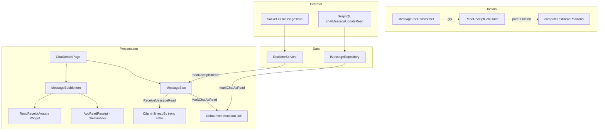
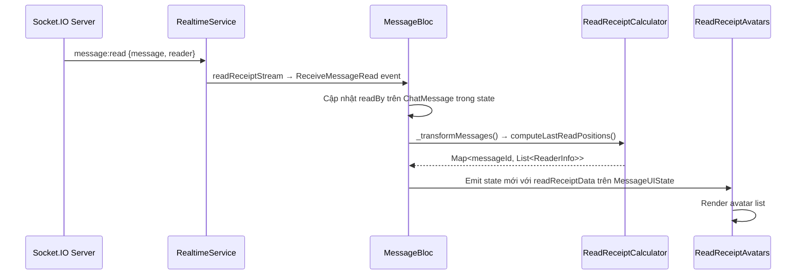
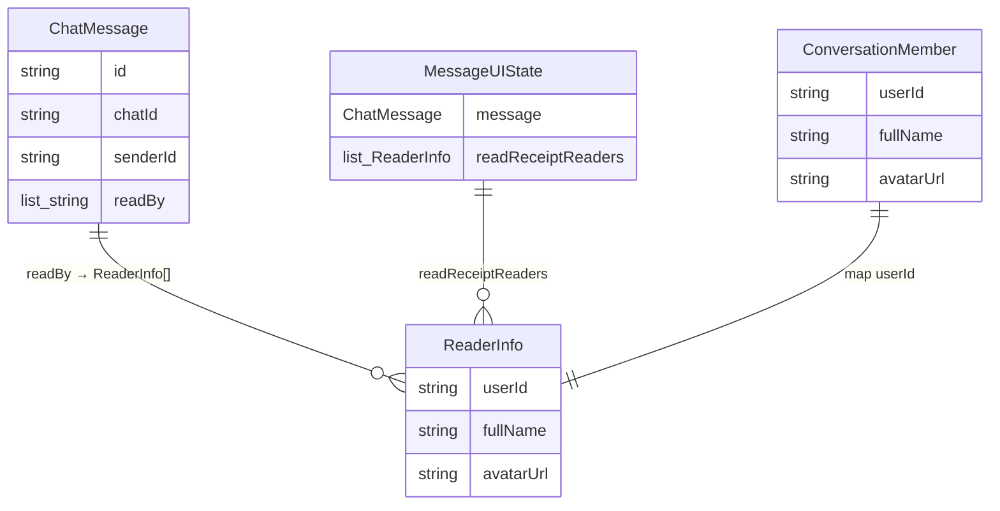

# Tài liệu Thiết kế — Xác nhận đã đọc tin nhắn (Message Read Receipts)

## Tổng quan

Tính năng hiển thị avatar người đã đọc bên dưới tin nhắn trong trang chi tiết cuộc trò chuyện. Hệ thống tận dụng tối đa các thành phần đã có sẵn trong codebase (`readBy` trên `ChatMessage`, `readReceiptStream` trên `RealtimeService`, `AppAvatar`, `ReadReceiptMode.avatars`) và chỉ bổ sung:

1. **Thuật toán tính Last Read Position** — xác định tin nhắn cuối cùng mà mỗi reader đã đọc tới
2. **Widget `ReadReceiptAvatars`** — hiển thị danh sách avatar nhỏ bên dưới message bubble
3. **Xử lý socket event `message:read`** trong `MessageBloc` — cập nhật `readBy` real-time
4. **Debounced mark-as-read** — gửi mutation `chatMessageUpdateRead` khi user đọc tin nhắn

### Quyết định thiết kế chính

| Quyết định | Lựa chọn | Lý do |
|---|---|---|
| Nơi tính toán read position | Pure function trong `ReadReceiptCalculator` | Testable độc lập, không phụ thuộc Flutter |
| Caching kết quả | Tính trong `MessageListTransformer` | Đã có pipeline transform, tránh tính lại mỗi frame |
| Widget avatar | Tạo mới `ReadReceiptAvatars` | `AppReadReceipt` hiện tại chỉ hiển thị checkmark, không phù hợp mở rộng |
| Socket event handling | Thêm event `ReceiveMessageRead` vào `MessageBloc` | Theo pattern đã có cho edit/delete/reaction |
| Debounce mark-as-read | 500ms debounce trong BLoC | Tránh gọi API quá nhiều khi cuộn nhanh |

## Kiến trúc



### Luồng dữ liệu



## Thành phần và Giao diện

### 1. `ReadReceiptCalculator` (Domain — Pure Function)

Đặt tại: `lib/domain/utils/read_receipt_calculator.dart`

```dart
/// Thông tin reader để hiển thị avatar
class ReaderInfo {
  final String userId;
  final String? fullName;
  final String? avatarUrl;
  const ReaderInfo({required this.userId, this.fullName, this.avatarUrl});
}

/// Tính toán vị trí hiển thị read receipt avatars
class ReadReceiptCalculator {
  /// Tính Last Read Position cho mỗi reader
  ///
  /// Input:
  ///   - messages: danh sách tin nhắn đã sắp xếp theo createdAt DESC (mới nhất trước)
  ///   - currentUserId: ID người dùng hiện tại (loại trừ khỏi kết quả)
  ///   - members: danh sách thành viên (để map userId → avatar/name)
  ///
  /// Output: Map<String messageId, List<ReaderInfo>> — chỉ chứa tin nhắn do currentUser gửi
  ///
  /// Thuật toán O(n):
  ///   1. Duyệt messages từ mới nhất → cũ nhất
  ///   2. Với mỗi message do currentUser gửi, kiểm tra readBy
  ///   3. Với mỗi readerId chưa được gán vị trí, gán vào message hiện tại
  ///   4. Khi tất cả reader đã được gán → dừng sớm
  static Map<String, List<ReaderInfo>> computeLastReadPositions({
    required List<ChatMessage> messages,
    required String currentUserId,
    required List<ConversationMember> members,
  });
}
```

### 2. Mở rộng `MessageUIState`

Thêm field vào `MessageUIState`:

```dart
/// Danh sách reader cần hiển thị avatar tại tin nhắn này
final List<ReaderInfo> readReceiptReaders;
```

### 3. Mở rộng `MessageListTransformer`

Gọi `ReadReceiptCalculator.computeLastReadPositions()` trong `transform()` và gán kết quả vào `MessageUIState.readReceiptReaders`.

### 4. `ReadReceiptAvatars` Widget (Presentation)

Đặt tại: `lib/presentation/widgets/design_system/chat/read_receipt_avatars.dart`

```dart
/// Widget hiển thị avatar nhỏ của người đã đọc bên dưới message bubble
class ReadReceiptAvatars extends BaseStatelessWidget {
  const ReadReceiptAvatars({
    super.key,
    required this.readers,
    required this.isGroupChat,
    this.maxAvatars = 4,
    this.avatarSize = 16.0,
    this.onTap,
  });

  final List<ReaderInfo> readers;
  final bool isGroupChat;
  final int maxAvatars;
  final double avatarSize;
  final VoidCallback? onTap;

  @override
  Widget buildContent(BuildContext context) {
    // Direct chat: hiển thị 1 avatar
    // Group chat: hiển thị tối đa maxAvatars + badge "+N"
    // Wrap trong GestureDetector (group) hoặc không (direct)
    // Sử dụng AppAvatar với kích thước avatarSize
    // AnimatedSize để smooth transition
  }
}
```

### 5. `ReadReceiptBottomSheet` Widget (Presentation — Group Chat)

Đặt tại: `lib/presentation/widgets/design_system/chat/read_receipt_bottom_sheet.dart`

```dart
/// Bottom sheet hiển thị danh sách đầy đủ người đã đọc
class ReadReceiptBottomSheet {
  static void show(BuildContext context, List<ReaderInfo> readers) {
    // Sử dụng AppModalBottomSheet
    // Hiển thị AppListView với AppAvatar + AppText cho mỗi reader
    // Sắp xếp theo thứ tự thời gian đọc
  }
}
```

### 6. Mở rộng `MessageBloc`

Thêm event và handler:

```dart
/// Event nhận socket message:read
class ReceiveMessageRead extends MessageEvent {
  final String messageId;
  final String readerId;
  const ReceiveMessageRead({required this.messageId, required this.readerId});
}
```

Handler pattern giống `ReceiveMessageEdited`:
1. Buffer nếu đang background fetch
2. Tìm message trong state, thêm readerId vào readBy (nếu chưa có)
3. Re-transform messages → emit state mới

### 7. Subscribe `readReceiptStream` trong `MessageBloc`

Trong `_subscribeToEditDeleteReaction()`, thêm subscription cho `readReceiptStream`:

```dart
_readReceiptSubscription = _realtimeService.readReceiptStream
    .where((receipt) => receipt.chatId == chatId)
    .listen((receipt) => add(ReceiveMessageRead(
          messageId: receipt.messageId,
          readerId: receipt.readerId,
        )));
```

### 8. Debounced Mark-as-Read

Mở rộng `MarkChatAsRead` event handler trong `MessageBloc`:
- Thêm `_markAsReadDebouncer` (Timer 500ms)
- Retry tối đa 2 lần với backoff 1 giây khi thất bại
- Gọi khi mở chat và khi cuộn tới tin nhắn chưa đọc

## Mô hình Dữ liệu

### Entities hiện có (không thay đổi)

```dart
// ChatMessage — đã có field readBy: List<String>
// ConversationMember — đã có userId, fullName, avatarUrl
// MessageReadReceipt — đã có trong RealtimeService
```

### Entities mới

```dart
/// Thông tin reader cho hiển thị avatar
class ReaderInfo {
  final String userId;
  final String? fullName;
  final String? avatarUrl;

  const ReaderInfo({
    required this.userId,
    this.fullName,
    this.avatarUrl,
  });
}
```

### Mở rộng MessageUIState

```dart
// Thêm field:
final List<ReaderInfo> readReceiptReaders; // default: const []
```

### Mở rộng MessageListTransformer.transform()

```dart
// Thêm parameters:
static List<MessageUIState> transform({
  // ... existing params ...
  List<ConversationMember> members = const [], // MỚI
});
```

### Socket Event Data Format

```json
// Server → Client: message:read
{
  "message": { "id": "msg_123", "conversationId": "conv_456", ... },
  "reader": { "id": "user_789", "fullname": "Nguyễn Văn A", ... }
}
```

### Mermaid — Quan hệ dữ liệu



## Correctness Properties

*Một property là một đặc tính hoặc hành vi phải luôn đúng trong mọi lần thực thi hợp lệ của hệ thống — về bản chất là một phát biểu hình thức về những gì hệ thống phải làm. Properties đóng vai trò cầu nối giữa đặc tả dễ đọc cho con người và đảm bảo tính đúng đắn có thể kiểm chứng bằng máy.*

### Property 1: Last Read Position chính xác

*For any* danh sách tin nhắn sắp xếp theo thời gian, tập hợp conversation members, và currentUserId, kết quả của `computeLastReadPositions` phải thỏa mãn: với mỗi reader R trong kết quả được gán vào message M, thì M là tin nhắn mới nhất (theo `createdAt`) do currentUser gửi mà có R.userId trong `readBy`, và R chỉ xuất hiện trong đúng một message trong kết quả.

**Validates: Requirements 1.1, 1.4, 1.5**

### Property 2: Lọc kết quả đúng

*For any* danh sách tin nhắn với nhiều sender khác nhau và currentUserId, kết quả của `computeLastReadPositions` chỉ chứa messageId của các tin nhắn có `sender.id == currentUserId`, và không có ReaderInfo nào trong kết quả có `userId == currentUserId`.

**Validates: Requirements 1.2, 1.3**

### Property 3: Cập nhật readBy idempotent từ socket event

*For any* danh sách tin nhắn trong state và một `ReceiveMessageRead` event với messageId và readerId, sau khi xử lý event: (a) tin nhắn tương ứng phải chứa readerId trong readBy, và (b) xử lý cùng event lần thứ hai không làm thay đổi state (readerId không bị duplicate).

**Validates: Requirements 4.1, 4.3**

### Property 4: Truncation avatar trong group chat

*For any* danh sách readers có độ dài N > 5, widget `ReadReceiptAvatars` phải hiển thị đúng 4 avatar và badge hiển thị giá trị "+{N-4}". Với N ≤ 5, phải hiển thị tất cả N avatar và không có badge.

**Validates: Requirements 3.2**

### Property 5: Debounce mark-as-read

*For any* chuỗi K lần gọi mark-as-read liên tiếp trong khoảng thời gian < 500ms, hệ thống chỉ thực hiện đúng 1 lần gọi mutation thực tế (lần cuối cùng).

**Validates: Requirements 5.3**

### Property 6: Map userId sang thông tin member

*For any* userId trong readBy và danh sách ConversationMember, nếu userId tồn tại trong members thì ReaderInfo phải có `fullName` và `avatarUrl` khớp với member tương ứng. Nếu userId không tồn tại trong members thì ReaderInfo phải có `fullName = null` và `avatarUrl = null`.

**Validates: Requirements 6.4**

## Xử lý Lỗi

| Tình huống | Xử lý |
|---|---|
| Socket event `message:read` với messageId không tồn tại trong state | Bỏ qua event, log warning, không emit state mới |
| Socket event `message:read` khi đang background fetch | Buffer event trong `SocketEventBuffer`, flush sau khi fetch xong |
| userId trong readBy không có trong ConversationMember | Hiển thị avatar mặc định (initials từ userId), log warning |
| Mutation `chatMessageUpdateRead` thất bại | Log lỗi, retry tối đa 2 lần với backoff 1 giây |
| Mutation retry vẫn thất bại sau 2 lần | Log error, không hiển thị lỗi cho user (non-critical operation) |
| ConversationMember list rỗng | Không hiển thị avatar nào (readReceiptReaders = []) |
| Message list rỗng | `computeLastReadPositions` trả về Map rỗng |

## Chiến lược Testing

### Dual Testing Approach

Tính năng này sử dụng kết hợp unit test và property-based test:

- **Property-based tests**: Kiểm chứng các property phổ quát trên mọi input (thuật toán `ReadReceiptCalculator`, idempotent update, truncation logic)
- **Unit tests**: Kiểm tra các ví dụ cụ thể, edge case, và tích hợp giữa các component

### Property-Based Testing

**Library**: `dart_check` (hoặc `glados` nếu project đã dùng)

**Cấu hình**: Mỗi property test chạy tối thiểu 100 iterations.

**Tag format**: `Feature: message-read-receipts, Property {number}: {property_text}`

Mỗi correctness property ở trên được implement bởi MỘT property-based test duy nhất:

| Property | Test file | Generator |
|---|---|---|
| Property 1: Last Read Position | `test/domain/utils/read_receipt_calculator_test.dart` | Random messages list + random readBy + random members |
| Property 2: Lọc kết quả | `test/domain/utils/read_receipt_calculator_test.dart` | Random messages với nhiều sender + random currentUserId |
| Property 3: Idempotent update | `test/presentation/blocs/message/message_bloc_read_receipt_test.dart` | Random message state + random ReceiveMessageRead events |
| Property 4: Truncation | `test/presentation/widgets/read_receipt_avatars_test.dart` | Random ReaderInfo lists với length 0..20 |
| Property 5: Debounce | `test/presentation/blocs/message/message_bloc_debounce_test.dart` | Random sequences of mark-as-read calls |
| Property 6: Map userId | `test/domain/utils/read_receipt_calculator_test.dart` | Random readBy + random ConversationMember lists |

### Unit Tests

| Test | Mô tả |
|---|---|
| Direct chat — 1 reader đã đọc tin cuối | Verify avatar hiển thị đúng vị trí |
| Direct chat — chưa đọc | Verify không có avatar nào |
| Group chat — 3 readers ở 3 vị trí khác nhau | Verify mỗi avatar ở đúng message |
| Group chat — 6 readers cùng vị trí | Verify 4 avatar + badge "+2" |
| Socket event cho message không tồn tại | Verify state không thay đổi |
| Socket event khi đang background fetch | Verify event được buffer và flush đúng |
| Mark-as-read retry sau failure | Verify retry 2 lần với backoff |
| Empty members list | Verify graceful handling |
