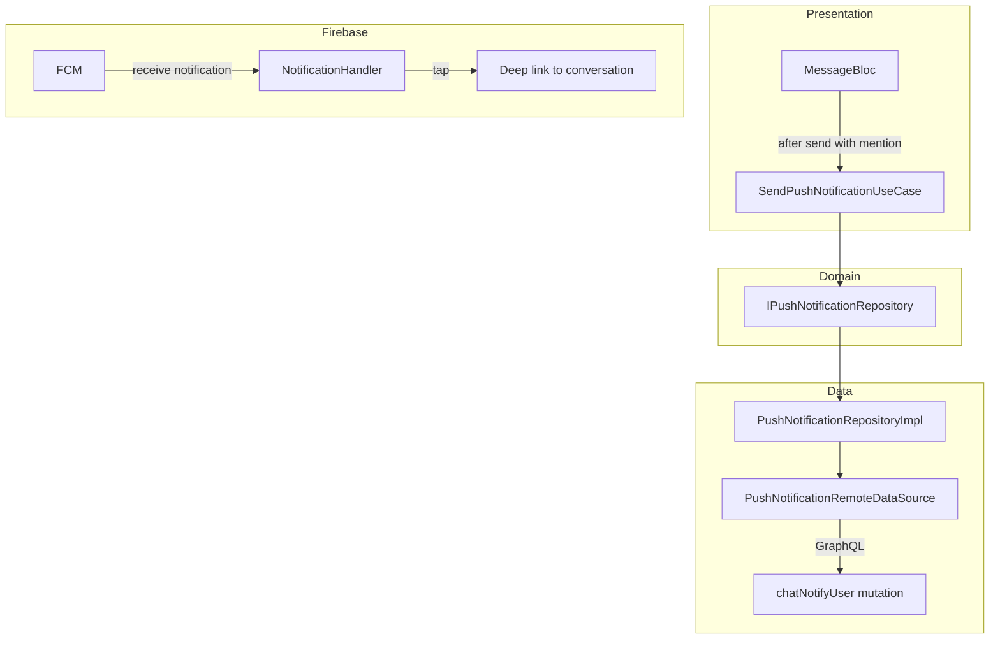
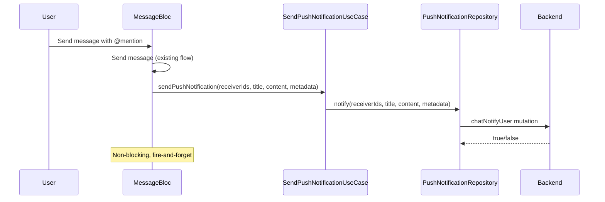

# Tài liệu Thiết kế — Push Notification qua chatNotifyUser

## Tổng quan

Thêm GraphQL operation, data source, repository, và use case cho `chatNotifyUser` mutation. Tích hợp vào flow gửi tin nhắn có mention. Tận dụng: Firebase Messaging setup đã có, notification handling đã có.

### Quyết định thiết kế chính

| Quyết định | Lựa chọn | Lý do |
|---|---|---|
| Trigger point | Sau khi send message thành công (có mention) | Đảm bảo message đã gửi trước khi notify |
| Notification content | Truncate 100 chars | Giới hạn push notification length |
| Deep link | metadata chứa conversationId | Đủ để navigate đến đúng conversation |
| Error handling | Silent fail (log only) | Push notification là non-critical, không block UX |

## Kiến trúc



### Luồng gửi Push Notification



## Thành phần và Giao diện

### 1. GraphQL Operation

Thêm vào `chat_operations.dart`:

```dart
class ChatMutations {
  // ... existing mutations ...

  static const String notifyUser = r'''
    mutation NotifyUser($arguments: ChatNotifyUserData!) {
      chatNotifyUser(arguments: $arguments)
    }
  ''';
}
```

### 2. `IPushNotificationRepository` (Domain)

Đặt tại: `lib/domain/repositories/i_push_notification_repository.dart`

```dart
abstract class IPushNotificationRepository {
  Future<Either<Failure, bool>> notifyUsers({
    required List<String> receiverIds,
    required String title,
    required String content,
    Map<String, dynamic>? metadata,
  });
}
```

### 3. `PushNotificationRemoteDataSource` (Data)

Đặt tại: `lib/data/datasources/notification/push_notification_remote_datasource.dart`

```dart
@lazySingleton
class PushNotificationRemoteDataSource {
  final GraphQLClientWrapper _graphqlClient;

  Future<bool> notifyUsers({
    required List<String> receiverIds,
    required String title,
    required String content,
    Map<String, dynamic>? metadata,
  }) async {
    final result = await _graphqlClient.mutate(
      ChatMutations.notifyUser,
      variables: {
        'arguments': {
          'receiverIds': receiverIds,
          'title': title,
          'content': content,
          if (metadata != null) 'metadata': metadata,
        },
      },
    );
    return result['chatNotifyUser'] as bool? ?? false;
  }
}
```

### 4. `SendPushNotificationUseCase` (Domain)

Đặt tại: `lib/domain/usecases/notification/send_push_notification_usecase.dart`

```dart
@injectable
class SendPushNotificationUseCase {
  final IPushNotificationRepository _repository;
  final AppLogger _logger;

  Future<void> call({
    required List<String> receiverIds,
    required String title,
    required String content,
    Map<String, dynamic>? metadata,
  }) async {
    if (receiverIds.isEmpty) return;
    final result = await _repository.notifyUsers(
      receiverIds: receiverIds,
      title: title,
      content: content.length > 100 ? '${content.substring(0, 100)}...' : content,
      metadata: metadata,
    );
    result.fold(
      (failure) => _logger.error('Push notification failed', failure),
      (success) => _logger.info('Push notification sent', {'count': receiverIds.length}),
    );
  }
}
```

### 5. Tích hợp vào MessageBloc

Sau khi send message thành công, kiểm tra mentions:

```dart
// Trong handler _onSendMessage, sau khi nhận server response:
if (message.mentions.isNotEmpty) {
  final mentionIds = message.mentions.map((m) => m.id).toList();
  _sendPushNotification.call(
    receiverIds: mentionIds,
    title: conversationName,
    content: message.content,
    metadata: {
      'conversationId': message.chatId,
      'messageId': message.id,
      'type': 'mention',
    },
  );
}
```

### 6. Deep Link Handling

Cập nhật notification tap handler hiện có:
- Parse `metadata.conversationId` từ notification payload
- Navigate đến `ChatDetailsPage` với conversationId

## Mô hình Dữ liệu

### GraphQL Variables

```json
{
  "arguments": {
    "receiverIds": ["user_1", "user_2"],
    "title": "Nhóm ABC",
    "content": "@Nguyễn Văn A Bạn xem giúp mình...",
    "metadata": {
      "conversationId": "conv_123",
      "messageId": "msg_456",
      "type": "mention"
    }
  }
}
```

## Correctness Properties

Không có thuật toán phức tạp. Fire-and-forget pattern.

## Xử lý Lỗi

| Tình huống | Xử lý |
|---|---|
| Mutation thất bại | Log error, không hiển thị lỗi cho user (non-critical) |
| receiverIds rỗng | Skip gọi API |
| Network offline | Silent fail, log warning |
| Deep link conversation không tồn tại | Hiển thị `AppSnackBar` thông báo |

## Chiến lược Testing

### Unit Tests

| Test | Mô tả |
|---|---|
| SendPushNotificationUseCase — success | Verify gọi repository đúng params |
| SendPushNotificationUseCase — empty receivers | Verify skip API call |
| SendPushNotificationUseCase — truncate content | Verify content > 100 chars bị truncate |
| SendPushNotificationUseCase — failure | Verify log error, không throw |
| PushNotificationRemoteDataSource — mutation | Verify GraphQL call đúng format |
