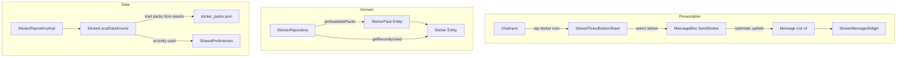

# Tài liệu Thiết kế — Hệ thống Sticker (Sticker System)

## Tổng quan

Thêm sticker picker UI, flow gửi sticker qua `chatMessageAdd` type `STICKER`, và hiển thị sticker trong message bubble. Sticker packs được định nghĩa dạng config (JSON) với URL hình ảnh từ CDN hoặc assets. Tận dụng: `AppEmojiPicker` pattern cho UI, optimistic update trong `MessageBloc`, `AppImage` cho hiển thị.

### Quyết định thiết kế chính

| Quyết định | Lựa chọn | Lý do |
|---|---|---|
| Sticker data source | JSON config bundled trong assets + CDN URLs | Đơn giản, không cần backend API mới, dễ mở rộng |
| Sticker picker UI | Bottom sheet giống emoji picker | Nhất quán UX, pattern đã quen thuộc |
| Recently used | SharedPreferences (local) | Đơn giản, không cần sync server |
| Sticker trong message | `message` field chứa sticker code, URL resolve từ config | Backend chỉ cần lưu code, client resolve URL |
| Image cache | `cached_network_image` (đã có) | Tái sử dụng, hỗ trợ offline |

## Kiến trúc



## Thành phần và Giao diện

### 1. `Sticker` và `StickerPack` Entities (Domain)

Đặt tại: `lib/domain/entities/sticker.dart`

```dart
class Sticker {
  final String code;       // 'pack01_sticker03'
  final String imageUrl;   // CDN URL hoặc asset path
  const Sticker({required this.code, required this.imageUrl});
}

class StickerPack {
  final String id;
  final String name;
  final String thumbnailUrl;
  final List<Sticker> stickers;
  const StickerPack({required this.id, required this.name, required this.thumbnailUrl, required this.stickers});
}
```

### 2. `IStickerRepository` (Domain)

Đặt tại: `lib/domain/repositories/i_sticker_repository.dart`

```dart
abstract class IStickerRepository {
  Future<Either<Failure, List<StickerPack>>> getAvailablePacks();
  Future<Either<Failure, List<Sticker>>> getRecentlyUsed();
  Future<void> addToRecentlyUsed(Sticker sticker);
  Sticker? resolveSticker(String code); // code → Sticker with URL
}
```

### 3. `StickerLocalDataSource` (Data)

Đặt tại: `lib/data/datasources/sticker/sticker_local_datasource.dart`

- Load sticker packs từ `assets/stickers/sticker_packs.json`
- Recently used: SharedPreferences key `recently_used_stickers`
- Cache sticker map cho quick lookup by code

### 4. `StickerPickerBottomSheet` (Presentation)

Đặt tại: `lib/presentation/widgets/design_system/chat/sticker_picker.dart`

```dart
class StickerPickerBottomSheet extends BaseStatefulWidget {
  final void Function(Sticker sticker) onStickerSelected;

  /// Tab bar: [Gần đây] [Pack 1] [Pack 2] ...
  /// Grid: 4 cột, mỗi sticker là AppImage với GestureDetector
  /// Sử dụng AppColors, AppDimens, context.l10n
}
```

### 5. `StickerMessageWidget` (Presentation)

Đặt tại: `lib/presentation/widgets/design_system/chat/sticker_message.dart`

```dart
class StickerMessageWidget extends BaseStatelessWidget {
  final String stickerCode;
  /// Resolve code → URL qua IStickerRepository
  /// Hiển thị AppImage kích thước 120dp, không có bubble background
  /// Placeholder khi loading, error icon khi fail
}
```

### 6. Mở rộng `ChatInput`

- Thêm nút sticker icon cạnh emoji/attachment
- Tap → show `StickerPickerBottomSheet`
- Callback `onStickerSelected` → `MessageBloc.add(SendSticker(code))`

### 7. Mở rộng `MessageBloc`

```dart
class SendSticker extends MessageEvent {
  final String stickerCode;
  const SendSticker({required this.stickerCode});
}
```

Handler: optimistic update → `chatMessageAdd(type: STICKER, message: stickerCode)` → replace temp.

## Mô hình Dữ liệu

### Sticker Pack JSON (assets)

```json
{
  "packs": [
    {
      "id": "emotions",
      "name": "Cảm xúc",
      "thumbnail": "https://cdn.example.com/stickers/emotions/thumb.png",
      "stickers": [
        {"code": "emotions_happy", "url": "https://cdn.example.com/stickers/emotions/happy.png"},
        {"code": "emotions_sad", "url": "https://cdn.example.com/stickers/emotions/sad.png"}
      ]
    }
  ]
}
```

### GraphQL — Send Sticker

```graphql
# Variables cho chatMessageAdd:
# {
#   "arguments": {
#     "conversationId": "conv_123",
#     "type": "STICKER",
#     "message": "emotions_happy",
#     "createdAt": 1709000000000
#   }
# }
```

## Correctness Properties

Tính năng này chủ yếu là UI + simple CRUD. Không có thuật toán phức tạp cần property-based testing.

No testable properties identified. All acceptance criteria are best validated through example-based widget tests.

## Xử lý Lỗi

| Tình huống | Xử lý |
|---|---|
| Sticker pack JSON load thất bại | Log error, hiển thị empty state trong picker |
| Sticker image không load được | Hiển thị placeholder icon, log warning |
| Send sticker mutation thất bại | Hiển thị trạng thái failed trên temp message + retry |
| Sticker code không resolve được (nhận từ server) | Hiển thị placeholder + sticker code text |

## Chiến lược Testing

### Unit Tests

| Test | Mô tả |
|---|---|
| StickerLocalDataSource — load packs | Verify parse JSON đúng |
| StickerRepositoryImpl — resolve code | Verify trả về đúng Sticker |
| StickerRepositoryImpl — recently used | Verify lưu và load đúng |
| MessageBloc — SendSticker | Verify optimistic update + replace |

### Widget Tests

| Test | Mô tả |
|---|---|
| StickerPickerBottomSheet — hiển thị packs | Verify tabs và grid |
| StickerPickerBottomSheet — select sticker | Verify callback + đóng sheet |
| StickerMessageWidget — hiển thị sticker | Verify image render đúng kích thước |
| StickerMessageWidget — error state | Verify placeholder khi URL fail |
