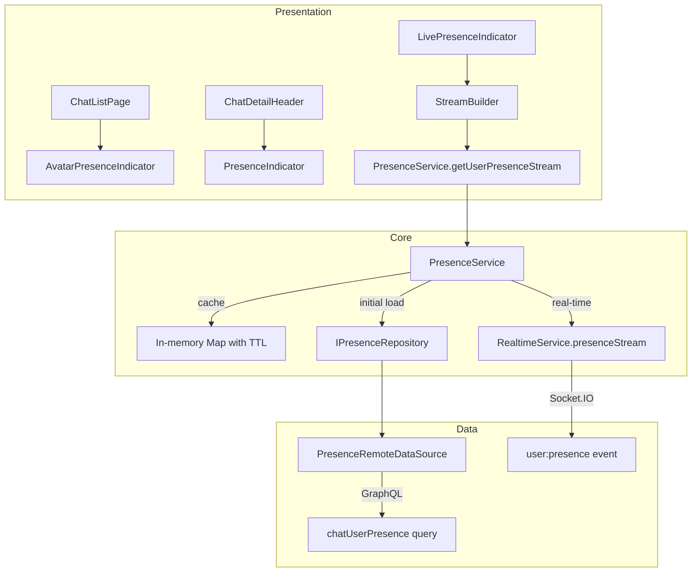
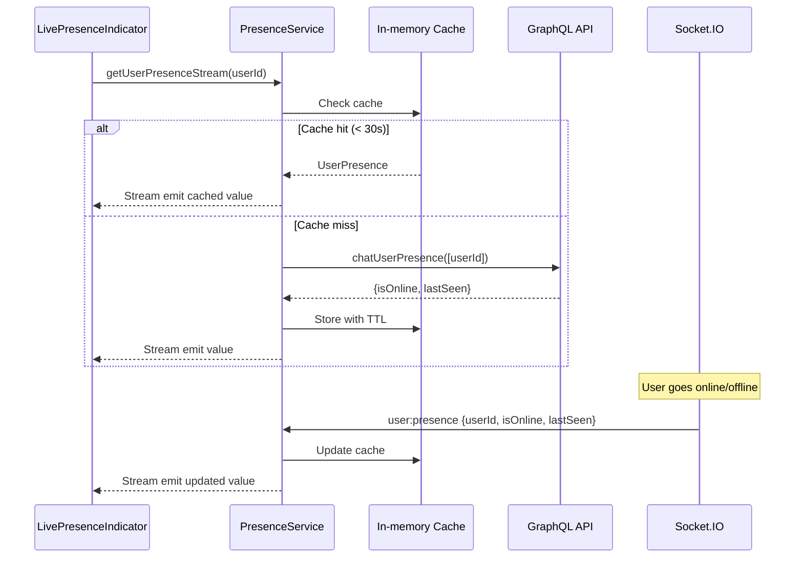

# Tài liệu Thiết kế — Trạng thái Online/Offline User (User Presence Status)

## Tổng quan

Kết nối `LivePresenceIndicator` với backend Redis-based presence system. Tạo `PresenceService` quản lý cache + real-time updates. Tận dụng: `PresenceIndicator`/`AvatarPresenceIndicator` widgets đã có, localization keys đã có, Socket.IO infrastructure đã có.

### Quyết định thiết kế chính

| Quyết định | Lựa chọn | Lý do |
|---|---|---|
| Data source | GraphQL query + Socket.IO events | Query cho initial load, socket cho real-time updates |
| Cache | In-memory Map + TTL 30s | Đơn giản, đủ cho use case, tránh stale data |
| Service pattern | Singleton `PresenceService` với streams | Nhiều widgets cần subscribe cùng user |
| Backend API | Cần thêm GraphQL query `chatUserPresence` | Backend có Redis data nhưng chưa expose qua API |
| Socket event | Cần thêm emit `user:presence` trong gateway | Backend set Redis nhưng chưa emit socket event |

**Lưu ý quan trọng:** Backend hiện tại set Redis keys khi connect/disconnect nhưng KHÔNG emit socket event cho presence changes và KHÔNG có GraphQL query để đọc presence. Cần coordinate với backend team để thêm:
1. GraphQL query `chatUserPresence(userIds: [String!]!)` → đọc từ Redis
2. Socket.IO emit `user:presence` event khi user connect/disconnect

## Kiến trúc



### Luồng dữ liệu



## Thành phần và Giao diện

### 1. `UserPresence` Entity (Domain)

Đặt tại: `lib/domain/entities/user_presence.dart`

```dart
class UserPresence {
  final String userId;
  final bool isOnline;
  final DateTime? lastSeen;
  const UserPresence({
    required this.userId,
    required this.isOnline,
    this.lastSeen,
  });

  static const offline = UserPresence(userId: '', isOnline: false);
}
```

### 2. `IPresenceRepository` (Domain)

Đặt tại: `lib/domain/repositories/i_presence_repository.dart`

```dart
abstract class IPresenceRepository {
  /// Query presence cho danh sách users
  Future<Either<Failure, List<UserPresence>>> getUsersPresence(List<String> userIds);
}
```

### 3. `PresenceRemoteDataSource` (Data)

Đặt tại: `lib/data/datasources/presence/presence_remote_datasource.dart`

```dart
@lazySingleton
class PresenceRemoteDataSource {
  final GraphQLClientWrapper _graphqlClient;

  /// Query batch user presence từ backend
  Future<List<UserPresenceModel>> getUsersPresence(List<String> userIds) async {
    final result = await _graphqlClient.query(
      PresenceQueries.getUserPresence,
      variables: {'userIds': userIds},
    );
    // Parse response
  }
}
```

### 4. `PresenceService` (Core — Service)

Đặt tại: `lib/core/services/presence_service.dart`

```dart
@lazySingleton
class PresenceService {
  final IPresenceRepository _repository;
  final RealtimeService _realtimeService;
  final AppLogger _logger;

  /// In-memory cache: userId → (UserPresence, DateTime cachedAt)
  final Map<String, _CachedPresence> _cache = {};
  static const _cacheTtl = Duration(seconds: 30);

  /// Stream controllers per userId
  final Map<String, BehaviorSubject<UserPresence>> _subjects = {};

  /// Stream cho một user cụ thể
  Stream<UserPresence> getUserPresenceStream(String userId) {
    _ensureSubject(userId);
    _fetchIfNeeded(userId);
    return _subjects[userId]!.stream;
  }

  /// Batch fetch cho chat list
  Future<void> fetchPresenceForUsers(List<String> userIds) async {
    final staleIds = userIds.where(_isCacheStale).toList();
    if (staleIds.isEmpty) return;
    final result = await _repository.getUsersPresence(staleIds);
    result.fold(
      (failure) => _logger.error('Presence fetch failed', failure),
      (presences) {
        for (final p in presences) {
          _updateCache(p);
        }
      },
    );
  }

  /// Subscribe socket presence events
  void _subscribeSocketEvents() {
    _realtimeService.presenceStream.listen((event) {
      _updateCache(event);
    });
  }

  void _updateCache(UserPresence presence) {
    _cache[presence.userId] = _CachedPresence(presence, DateTime.now());
    _subjects[presence.userId]?.add(presence);
  }

  void dispose() {
    for (final subject in _subjects.values) { subject.close(); }
  }
}
```

### 5. Cập nhật `LivePresenceIndicator`

Thay thế TODO placeholder bằng real implementation:

```dart
class LivePresenceIndicator extends StatelessWidget {
  final String userId;
  // ...

  @override
  Widget build(BuildContext context) {
    final presenceService = getIt<PresenceService>();
    return StreamBuilder<UserPresence>(
      stream: presenceService.getUserPresenceStream(userId),
      builder: (context, snapshot) {
        final presence = snapshot.data;
        return PresenceIndicator(
          isOnline: presence?.isOnline ?? false,
          lastSeen: presence?.lastSeen,
          showLabel: showLabel,
          dotSize: dotSize,
          textStyle: textStyle,
        );
      },
    );
  }
}
```

### 6. GraphQL Operations (cần backend thêm)

```dart
class PresenceQueries {
  static const String getUserPresence = r'''
    query GetUserPresence($userIds: [String!]!) {
      chatUserPresence(userIds: $userIds) {
        userId
        isOnline
        lastSeen
      }
    }
  ''';
}
```

### 7. Socket.IO Event (cần backend thêm)

Backend cần emit trong `handleConnection` và `handleDisconnect`:
```typescript
// Emit to all conversations of user
this.server.to(conversationId).emit('user:presence', {
  userId: client.officeUserId,
  isOnline: true/false,
  lastSeen: new Date().getTime()
});
```

### 8. Tích hợp vào Chat List

Trong chat list item, cho direct chat:
- Gọi `presenceService.fetchPresenceForUsers(memberIds)` khi load list
- Wrap avatar với `Stack` + `AvatarPresenceIndicator` kết nối `PresenceService`

### 9. Tích hợp vào Chat Detail Header

Trong chat detail header, cho direct chat:
- Thêm `LivePresenceIndicator(userId: otherUserId)` dưới tên user

## Mô hình Dữ liệu

### Entity mới

```dart
class UserPresence {
  final String userId;
  final bool isOnline;
  final DateTime? lastSeen;
}
```

### Socket Event Format

```json
{
  "userId": "user_123",
  "isOnline": true,
  "lastSeen": 1709000000000
}
```

## Correctness Properties

### Property 1: Cache consistency

*For any* sequence of presence updates (socket events) cho một userId, giá trị trong cache và stream phải luôn phản ánh update mới nhất. Không có race condition giữa API fetch và socket update.

**Validates: Requirements 1.2, 2.2**

## Xử lý Lỗi

| Tình huống | Xử lý |
|---|---|
| GraphQL query thất bại | Log error, trả về offline mặc định, retry sau 30s |
| Socket disconnect | Giữ cache hiện tại, không clear |
| userId không tồn tại | Trả về offline mặc định |
| Backend chưa có API | Fallback: tất cả hiển thị offline (graceful degradation) |

## Chiến lược Testing

### Unit Tests

| Test | Mô tả |
|---|---|
| PresenceService — cache hit | Verify không gọi API khi cache còn valid |
| PresenceService — cache miss | Verify gọi API và update cache |
| PresenceService — socket update | Verify cache và stream được update |
| PresenceService — batch fetch | Verify chỉ fetch stale userIds |

### Widget Tests

| Test | Mô tả |
|---|---|
| LivePresenceIndicator — online | Verify green dot + "Online" text |
| LivePresenceIndicator — offline | Verify grey dot + "Last seen" text |
| LivePresenceIndicator — no data | Verify offline mặc định |
