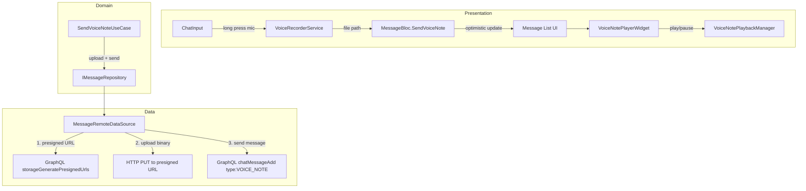
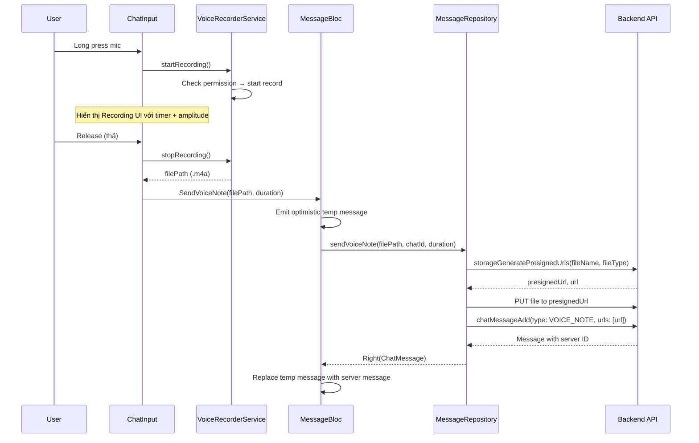

# Tài liệu Thiết kế — Ghi âm Tin nhắn Thoại (Voice Recording / Voice Note)

## Tổng quan

Tích hợp ghi âm thật vào `ChatInput`, upload audio qua presigned URL, gửi message type `VOICE_NOTE`, và hiển thị voice note player trong message bubble. Tận dụng tối đa: upload flow hiện có (`storageGeneratePresignedUrls`), `ChatInput` UI ghi âm, `MessageType.voiceNote`, optimistic update pattern trong `MessageBloc`.

### Quyết định thiết kế chính

| Quyết định | Lựa chọn | Lý do |
|---|---|---|
| Thư viện ghi âm | Package `record` | Cross-platform, API đơn giản, hỗ trợ AAC/m4a |
| Audio format | AAC (.m4a), 128kbps | Chất lượng tốt, file size nhỏ, tương thích rộng |
| Upload flow | Presigned URL (2-step) | Tái sử dụng flow upload hiện có cho image/file |
| Audio player | Package `just_audio` | Lightweight, hỗ trợ streaming, seek, duration |
| Quản lý playback | Singleton `VoiceNotePlaybackManager` | Đảm bảo chỉ 1 voice note phát tại một thời điểm |
| Permission | Package `permission_handler` | Đã có trong project, xử lý microphone permission |

## Kiến trúc



### Luồng dữ liệu — Ghi âm và gửi



## Thành phần và Giao diện

### 1. `VoiceRecorderService` (Core — Service)

Đặt tại: `lib/core/services/voice_recorder_service.dart`

```dart
/// Service quản lý ghi âm audio sử dụng package `record`
@lazySingleton
class VoiceRecorderService {
  final AppLogger _logger;

  /// Trạng thái hiện tại
  bool get isRecording => ...;

  /// Stream amplitude cho UI waveform
  Stream<double> get amplitudeStream => ...;

  /// Kiểm tra và yêu cầu quyền microphone
  Future<bool> requestPermission() async { ... }

  /// Bắt đầu ghi âm
  /// Returns: true nếu bắt đầu thành công
  Future<bool> startRecording() async { ... }

  /// Dừng ghi âm và trả về file path
  /// Returns: đường dẫn file .m4a đã ghi
  Future<String?> stopRecording() async { ... }

  /// Huỷ ghi âm và xoá file tạm
  Future<void> cancelRecording() async { ... }

  /// Dispose resources
  void dispose() { ... }
}
```

### 2. `VoiceNotePlaybackManager` (Core — Service)

Đặt tại: `lib/core/services/voice_note_playback_manager.dart`

```dart
/// Singleton quản lý playback voice note — chỉ 1 audio phát tại một thời điểm
@lazySingleton
class VoiceNotePlaybackManager {
  /// ID của voice note đang phát
  String? get currentPlayingId => ...;

  /// Stream trạng thái playback cho một message ID
  Stream<VoiceNotePlaybackState> getPlaybackStream(String messageId) => ...;

  /// Phát voice note
  Future<void> play(String messageId, String audioUrl) async { ... }

  /// Tạm dừng
  Future<void> pause() async { ... }

  /// Seek đến vị trí
  Future<void> seek(Duration position) async { ... }

  /// Dispose
  void dispose() { ... }
}

class VoiceNotePlaybackState {
  final bool isPlaying;
  final Duration position;
  final Duration duration;
  const VoiceNotePlaybackState({...});
}
```

### 3. `VoiceNotePlayerWidget` (Presentation — Widget)

Đặt tại: `lib/presentation/widgets/design_system/chat/voice_note_player.dart`

```dart
/// Widget phát lại voice note trong message bubble
class VoiceNotePlayerWidget extends BaseStatefulWidget {
  const VoiceNotePlayerWidget({
    super.key,
    required this.messageId,
    required this.audioUrl,
    required this.duration,
    this.isCurrentUser = false,
  });

  final String messageId;
  final String audioUrl;
  final Duration duration;
  final bool isCurrentUser;

  /// Hiển thị: [Play/Pause] [===progress===] [mm:ss]
  /// Sử dụng AppColors, AppDimens, AppIconButton
  /// StreamBuilder kết nối VoiceNotePlaybackManager
}
```

### 4. Mở rộng `ChatInput`

Thay thế logic giả trong `_stopRecording`:
- Inject `VoiceRecorderService` thay vì tạo fakePath
- `_startRecording()` → gọi `voiceRecorderService.startRecording()`
- `_stopRecording()` → gọi `voiceRecorderService.stopRecording()` → callback `onVoiceRecordingEnded(realPath)`
- `_cancelRecording()` → gọi `voiceRecorderService.cancelRecording()`
- Subscribe `amplitudeStream` để hiển thị waveform indicator

### 5. Mở rộng `MessageBloc`

Thêm event `SendVoiceNote`:

```dart
class SendVoiceNote extends MessageEvent {
  final String filePath;
  final int durationSeconds;
  const SendVoiceNote({required this.filePath, required this.durationSeconds});
}
```

Handler: tạo temp message → upload file → send message → replace temp.

### 6. Mở rộng `MessageRemoteDataSource`

Thêm method `sendVoiceNote`:
- Gọi `storageGeneratePresignedUrls` với fileName + fileType `audio/mp4`
- Upload file binary qua HTTP PUT
- Gọi `chatMessageAdd` với type `VOICE_NOTE`

### 7. Tích hợp vào Message Bubble

Trong message bubble builder, khi `message.type == MessageType.voiceNote`:
- Render `VoiceNotePlayerWidget` thay vì text content
- Truyền `audioUrl` từ `message.mediaUrls[0]`

## Mô hình Dữ liệu

### Entities hiện có (không thay đổi)

```dart
// ChatMessage — đã có type, mediaUrls (mapped từ urls)
// MessageType.voiceNote — đã có trong enum
```

### Entities mới

```dart
/// Trạng thái playback cho voice note
class VoiceNotePlaybackState {
  final bool isPlaying;
  final Duration position;
  final Duration duration;
  const VoiceNotePlaybackState({
    this.isPlaying = false,
    this.position = Duration.zero,
    this.duration = Duration.zero,
  });
}
```

### GraphQL — Send Voice Note

```graphql
mutation SendMessage($arguments: ChatAddMessageInput!) {
  chatMessageAdd(arguments: $arguments) {
    # ... existing fields
  }
}
# Variables:
# {
#   "arguments": {
#     "conversationId": "conv_123",
#     "type": "VOICE_NOTE",
#     "message": "",
#     "urls": ["https://storage.example.com/voice_note_123.m4a"],
#     "fileName": "voice_note_123.m4a",
#     "createdAt": 1709000000000
#   }
# }
```

## Correctness Properties

### Property 1: File cleanup sau ghi âm

*For any* recording session (start → stop hoặc start → cancel), sau khi session kết thúc, file tạm trong cache directory phải được xoá (sau upload thành công hoặc sau cancel). Không có file tạm orphan.

**Validates: Requirements 1.6, 2.5**

### Property 2: Single playback

*For any* thời điểm, chỉ có tối đa 1 voice note đang phát. Khi phát voice note mới, voice note cũ phải ở trạng thái paused/stopped.

**Validates: Requirements 3.6**

## Xử lý Lỗi

| Tình huống | Xử lý |
|---|---|
| Quyền microphone bị từ chối | Hiển thị `AppAlertDialog` giải thích + nút Settings |
| Ghi âm thất bại (hardware error) | Log error, hiển thị `AppSnackBar` thông báo lỗi |
| Upload thất bại | Hiển thị trạng thái "gửi thất bại" trên temp message + nút retry |
| Audio URL không load được (player) | Hiển thị icon lỗi thay vì player, log warning |
| Ghi âm vượt 5 phút | Tự động dừng, gửi phần đã ghi |
| App bị kill khi đang ghi âm | File tạm sẽ bị xoá bởi OS (cache directory) |

## Chiến lược Testing

### Unit Tests

| Test | Mô tả |
|---|---|
| VoiceRecorderService — start/stop | Verify file path trả về hợp lệ |
| VoiceRecorderService — cancel | Verify file tạm bị xoá |
| VoiceRecorderService — permission denied | Verify trả về false, không crash |
| VoiceNotePlaybackManager — single playback | Verify phát mới dừng cũ |
| VoiceNotePlaybackManager — play/pause/seek | Verify state transitions đúng |
| MessageBloc — SendVoiceNote | Verify optimistic update + replace |
| MessageBloc — SendVoiceNote upload fail | Verify error state trên temp message |

### Widget Tests

| Test | Mô tả |
|---|---|
| VoiceNotePlayerWidget — hiển thị đúng | Verify play button, duration, progress |
| VoiceNotePlayerWidget — play/pause toggle | Verify icon thay đổi |
| ChatInput — recording UI | Verify timer, cancel gesture |
