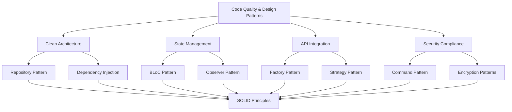

# Rules Integration Matrix - Comprehensive System Integration

**Type**: Manual  
**Description**: Integration matrix showing how Code Quality & Design Patterns rules integrate with existing Augment rules system for seamless AI-assisted development

## Integration Overview

### Rule Dependencies & Cross-References



### Rule Application Priority Matrix

| Scenario | Primary Rule | Supporting Rules | Code Quality Enforcement |
|----------|-------------|------------------|-------------------------|
| **New Feature Development** | `code_quality_design_patterns.md` | `clean_architecture.md`, `state_management.md` | ✅ Always Applied |
| **API Integration** | `api_integration.md` | `code_quality_design_patterns.md` | ✅ Factory & Strategy Patterns |
| **State Management** | `state_management.md` | `code_quality_design_patterns.md` | ✅ Observer & Command Patterns |
| **Security Implementation** | `security_compliance.md` | `code_quality_design_patterns.md` | ✅ Encapsulation & SOLID |
| **Performance Optimization** | `monitoring_optimization.md` | `code_quality_design_patterns.md` | ✅ Strategy Pattern |
| **Testing Implementation** | `comprehensive_testing.md` | `code_quality_design_patterns.md` | ✅ Dependency Injection |

## Specific Integration Examples

### Clean Architecture + Code Quality Integration
```dart
// Integration Example: Message Use Case with SOLID Principles
class SendMessageUseCase implements UseCase<Message, SendMessageParams> {
  // Dependency Inversion Principle - depend on abstractions
  final MessageRepository _repository;
  final MessageValidator _validator;
  final MessageEncryptionService _encryptionService;
  final NotificationService _notificationService;
  
  SendMessageUseCase({
    required MessageRepository repository,
    required MessageValidator validator,
    required MessageEncryptionService encryptionService,
    required NotificationService notificationService,
  }) : _repository = repository,
       _validator = validator,
       _encryptionService = encryptionService,
       _notificationService = notificationService;
  
  @override
  Future<Either<Failure, Message>> call(SendMessageParams params) async {
    // Single Responsibility - this use case only handles message sending
    try {
      // Clear logical flow with early returns
      final validationResult = await _validator.validate(params);
      if (!validationResult.isValid) {
        return Left(ValidationFailure(validationResult.errors.first));
      }
      
      // Factory pattern for message creation (from code_quality rules)
      final message = MessageFactory.createMessage(
        type: params.messageType,
        data: params.toMap(),
      );
      
      // Strategy pattern for encryption (from code_quality rules)
      final processedMessage = params.shouldEncrypt
          ? await _encryptionService.encrypt(message, params.encryptionKey!)
          : message;
      
      // Repository pattern (from clean_architecture rules)
      final result = await _repository.saveMessage(processedMessage);
      
      return result.fold(
        (failure) => Left(failure),
        (savedMessage) async {
          // Observer pattern notification (from code_quality rules)
          await _notificationService.notifyMessageSent(savedMessage);
          return Right(savedMessage);
        },
      );
      
    } catch (e) {
      return Left(UnexpectedFailure(e.toString()));
    }
  }
}
```

### State Management + Design Patterns Integration
```dart
// Integration Example: BLoC with Observer and Command Patterns
class MessageBloc extends Bloc<MessageEvent, MessageState> 
    implements MessageObserver { // Observer pattern from code_quality rules
  
  final SendMessageUseCase _sendMessageUseCase;
  final GetMessagesUseCase _getMessagesUseCase;
  final MessageCommandInvoker _commandInvoker; // Command pattern
  final MessageSubject _messageSubject; // Observer pattern
  
  MessageBloc({
    required SendMessageUseCase sendMessageUseCase,
    required GetMessagesUseCase getMessagesUseCase,
    required MessageCommandInvoker commandInvoker,
    required MessageSubject messageSubject,
  }) : _sendMessageUseCase = sendMessageUseCase,
       _getMessagesUseCase = getMessagesUseCase,
       _commandInvoker = commandInvoker,
       _messageSubject = messageSubject,
       super(const MessageState.initial()) {
    
    // Register as observer for real-time updates
    _messageSubject.addObserver(this);
    
    // Event handlers following SOLID principles
    on<SendMessageEvent>(_onSendMessage);
    on<LoadMessagesEvent>(_onLoadMessages);
    on<UndoMessageEvent>(_onUndoMessage); // Command pattern
  }
  
  // Single Responsibility - each method handles one specific event
  Future<void> _onSendMessage(
    SendMessageEvent event,
    Emitter<MessageState> emit,
  ) async {
    // Command pattern implementation
    final command = SendMessageCommand(
      message: event.message,
      repository: _messageRepository,
      notificationService: _notificationService,
    );
    
    try {
      await _commandInvoker.executeCommand(command);
      
      // Update state following BLoC pattern
      final currentState = state;
      if (currentState is MessageLoaded) {
        emit(currentState.copyWith(
          messages: [event.message, ...currentState.messages],
        ));
      }
    } catch (e) {
      emit(MessageState.error(
        message: e.toString(),
        messages: state.messages,
      ));
    }
  }
  
  // Observer pattern implementation
  @override
  void onMessageReceived(Message message) {
    add(MessageEvent.receiveMessage(message: message));
  }
  
  @override
  void onMessageStatusChanged(String messageId, MessageStatus status) {
    add(MessageEvent.updateMessageStatus(
      messageId: messageId,
      status: status,
    ));
  }
}
```

### API Integration + Factory Pattern Integration
```dart
// Integration Example: API Data Sources with Factory and Strategy Patterns
class MessageRemoteDataSource {
  final ApiClient _apiClient;
  final MessageFactory _messageFactory; // Factory pattern
  final Map<MessageType, MessageProcessingStrategy> _processingStrategies; // Strategy pattern
  
  MessageRemoteDataSource({
    required ApiClient apiClient,
    required MessageFactory messageFactory,
    required Map<MessageType, MessageProcessingStrategy> processingStrategies,
  }) : _apiClient = apiClient,
       _messageFactory = messageFactory,
       _processingStrategies = processingStrategies;
  
  Future<List<Message>> getMessages(String conversationId) async {
    try {
      final response = await _apiClient.get('/conversations/$conversationId/messages');
      final messagesData = response.data as List<dynamic>;
      
      // Factory pattern for creating messages from API data
      final messages = <Message>[];
      for (final messageData in messagesData) {
        final messageType = MessageType.values.firstWhere(
          (type) => type.name == messageData['type'],
        );
        
        // Use factory to create appropriate message type
        final message = _messageFactory.createMessage(messageType, messageData);
        
        // Use strategy pattern for processing
        final strategy = _processingStrategies[messageType];
        if (strategy != null) {
          final processedMessage = await strategy.processMessage(message);
          messages.add(processedMessage);
        } else {
          messages.add(message);
        }
      }
      
      return messages;
      
    } on DioException catch (e) {
      throw ServerException(
        message: e.message ?? 'Failed to fetch messages',
        statusCode: e.response?.statusCode ?? 500,
      );
    }
  }
}
```

## Team Workflow Integration

### Code Review Integration
```dart
// Integration with code_review_automation.md
class CodeQualityValidator extends ArchitectureValidator {
  @override
  Future<ValidationResult> validate(PullRequest pr) async {
    final violations = <ArchitectureViolation>[];
    
    // Check SOLID principles compliance
    violations.addAll(await _checkSOLIDPrinciples(pr.changedFiles));
    
    // Check design patterns usage
    violations.addAll(await _checkDesignPatterns(pr.changedFiles));
    
    // Check OOP best practices
    violations.addAll(await _checkOOPBestPractices(pr.changedFiles));
    
    // Check logical flow and clarity
    violations.addAll(await _checkLogicalFlow(pr.changedFiles));
    
    // Integrate with existing architecture validation
    violations.addAll(await super._checkCleanArchitecture(pr.changedFiles));
    
    return violations.isEmpty
        ? ValidationResult.success('Code quality standards met')
        : ValidationResult.failure('Code quality violations found', details: violations);
  }
  
  Future<List<ArchitectureViolation>> _checkSOLIDPrinciples(
    List<ChangedFile> files,
  ) async {
    final violations = <ArchitectureViolation>[];
    
    for (final file in files) {
      // Single Responsibility Principle check
      if (_hasMultipleResponsibilities(file.content)) {
        violations.add(ArchitectureViolation(
          type: ViolationType.solidViolation,
          file: file.path,
          description: 'Class violates Single Responsibility Principle',
          severity: Severity.warning,
          suggestion: 'Consider breaking this class into smaller, focused classes',
        ));
      }
      
      // Open/Closed Principle check
      if (_violatesOpenClosedPrinciple(file.content)) {
        violations.add(ArchitectureViolation(
          type: ViolationType.solidViolation,
          file: file.path,
          description: 'Code violates Open/Closed Principle',
          severity: Severity.warning,
          suggestion: 'Use abstraction and polymorphism instead of modification',
        ));
      }
      
      // Dependency Inversion Principle check
      if (_violatesDependencyInversion(file.content)) {
        violations.add(ArchitectureViolation(
          type: ViolationType.solidViolation,
          file: file.path,
          description: 'Code violates Dependency Inversion Principle',
          severity: Severity.error,
          suggestion: 'Depend on abstractions, not concrete implementations',
        ));
      }
    }
    
    return violations;
  }
}
```

### Git Workflow Integration
```yaml
# Integration with git_automation.md
# .augment/scripts/enhanced-pre-commit-validation.sh

#!/bin/bash
echo "🔍 Running enhanced pre-commit validation with code quality checks..."

# Existing checks from git_automation.md
dart format --set-exit-if-changed lib/ test/
dart analyze --fatal-infos
flutter test --coverage

# New code quality checks
echo "📋 Checking SOLID principles compliance..."
dart run solid_principles_checker lib/

echo "🎨 Checking design patterns usage..."
dart run design_patterns_analyzer lib/

echo "🧹 Checking code clarity and logical flow..."
dart run code_clarity_analyzer lib/

echo "📊 Checking OOP best practices..."
dart run oop_practices_checker lib/

# Performance impact with code quality
echo "⚡ Running performance benchmarks with quality metrics..."
flutter test integration_test/performance_test.dart
dart run code_quality_performance_analyzer

echo "✅ All enhanced pre-commit checks passed!"
```

## AI Prompt Enhancement

### Enhanced Prompting with Integrated Rules
```markdown
# Example Enhanced Prompt for AI

When implementing a new message feature, follow these integrated guidelines:

## Architecture (from clean_architecture.md + code_quality_design_patterns.md):
- Use Clean Architecture layers with proper dependency flow
- Apply SOLID principles throughout implementation
- Implement appropriate design patterns (Repository, Factory, Observer, Strategy)
- Ensure single responsibility for each class and method

## State Management (from state_management.md + code_quality_design_patterns.md):
- Use BLoC pattern with Observer pattern for real-time updates
- Implement Command pattern for undoable operations
- Apply Strategy pattern for different message processing types
- Maintain clear separation of concerns

## Code Quality Standards:
- Use intention-revealing names for all variables, methods, and classes
- Keep methods small and focused (< 30 lines)
- Apply early returns to reduce nesting
- Implement proper error handling with specific exception types
- Use dependency injection for all external dependencies

## Performance Requirements:
- Message delivery < 100ms
- Memory usage < 150MB
- Startup time < 2s
- Apply performance-optimized design patterns

Please implement the feature following these integrated guidelines and provide examples showing how the rules work together.
```

## Monitoring & Continuous Improvement

### Rule Effectiveness Tracking
```dart
class IntegratedRuleEffectivenessMonitor {
  static Future<void> trackRuleIntegration() async {
    final metrics = await _collectIntegrationMetrics();
    
    // Track how well rules work together
    await _trackRuleSynergy(metrics);
    
    // Identify integration gaps
    await _identifyIntegrationGaps(metrics);
    
    // Measure AI response quality with integrated rules
    await _measureAIResponseQuality(metrics);
    
    // Generate improvement recommendations
    await _generateIntegrationImprovements(metrics);
  }
  
  static Future<IntegrationMetrics> _collectIntegrationMetrics() async {
    return IntegrationMetrics(
      codeQualityScore: await _calculateCodeQualityScore(),
      architectureCompliance: await _calculateArchitectureCompliance(),
      designPatternUsage: await _calculateDesignPatternUsage(),
      solidPrincipleAdherence: await _calculateSOLIDAdherence(),
      aiResponseAccuracy: await _calculateAIResponseAccuracy(),
      developmentVelocity: await _calculateDevelopmentVelocity(),
    );
  }
}
```
