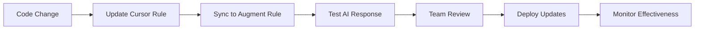

# Cursor Rules Integration Strategy

**Type**: Manual  
**Description**: Strategy for integrating existing Cursor rules with new Augment rules system while maintaining consistency

## Current Cursor Rules Analysis

### Existing Rules Structure
```
.cursor/rules/
├── core/
│   ├── clean_architecture.mdc      # ✅ Convert to Augment
│   ├── state_management.mdc        # ✅ Enhance for Augment
│   ├── dependency_injection.mdc    # ✅ Adapt patterns
│   ├── error_handling.mdc          # ✅ Standardize approach
│   └── testing_strategy.mdc        # ✅ Expand coverage
├── feature/
│   ├── realtime_messaging.mdc      # ✅ Performance focus
│   ├── offline_sync.mdc            # ✅ Enterprise patterns
│   ├── media_handling.mdc          # ✅ Optimization rules
│   └── isar_database.mdc           # ✅ Data layer rules
└── optimization/
    ├── performance.mdc             # ✅ Memory management
    ├── memory_management.mdc       # ✅ Leak prevention
    └── build_optimization.mdc      # ✅ Build performance
```

## Integration Approach

### 1. Rule Conversion Matrix

| Cursor Rule | Augment Equivalent | Enhancement Focus |
|-------------|-------------------|-------------------|
| `clean_architecture.mdc` | `.augment/rules/core/clean_architecture.md` | API synchronization |
| `state_management.mdc` | `.augment/rules/core/state_management.md` | Real-time optimization |
| `realtime_messaging.mdc` | `.augment/rules/features/realtime_messaging.md` | Performance targets |
| `error_handling.mdc` | `.augment/rules/core/error_handling.md` | Enterprise patterns |

### 2. Dual System Maintenance

#### Cursor Rules (IDE-Specific)
- Keep for Cursor IDE users
- Focus on development workflow
- Maintain syntax highlighting and IntelliSense
- Preserve existing team familiarity

#### Augment Rules (AI-Specific)
- Optimize for AI understanding
- Include performance benchmarks
- Add enterprise-grade patterns
- Provide comprehensive examples

### 3. Synchronization Strategy

```dart
// Script to sync rules between systems
class RuleSynchronizer {
  static Future<void> syncRules() async {
    final cursorRules = await _loadCursorRules();
    final augmentRules = await _loadAugmentRules();
    
    for (final cursorRule in cursorRules) {
      final augmentEquivalent = _findAugmentEquivalent(cursorRule);
      
      if (augmentEquivalent != null) {
        await _syncRuleContent(cursorRule, augmentEquivalent);
      } else {
        await _createAugmentRule(cursorRule);
      }
    }
  }
  
  static Future<void> _syncRuleContent(
    CursorRule cursorRule,
    AugmentRule augmentRule,
  ) async {
    // Extract common patterns
    final commonPatterns = _extractCommonPatterns(cursorRule);
    
    // Enhance for Augment
    final enhancedPatterns = _enhanceForAugment(commonPatterns);
    
    // Update Augment rule
    await _updateAugmentRule(augmentRule, enhancedPatterns);
  }
}
```

## Enhanced Rule Examples

### Clean Architecture Enhancement
```markdown
# Original Cursor Rule Focus
- Layer separation
- Dependency inversion
- Basic patterns

# Augment Enhancement
- API synchronization requirements
- Performance implications
- Enterprise scalability
- Comprehensive error handling
- Real-world examples from messaging apps
```

### State Management Enhancement
```markdown
# Original Cursor Rule Focus
- BLoC pattern basics
- Event/State definitions
- Basic testing

# Augment Enhancement
- Real-time performance optimization
- Memory management strategies
- Offline-first patterns
- Enterprise-scale considerations
- Comprehensive testing with bloc_test
```

## Team Adoption Strategy

### Phase 1: Parallel Operation (2 tuần)
- Run both systems simultaneously
- Compare AI responses and code quality
- Gather team feedback on effectiveness
- Identify gaps and improvements

### Phase 2: Gradual Migration (4 tuần)
- Start using Augment rules for new features
- Maintain Cursor rules for existing code
- Train team on Augment-specific patterns
- Document best practices and workflows

### Phase 3: Full Integration (2 tuần)
- Standardize on Augment rules for AI interactions
- Keep Cursor rules for IDE-specific features
- Establish maintenance procedures
- Create team guidelines for rule updates

## Maintenance Procedures

### Rule Update Workflow


### Quality Assurance
- **Weekly Reviews**: Check rule effectiveness
- **Monthly Audits**: Comprehensive rule analysis
- **Quarterly Updates**: Major enhancements and optimizations
- **Bi-annual Overhaul**: Complete system review

## Performance Monitoring

### Metrics to Track
- **AI Response Quality**: Accuracy and relevance scores
- **Development Speed**: Time to implement features
- **Code Quality**: Architecture compliance and test coverage
- **Team Satisfaction**: Developer experience ratings

### Monitoring Tools
```dart
class RuleEffectivenessMonitor {
  static void trackRuleUsage(String ruleName, String context) {
    // Track which rules are used most frequently
    // Measure impact on code quality
    // Monitor team satisfaction
  }
  
  static void measureAIResponseQuality(
    String prompt,
    String response,
    double qualityScore,
  ) {
    // Track AI response quality over time
    // Identify rules that improve responses
    // Optimize rule content based on effectiveness
  }
}
```

## Best Practices

### Rule Writing Guidelines
1. **Consistency**: Maintain similar structure across both systems
2. **Clarity**: Use clear, actionable language
3. **Examples**: Provide concrete code examples
4. **Context**: Include performance and scalability considerations
5. **Testing**: Add comprehensive testing strategies

### Team Collaboration
1. **Documentation**: Keep both rule systems documented
2. **Training**: Regular team training on rule updates
3. **Feedback**: Continuous feedback loop for improvements
4. **Standards**: Maintain coding standards across both systems

### Continuous Improvement
1. **Analytics**: Track rule effectiveness metrics
2. **Optimization**: Regular rule optimization based on usage
3. **Innovation**: Incorporate new patterns and best practices
4. **Community**: Share learnings with broader development community
